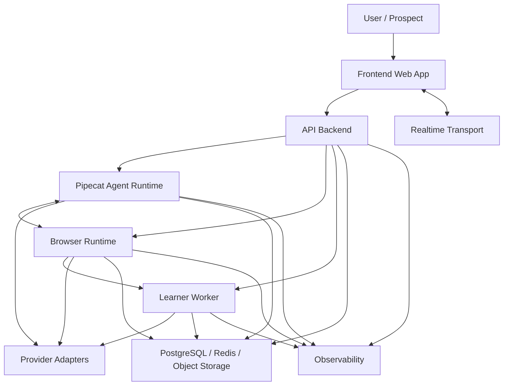
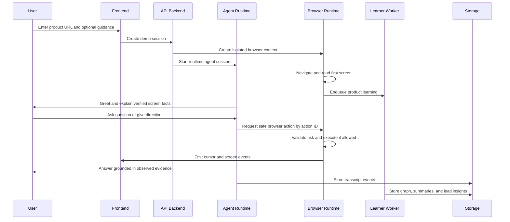
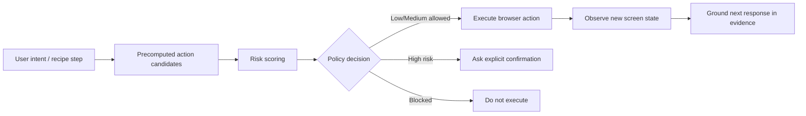
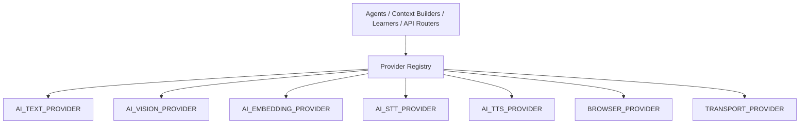
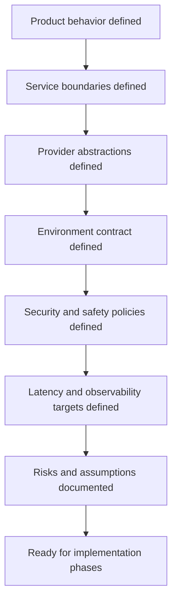

# Personalised Demo AI Agent

Production-grade foundation for a live AI product-demo agent. The agent opens a product URL in an isolated browser, learns the interface, presents the product conversationally, controls the browser through safe validated actions, answers only from grounded evidence, and generates CRM-ready sales intelligence after the demo.

## Current Status

This repository currently contains the Phase 0 product and architecture foundation only. It intentionally does not implement the full application yet.

Phase 0 defines:

- Product requirements and live-demo behavior.
- Service architecture and boundaries.
- Provider-agnostic AI/browser/transport abstractions.
- Environment variable contract and `.env.example`.
- Security, determinism, latency, observability, and risk criteria.

## System At A Glance



## User And Agent Flow



## Safety Model

The LLM is never given raw browser-control authority. It can choose only from precomputed safe actions, and the browser runtime validates every action before execution.



## Provider-Agnostic Design

Provider choices are environment-driven. Business logic imports generic interfaces only.



NVIDIA NIM, OpenAI, Ollama, local models, and custom OpenAI-compatible providers fit behind the same generic provider contracts.

## Documentation Map

| File | Purpose |
| --- | --- |
| [architecture/README.md](architecture/README.md) | Architecture documentation index and visual navigation |
| [architecture/phase_0_product_requirements.md](architecture/phase_0_product_requirements.md) | Product behavior, modes, UX, safety, voice, cursor, learning, lead output |
| [architecture/phase_0_system_architecture.md](architecture/phase_0_system_architecture.md) | Services, boundaries, diagrams, hot/cold path, data structures, cybersecurity |
| [architecture/phase_0_provider_abstractions.md](architecture/phase_0_provider_abstractions.md) | Provider categories, interfaces, registry, errors, fallback, routing |
| [architecture/phase_0_environment_contract.md](architecture/phase_0_environment_contract.md) | Environment variables, local/cloud modes, secrets, service readers |
| [architecture/phase_0_acceptance_criteria.md](architecture/phase_0_acceptance_criteria.md) | Phase 0 completion checklist |
| [architecture/phase_0_risks_and_assumptions.md](architecture/phase_0_risks_and_assumptions.md) | Risks, assumptions, impact, mitigation phase |
| [.env.example](.env.example) | Complete provider-agnostic environment template |

## Repository Structure

```text
.
|-- README.md
|-- .env.example
`-- architecture
    |-- README.md
    |-- phase_0_product_requirements.md
    |-- phase_0_system_architecture.md
    |-- phase_0_provider_abstractions.md
    |-- phase_0_environment_contract.md
    |-- phase_0_acceptance_criteria.md
    `-- phase_0_risks_and_assumptions.md
```

## Phase 0 Acceptance Gate



## Implementation Notes

- Do not put provider SDKs in business logic.
- Do not let the LLM execute arbitrary JavaScript.
- Do not put full raw DOM into hot-path prompts.
- Do not make product claims without evidence.
- Do not expose provider secrets to the frontend.
- Keep the learner asynchronous so it never blocks live voice response.
