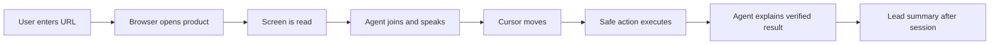
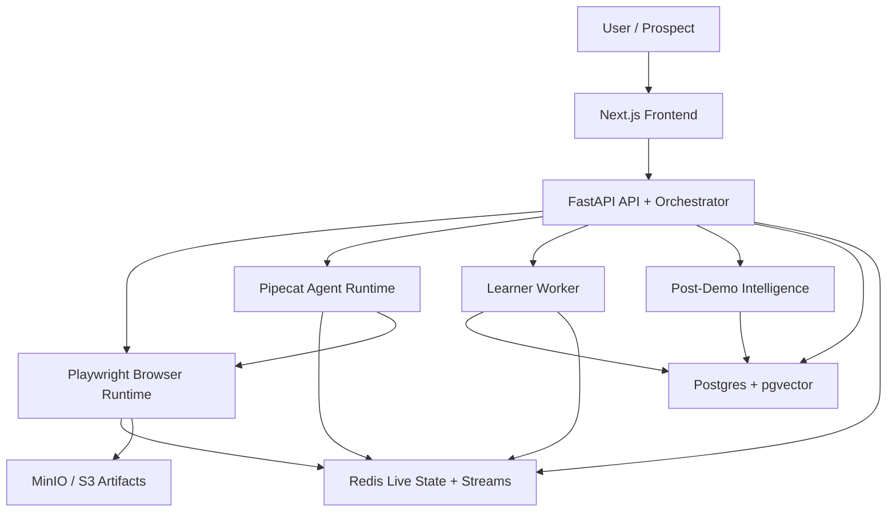

# Live Demo Agent

## What It Is

Live Demo Agent is a realtime AI sales-engineer runtime. It opens a real product URL in an isolated controlled browser, learns the visible product screen, speaks with a user, moves a synthetic cursor, executes safe browser actions, answers questions grounded in observed UI and approved knowledge, and produces evidence-backed post-demo intelligence.

The repo is a monorepo for the full local system: Next.js web UI, FastAPI backend, Pipecat agent runtime, Playwright browser runtime, learner worker, post-demo intelligence, Redis, Postgres with pgvector, MinIO/S3-compatible artifacts, observability, tests, and production hardening assets.

## Core Demo Loop



The most important milestone is:

```text
User enters URL -> browser opens product -> agent joins voice call -> agent reads current screen -> agent speaks -> cursor moves -> agent clicks safe element -> agent explains result
```

## Quick Start

The default documented local path uses deterministic fake providers and does not require paid APIs.

```bash
cp .env.example .env
pnpm install
uv sync --all-packages
docker compose up --build
```

Open:

```text
http://localhost:3000
```

Health checks:

```bash
curl -s http://localhost:8000/healthz
curl -s http://localhost:8000/readyz
curl -s http://localhost:8200/healthz
curl -s http://localhost:8300/healthz
```

For full setup details, provider modes, and clean reset commands, see [docs/setup/local-setup.md](docs/setup/local-setup.md).

## Architecture at a Glance



Key rule: the LLM never controls Playwright directly. It can propose a response and choose a safe action ID. The policy layer and browser runtime validate again before deterministic browser execution.

## Provider Modes

Provider-specific code lives behind interfaces for text generation, embeddings, vision, STT, and TTS.

Common modes:

| Mode | LLM | STT | TTS | Use case |
| --- | --- | --- | --- | --- |
| Fake | fake | fake | fake | CI, local smoke, deterministic demos |
| Local | Ollama | local Whisper or fake | Kokoro/Piper or fake | no-cost development |
| Hosted demo | NVIDIA NIM or OpenAI-compatible | fake or cloud STT | fake or cloud TTS | smoother interview/demo |
| Production | managed provider | cloud STT | cloud TTS | real users after provider validation |

Read [docs/providers/provider-switching.md](docs/providers/provider-switching.md).

## Demo Recipes

You can run with:

- URL only for quick exploration.
- URL plus text guidance for a better demo route.
- URL plus screen-by-screen recipe JSON for the most reliable demo.

Recipe policy can make the demo stricter, but it cannot override global hard blocks such as destructive actions, raw JavaScript, raw selectors, billing/payment pages, or sensitive credential fields.

Read [docs/recipes/demo-recipe-guide.md](docs/recipes/demo-recipe-guide.md).

## Testing

Primary quality commands:

```bash
make test-fixture-secrets
make test-unit
make test-browser
make test-session-lifecycle
make test-e2e
make test-evals
make test-load-smoke
```

The quality system uses fake providers by default. Live-provider tests are opt-in.

Read [docs/development/testing-and-evals.md](docs/development/testing-and-evals.md).

## Deployment

The repo includes hardened Dockerfiles, Kubernetes manifests, Helm chart scaffolding, CI/CD workflows, security scans, and operational runbooks. Production deployment still requires real environment secrets, domain configuration, provider credentials, and capacity tuning.

Read [docs/architecture/deployment.md](docs/architecture/deployment.md) and [docs/runbooks/deployment.md](docs/runbooks/deployment.md).

## Documentation Index

- Local setup: [docs/setup/local-setup.md](docs/setup/local-setup.md)
- Architecture: [docs/architecture/system-design.md](docs/architecture/system-design.md)
- Provider switching: [docs/providers/provider-switching.md](docs/providers/provider-switching.md)
- Recipes: [docs/recipes/demo-recipe-guide.md](docs/recipes/demo-recipe-guide.md)
- Troubleshooting: [docs/troubleshooting/troubleshooting.md](docs/troubleshooting/troubleshooting.md)
- Interview demo: [docs/demo/interview-demo-script.md](docs/demo/interview-demo-script.md)
- Recommended build order: [docs/development/recommended-build-order.md](docs/development/recommended-build-order.md)
- Full docs hub: [docs/README.md](docs/README.md)

## Current Limitations

- Local fake-provider mode proves orchestration, browser control, safety, UI events, and deterministic test paths; it does not produce natural live audio.
- Ollama, local STT, and local TTS depend heavily on laptop CPU/GPU and model size.
- HubSpot and Salesforce adapters are skeletons unless a later implementation enables real writes.
- Production capacity values are starting points and must be tuned with Phase 15 load tests and Phase 14 telemetry.
- Phase 17 documents how to operate and explain the system; it does not add new product behavior.
