# Live Demo Agent

Monorepo foundation for a production-grade, low-latency, secure, deterministic, provider-agnostic AI product-demo agent platform.

Phase 5 provides the monorepo, contracts, tooling, durable database schema, Redis live-state layer, Redis Streams event bus, S3-compatible artifact storage, FastAPI backend APIs, provider-agnostic AI adapters, and a deterministic Playwright browser runtime. It does not yet implement the live voice agent, AI planner, product learner, frontend cursor rendering, or CRM export workflow.

## What This Repo Is

The eventual system will run a live AI product-demo agent that opens a product URL in an isolated browser, learns the interface, speaks with a user in real time, controls the browser through safe actions, answers from grounded UI evidence, and creates CRM-ready sales intelligence.

This repository currently contains:

- Phase 0 architecture and product requirements.
- Phase 1 monorepo scaffold.
- Phase 2 database, Redis, event bus, and artifact storage foundation.
- Phase 3 FastAPI backend API and orchestration placeholders.
- Phase 4 reusable AI provider abstraction package.
- Phase 5 deterministic browser runtime service.
- Python and TypeScript workspace tooling.
- Shared JSON Schema contracts with generated Python and TypeScript outputs.
- Local Docker Compose stack for lightweight development.
- Observability placeholders.

## System Components

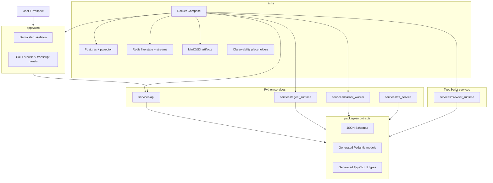

## Dependency Graph

The dependency graph is intentionally acyclic.

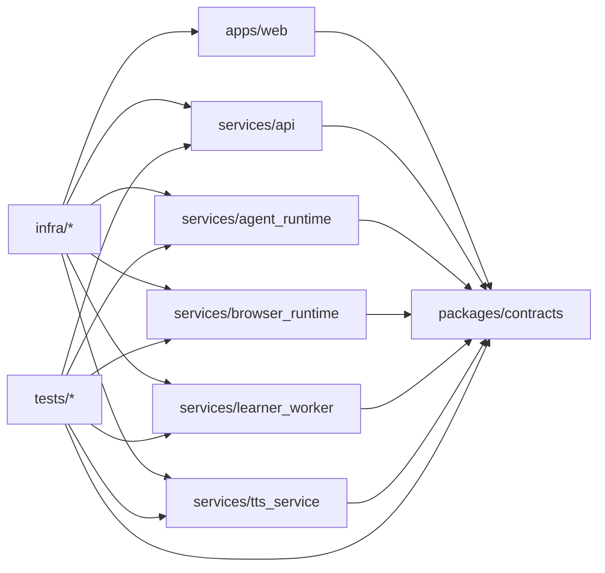

Forbidden directions:

- `packages/contracts` must not import apps or services.
- `services/api` must not import `apps/web`.
- `services/browser_runtime` must not import Python service internals.
- `apps/web` must not import backend secrets or provider adapters.

## Folder Structure

```text
.
|-- apps
|   `-- web
|-- architecture
|-- infra
|   |-- docker
|   `-- observability
|-- packages
|   `-- contracts
|       |-- schemas
|       |-- generated
|       `-- scripts
|-- services
|   |-- api
|   |-- agent_runtime
|   |-- browser_runtime
|   |-- learner_worker
|   `-- tts_service
|-- tests
|   |-- integration
|   `-- e2e
|-- docker-compose.yml
|-- Makefile
|-- package.json
|-- pnpm-workspace.yaml
|-- pyproject.toml
`-- .env.example
```

## Local Prerequisites

- Python `>=3.12,<3.14`.
- `uv` with workspace support. This repo was verified with `uv 0.11.7`.
- Node `>=20`. This repo was verified with Node `24.13.1`.
- pnpm `>=9`. This repo was verified with pnpm `10.30.1`.
- Docker and Docker Compose for the local stack.

## Local Setup

```bash
cp .env.example .env
pnpm install
uv sync --all-packages
make contracts
make lint
make test
docker compose up --build
```

`uv sync --all-packages` is supported by the local `uv 0.11.7` toolchain and syncs every Python workspace package.

## Common Commands

```bash
make install
make contracts
make lint
make format
make format-write
make typecheck
make test
make docker-config
make docker-up
make docker-down
make db-upgrade
make db-current
make db-downgrade
make ai-test
make browser-test
make browser-test-integration
make secrets-check
```

Python-only:

```bash
uv sync --all-packages
uv run ruff check .
uv run ruff format --check .
uv run mypy services packages/contracts/generated/python tests
uv run pytest
```

TypeScript-only:

```bash
pnpm install
pnpm lint
pnpm format
pnpm typecheck
pnpm test
```

## Docker Compose

Default lightweight stack:

```bash
docker compose up --build
```

Include local LLM runtime:

```bash
docker compose --profile ai-local up --build
```

Include local TTS service:

```bash
docker compose --profile tts-local up --build
```

Include observability stack:

```bash
docker compose --profile observability up --build
```

Include everything:

```bash
docker compose --profile ai-local --profile tts-local --profile observability up --build
```

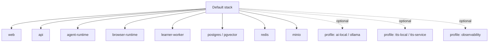

The default stack does not start Ollama, Grafana, Prometheus, Loki, Jaeger, or local TTS.

## Phase 2 Storage Architecture

Phase 2 uses a strict storage split:

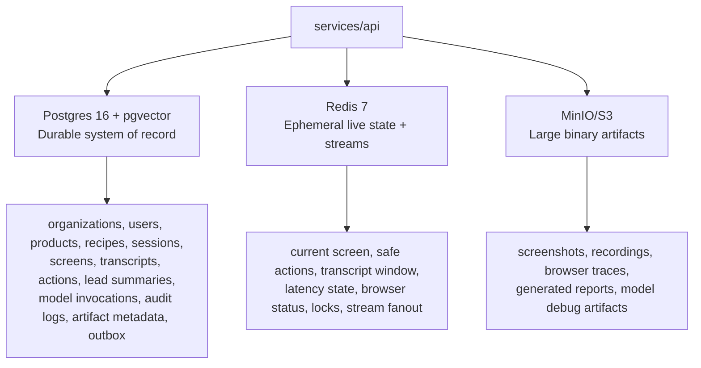

Rules:

- Durable business records belong in Postgres.
- Hot-path live context belongs in compact Redis keys.
- Screenshots, recordings, traces, and reports belong in MinIO/S3, with only metadata in Postgres.
- Artifact rows store `bucket` and `object_key`, never public URLs.
- Redis streams are capped with `MAXLEN ~ REDIS_EVENT_STREAM_MAXLEN`.
- Audit logs are append-only and do not have `updated_at` or `deleted_at`.

## Database and Migrations

Start storage dependencies:

```bash
docker compose up -d postgres redis minio
```

Apply migrations:

```bash
make db-upgrade
make db-current
make db-history
```

Rollback one migration:

```bash
make db-downgrade
```

Create a future migration:

```bash
make db-revision m="describe change"
```

The Alembic environment reads `DATABASE_SYNC_URL` for host-side migrations. `.env.example` uses `localhost` so `make db-upgrade` works from the host. Docker Compose overrides database, Redis, and object-storage endpoints inside containers to use service DNS names.

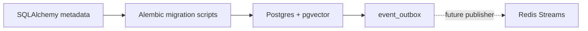

Inspect Postgres:

```bash
docker compose exec postgres psql -U demo_agent -d demo_agent
\dt
\di
select * from alembic_version;
```

## Redis Live State and Events

Redis keys are centralized under `services/api/src/live_demo_api/live_state/redis_keys.py`.

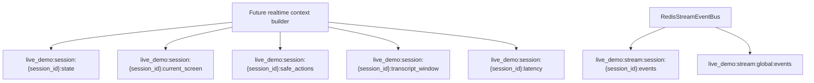

Inspect Redis:

```bash
docker compose exec redis redis-cli
keys live_demo:*
xrange live_demo:stream:global:events - +
xinfo stream live_demo:stream:global:events
```

## Phase 3 API Overview

All Phase 3 business APIs are under `/api/v1`. Health endpoints are also available at the root for container health checks.

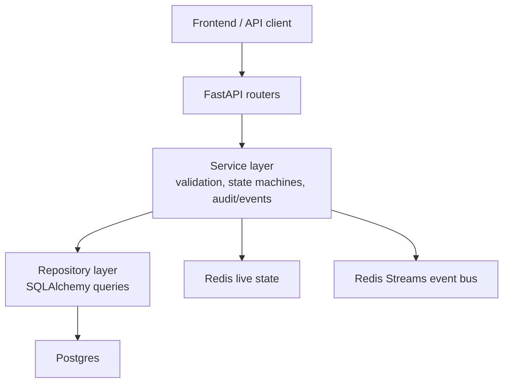

Endpoint groups:

- `GET /healthz`, `GET /readyz`, `GET /api/v1/healthz`, `GET /api/v1/readyz`
- `POST/GET/PATCH/DELETE /api/v1/products`
- `POST/GET/PATCH/DELETE /api/v1/products/{product_id}/guidance`
- `POST/GET/PATCH/DELETE /api/v1/products/{product_id}/recipes`
- `POST /api/v1/products/{product_id}/recipes/{recipe_id}/validate`
- `POST /api/v1/products/{product_id}/recipes/{recipe_id}/activate`
- `POST /api/v1/products/{product_id}/recipes/{recipe_id}/archive`
- `POST/GET /api/v1/demo-sessions`
- `POST /api/v1/demo-sessions/{session_id}/start`
- `POST /api/v1/demo-sessions/{session_id}/end`
- `GET /api/v1/demo-sessions/{session_id}/state`
- `GET /api/v1/demo-sessions/{session_id}/join-config`
- `GET /api/v1/demo-sessions/{session_id}/transcript`
- `GET /api/v1/demo-sessions/{session_id}/browser-actions`
- `GET /api/v1/demo-sessions/{session_id}/features-shown`
- `GET /api/v1/demo-sessions/{session_id}/questions`
- `GET /api/v1/demo-sessions/{session_id}/lead-insights`
- `GET /api/v1/demo-sessions/{session_id}/lead-summary`
- `GET /api/v1/demo-sessions/{session_id}/crm-payload`

### Local Auth

Phase 3 local auth is development-only. Requests use:

```text
X-Organization-ID: 00000000-0000-0000-0000-000000000001
X-User-ID: 00000000-0000-0000-0000-000000000002
X-User-Role: owner
```

When `DEV_ALLOW_IMPLICIT_LOCAL_ORG=true`, the API creates the deterministic local organization and user if needed. This is not production auth.

### API Examples

Start dependencies and migrations:

```bash
docker compose up -d postgres redis minio
make db-upgrade
make api-dev
```

Create a product:

```bash
curl -X POST http://localhost:8000/api/v1/products \
  -H "Content-Type: application/json" \
  -H "X-Organization-ID: 00000000-0000-0000-0000-000000000001" \
  -d '{
    "product_name": "Example Product",
    "product_url": "https://example.com",
    "default_persona": "founder"
  }'
```

Create guidance:

```bash
curl -X POST http://localhost:8000/api/v1/products/{product_id}/guidance \
  -H "Content-Type: application/json" \
  -H "X-Organization-ID: 00000000-0000-0000-0000-000000000001" \
  -d '{
    "guidance_type": "product_positioning",
    "title": "Founder positioning",
    "content": {"summary": "Focus on speed to insight."}
  }'
```

Create and start a session:

```bash
curl -X POST http://localhost:8000/api/v1/demo-sessions \
  -H "Content-Type: application/json" \
  -H "X-Organization-ID: 00000000-0000-0000-0000-000000000001" \
  -d '{"product_id": "{product_id}", "user_persona": "founder"}'

curl -X POST http://localhost:8000/api/v1/demo-sessions/{session_id}/start \
  -H "Content-Type: application/json" \
  -H "X-Organization-ID: 00000000-0000-0000-0000-000000000001" \
  -d '{}'
```

The join config response is an explicit placeholder:

```json
{
  "transport_provider": "small_webrtc",
  "session_id": "uuid",
  "room_id": "local-placeholder",
  "join_token": null,
  "expires_at": "2026-06-20T12:00:00Z",
  "status": "not_implemented_in_phase_3"
}
```

### Session Lifecycle

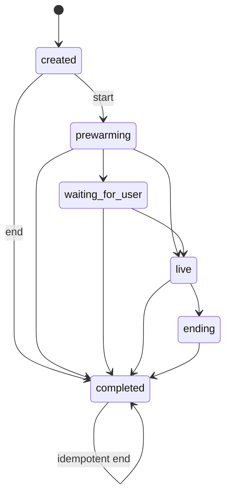

Session state reads merge durable Postgres identity/status with Redis live-state overlays. If Redis is unavailable, the API returns the durable session with `live_state_status="unavailable"`.

### Pagination and Errors

List endpoints use keyset pagination with opaque base64url JSON cursors. They do not use offset pagination.

Error responses are deterministic:

```json
{
  "error": {
    "code": "product_not_found",
    "message": "Product not found.",
    "request_id": "string",
    "trace_id": "string",
    "details": {}
  }
}
```

## Object Storage

Object keys are deterministic and tenant scoped:

```text
org/{organization_id}/sessions/{session_id}/screenshots/{screen_id}.webp
org/{organization_id}/sessions/{session_id}/browser-traces/{trace_id}.zip
org/{organization_id}/sessions/{session_id}/recordings/{recording_id}.wav
org/{organization_id}/sessions/{session_id}/reports/{report_name}.json
```

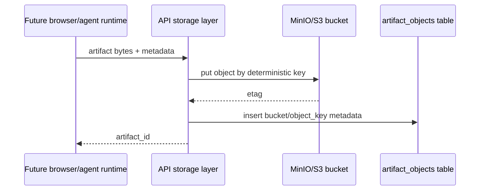

Inspect MinIO:

- API: `http://localhost:9000`
- Console: `http://localhost:9001`
- Local credentials are from `.env.example` and are not production credentials.

## Phase 2 Test Commands

```bash
docker compose up -d postgres redis minio
make db-upgrade
make db-current
uv run pytest services/api/tests/test_db_models.py
uv run pytest services/api/tests/test_alembic_migrations.py
uv run pytest services/api/tests/test_redis_keys.py
uv run pytest services/api/tests/test_live_state_store.py
uv run pytest services/api/tests/test_event_bus.py
uv run pytest services/api/tests/test_artifact_store.py
```

## Phase 3 Test Commands

```bash
docker compose up -d postgres redis minio
make db-upgrade
make api-test
make lint
make typecheck
uv run pytest services/api/tests/test_app_factory.py
uv run pytest services/api/tests/test_health_api.py
uv run pytest services/api/tests/test_products_api.py
uv run pytest services/api/tests/test_guidance_api.py
uv run pytest services/api/tests/test_recipes_api.py
uv run pytest services/api/tests/test_demo_sessions_api.py
uv run pytest services/api/tests/test_transcripts_api.py
uv run pytest services/api/tests/test_lead_summaries_api.py
uv run pytest services/api/tests/test_error_handlers.py
uv run pytest services/api/tests/test_security_redaction.py
uv run pytest services/api/tests/test_pagination.py
```

## AI Provider Architecture

Phase 4 adds a reusable provider-agnostic Python package at `packages/backend_common`. Later services should use the registry and interfaces, not provider constructors.

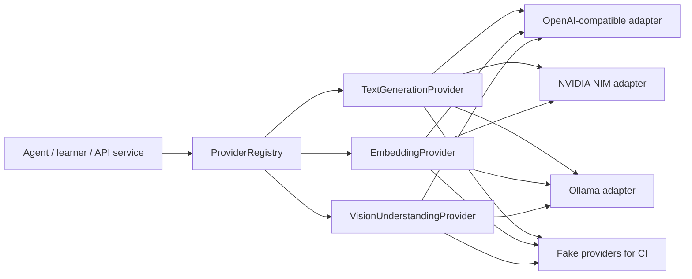

The interfaces live in:

- `live_demo_backend_common.ai.text.base.TextGenerationProvider`
- `live_demo_backend_common.ai.embeddings.base.EmbeddingProvider`
- `live_demo_backend_common.ai.vision.base.VisionUnderstandingProvider`

Allowed business-code usage:

```python
from live_demo_backend_common.ai.config import get_ai_provider_settings
from live_demo_backend_common.ai.registry import ProviderRegistry
from live_demo_backend_common.ai.types import ChatMessage, MessageRole, TextGenerationRequest

settings = get_ai_provider_settings()
registry = ProviderRegistry(settings)

text_provider = registry.get_text_provider()

response = await text_provider.generate(
    TextGenerationRequest(
        messages=[
            ChatMessage(role=MessageRole.user, content="Say hello in one sentence.")
        ],
        metadata={
            "purpose": "realtime_host",
            "request_id": "req_123",
            "trace_id": "trace_123",
        },
    )
)

print(response.content)
await registry.close()
```

### Text Providers

Text generation supports:

- `AI_TEXT_PROVIDER=nvidia_nim`
- `AI_TEXT_PROVIDER=openai`
- `AI_TEXT_PROVIDER=custom_openai_compatible`
- `AI_TEXT_PROVIDER=ollama`
- `AI_TEXT_PROVIDER=fake`
- `AI_TEXT_PROVIDER=disabled`

NVIDIA NIM uses the same generic OpenAI-compatible adapter surface:

```env
AI_TEXT_PROVIDER=nvidia_nim
AI_TEXT_BASE_URL=https://integrate.api.nvidia.com/v1
AI_TEXT_API_KEY=...
AI_TEXT_MODEL=meta/llama-3.1-70b-instruct
```

Custom OpenAI-compatible endpoint:

```env
AI_TEXT_PROVIDER=custom_openai_compatible
AI_TEXT_BASE_URL=https://provider.example.com/v1
AI_TEXT_API_KEY=...
AI_TEXT_MODEL=provider-model-name
```

Local Ollama, no API key:

```env
AI_TEXT_PROVIDER=ollama
OLLAMA_BASE_URL=http://localhost:11434
OLLAMA_TEXT_MODEL=llama3.2
OLLAMA_TEXT_MODE=openai_compatible
```

Ollama native mode uses `/api/chat` and does not auto-pull models.

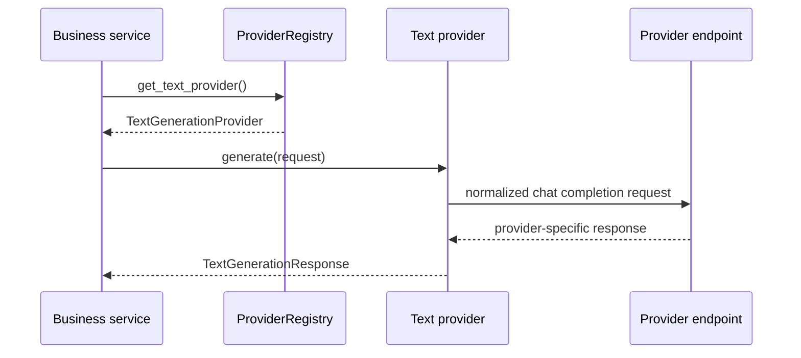

Streaming uses server-sent event parsing for OpenAI-compatible endpoints and yields `TextGenerationChunk` objects as deltas arrive. The provider layer returns tool calls as data and never executes tools.

### Embedding Providers

Embeddings support:

- `AI_EMBEDDING_PROVIDER=nvidia_nim`
- `AI_EMBEDDING_PROVIDER=openai`
- `AI_EMBEDDING_PROVIDER=custom_openai_compatible`
- `AI_EMBEDDING_PROVIDER=ollama`
- `AI_EMBEDDING_PROVIDER=fake`
- `AI_EMBEDDING_PROVIDER=disabled`

The default vector dimension is `AI_EMBEDDING_DIMENSIONS=768`, matching the Phase 2 pgvector schema. Dimension mismatches, NaN values, infinite values, and zero-vector normalization are rejected before vectors reach storage.

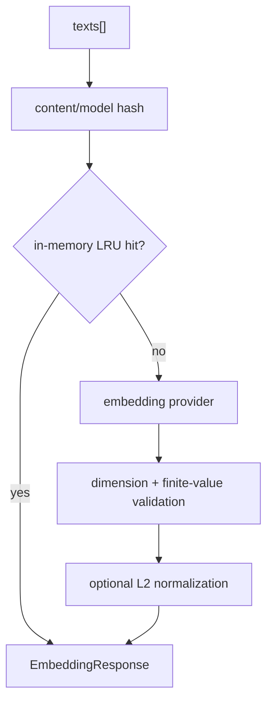

Ollama embeddings use `/api/embed` by default. The deprecated `/api/embeddings` path is only used when `OLLAMA_EMBEDDING_USE_LEGACY_ENDPOINT=true`.

### Vision Providers

Vision is disabled by default:

```env
AI_VISION_PROVIDER=disabled
AI_VISION_ALLOW_HOT_PATH=false
```

Vision adapters accept bytes, base64, or a trusted artifact reference. They do not fetch arbitrary remote image URLs. Image bytes/base64 are never logged, and screenshots are treated as sensitive data.

### Provider Reliability Controls

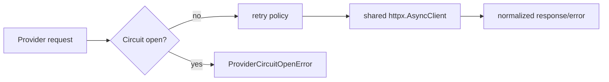

- One `httpx.AsyncClient` is reused per provider instance.
- Hot-path retries default to `AI_PROVIDER_HOT_PATH_MAX_RETRIES=0`.
- Cold-path retries default to `AI_PROVIDER_COLD_PATH_MAX_RETRIES=2`.
- Circuit breakers are in-process for Phase 4.
- Streaming requests are not retried after partial chunks have been yielded.

### AI Provider Tests

Unit tests do not require provider keys:

```bash
make ai-test
```

Live tests are opt-in:

```bash
export RUN_LIVE_PROVIDER_TESTS=true
export AI_TEXT_PROVIDER=nvidia_nim
export AI_TEXT_BASE_URL=https://integrate.api.nvidia.com/v1
export AI_TEXT_API_KEY=...
export AI_TEXT_MODEL=...
make ai-test-live
```

For Ollama live tests, use an already-pulled model. The test suite does not download model weights:

```bash
docker compose --profile ai-local up -d ollama
export RUN_LIVE_PROVIDER_TESTS=true
export AI_TEXT_PROVIDER=ollama
export OLLAMA_BASE_URL=http://localhost:11434
export OLLAMA_TEXT_MODEL=<already-pulled-model>
make ai-test-live
```

## Browser Runtime Architecture

Phase 5 adds `services/browser_runtime`, a standalone internal Fastify service under `/internal/browser/v1`. It is the deterministic execution engine for the product-demo browser. The API or agent may request browser work, but the runtime validates policy, resolves generated element IDs, executes Playwright actions, observes the result, updates Redis live state, stores screenshots in MinIO/S3, and publishes typed Redis Stream events.

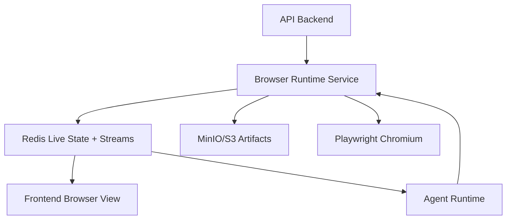

Browser runtime endpoints:

- `GET /healthz`
- `GET /readyz`
- `POST /internal/browser/v1/sessions`
- `GET /internal/browser/v1/sessions/{browser_session_id}`
- `DELETE /internal/browser/v1/sessions/{browser_session_id}`
- `POST /internal/browser/v1/sessions/{browser_session_id}/navigate`
- `GET /internal/browser/v1/sessions/{browser_session_id}/screen`
- `POST /internal/browser/v1/sessions/{browser_session_id}/screenshot`
- `POST /internal/browser/v1/sessions/{browser_session_id}/actions/read_current_screen`
- `POST /internal/browser/v1/sessions/{browser_session_id}/actions/highlight_element`
- `POST /internal/browser/v1/sessions/{browser_session_id}/actions/click_element`
- `POST /internal/browser/v1/sessions/{browser_session_id}/actions/type_into_element`
- `POST /internal/browser/v1/sessions/{browser_session_id}/actions/scroll`
- `POST /internal/browser/v1/sessions/{browser_session_id}/actions/go_back`
- `POST /internal/browser/v1/sessions/{browser_session_id}/actions/navigate`
- `POST /internal/browser/v1/sessions/{browser_session_id}/actions/wait_for_idle`

### Browser Isolation

The runtime reuses one Chromium process per service process and creates one non-persistent Playwright `BrowserContext` plus one `Page` per browser session. Session lookup is `Map` based and `O(1)`. Contexts are closed idempotently on explicit close, expiration cleanup, and service shutdown.

Isolation rules:

- No shared cookies or storage across sessions.
- No persistent browser profile by default.
- Downloads and uploads are blocked by default.
- External navigation is blocked unless allowed by session policy.
- Browser sessions are capped by `BROWSER_MAX_CONCURRENT_SESSIONS`.

### Navigation Safety

Navigation validates requested and final redirected URLs:

- Allows only `http` and `https`.
- Rejects `file:`, `javascript:`, `data:`, `ftp:`, and `mailto:`.
- Rejects URL credentials.
- Blocks private/local IP ranges unless `APP_ENV=local` and `ALLOW_LOCAL_PRODUCT_URLS=true`.
- Enforces `allowed_domains` when `BROWSER_BLOCK_EXTERNAL_NAVIGATION=true`.

The runtime waits for `domcontentloaded`, a bounded idle window, and a visible `body`. It does not use unbounded sleeps.

### Screen Reader Pipeline

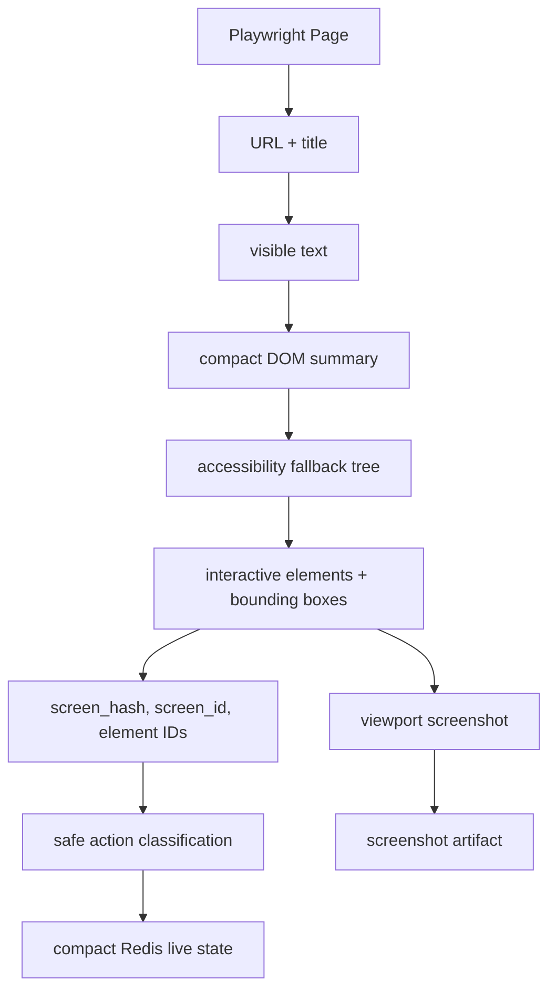

The screen reader returns degraded state if a non-critical extractor fails. It never returns full HTML, screenshot bytes, cookies, localStorage, or sessionStorage. Redis stores only compact current screen, safe actions, and browser status.

### Screen Normalization

- `screen_hash` is a SHA-256 hash of normalized URL path, top visible-text tokens, accessibility signature, and coarse layout signature.
- `screen_id` is `screen_` plus the first 16 hash characters, with deterministic collision suffixes.
- `element_fingerprint` uses role, normalized label, tag, input type, nearby text, and coarse bounding-box grid.
- `element_id` is generated from role plus fingerprint and deterministic duplicate suffixes.
- Compact summaries mention only extracted facts.

### Safety and Actions

Risk classification is deterministic:

- Blocked keywords include destructive, billing, payment, invite, publish, token, and account-sensitive actions.
- High-risk actions require confirmation.
- Recipe/global `never_click` entries override scores.
- Blocked actions are never executable unless an explicit local destructive-action flag is enabled.
- The runtime accepts generated `element_id` and action commands, not arbitrary JavaScript or raw selectors from the agent.

Supported actions are `read_current_screen`, `highlight_element`, `click_element`, `type_into_element`, `scroll`, `go_back`, `navigate`, and `wait_for_idle`. After every mutating action, the runtime rereads the screen, computes URL/hash/element deltas, updates Redis, and emits action and screen events.

### Cursor Event Flow

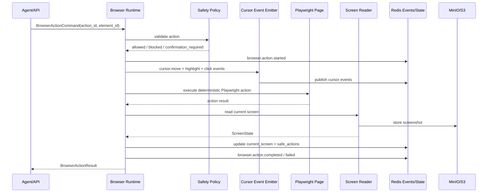

Cursor motion is visual only. Duration and path are deterministic from current position, target bounds, viewport, and action ID.

### Optional Browser Adapters

Stagehand and browser-use placeholders exist behind feature flags:

- `STAGEHAND_ENABLED=false`
- `STAGEHAND_ALLOW_HOT_PATH=false`
- `BROWSER_USE_ENABLED=false`
- `BROWSER_USE_ALLOW_HOT_PATH=false`

They cannot bypass deterministic safety validation. Stagehand can later propose actions; browser-use can later explore in a disposable background context. Neither controls the live browser hot path in Phase 5.

### Browser Runtime Commands

```bash
pnpm --filter @live-demo-agent/browser-runtime build
pnpm --filter @live-demo-agent/browser-runtime lint
pnpm --filter @live-demo-agent/browser-runtime typecheck
pnpm --filter @live-demo-agent/browser-runtime test
pnpm --filter @live-demo-agent/browser-runtime test:integration
make browser-dev
```

Manual smoke:

```bash
docker compose up -d redis minio
docker compose up --build browser-runtime
curl -s http://localhost:8200/healthz
curl -s http://localhost:8200/readyz
```

Create a browser session:

```bash
curl -X POST http://localhost:8200/internal/browser/v1/sessions \
  -H "Content-Type: application/json" \
  -d '{
    "organization_id": "00000000-0000-0000-0000-000000000001",
    "demo_session_id": "00000000-0000-0000-0000-000000000010",
    "product_id": "00000000-0000-0000-0000-000000000020",
    "start_url": "https://example.com",
    "allowed_domains": ["example.com"],
    "viewport": {"width": 1440, "height": 900}
  }'
```

## How Contracts Work

JSON Schema is the source of truth:

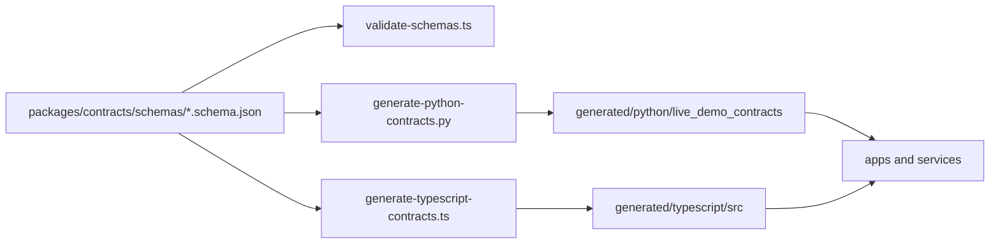

Run:

```bash
make contracts
git diff --exit-code packages/contracts/generated
```

Generated files are marked with "Do not edit manually."

## Provider Configuration Summary

Provider choices are configured with generic environment variables:

- `AI_TEXT_*`
- `AI_VISION_*`
- `AI_EMBEDDING_*`
- `AI_STT_*`
- `AI_TTS_*`
- `BROWSER_*`
- `TRANSPORT_*`

Vendor-specific secrets are backend-only. Do not expose provider keys to the frontend and do not add `NEXT_PUBLIC_` provider key variables.

## Security Notes

- `.env` and `.env.*` are ignored.
- `.env.example` contains local-only placeholder credentials; do not use them in production.
- Docker images do not copy `.env`.
- Frontend code must not receive provider API keys.
- Database, Redis values, event payloads, object metadata, and audit logs must not contain secrets.
- Browser screenshots are treated as sensitive artifacts.
- Object buckets are not public; future access must use backend-generated signed URLs.
- Raw prompts are not stored in `model_invocations` by default.
- Raw audio is not stored in `transcript_events`.
- Browser runtime does not run privileged and does not use host networking.
- Heavy local AI services are opt-in profiles.
- `make secrets-check` is a placeholder for adding gitleaks or equivalent in CI.

## Troubleshooting

If `uv sync --all-packages` fails because no compatible Python is installed, allow `uv` to install Python `3.12` or install Python `3.12` manually.

The contracts package uses `python3` for generation because this environment does not provide a `python` shim.

If `pnpm install` uses a different pnpm version, ensure it is at least pnpm `9`. The committed lockfile is generated with pnpm `10.30.1`.

If `docker compose config` fails because `.env` is missing, run:

```bash
cp .env.example .env
```

If Docker build fails on frozen lockfiles, rerun dependency installation and commit the updated lockfiles:

```bash
pnpm install
uv sync --all-packages
```

## Phase 3 Limitations

- Realtime voice and Pipecat pipeline are not implemented in Phase 3.
- Browser automation and Playwright control are implemented later by the Phase 5 browser runtime, not by the Phase 3 API.
- Product learning, summarization, and graph building are not implemented in Phase 3.
- AI provider adapters are implemented in Phase 4, but the live agent brain does not call them yet.
- Actual WebRTC room creation is not implemented; join config is a safe placeholder.
- CRM export is not implemented in Phase 3.
- Lead-summary generation is not implemented; the API only reads existing summaries.
- Event outbox publisher worker is not implemented yet; the outbox table and Redis event bus foundation exist.
- Observability configs are placeholders until runtime metrics and traces are emitted.

## Phase 4 Limitations

- Phase 4 implements AI provider abstractions and adapters.
- It does not implement the live agent brain, Pipecat runtime, browser automation, product learner, or CRM summaries.
- Live provider tests are opt-in and skipped unless `RUN_LIVE_PROVIDER_TESTS=true`.
- Ollama providers do not auto-pull models.
- Vision remains disabled by default and should be used as fallback/cold-path enrichment unless explicitly enabled.

## Phase 5 Limitations

- Phase 5 implements deterministic browser control and screen extraction.
- It does not implement the voice agent, AI action planner, frontend cursor rendering, product learner intelligence, or CRM export.
- Screenshot upload stores objects and returns artifact metadata; durable `artifact_objects` persistence remains API/orchestrator responsibility.
- Stagehand and browser-use adapters are placeholders behind disabled feature flags.
- Browser runtime events are published to Redis Streams; durable action/screen persistence is handled by later orchestration.
- DNS rebinding protection is limited to request-time URL/IP validation in this phase.

## Architecture Docs

- [Phase 0 product requirements](architecture/phase_0_product_requirements.md)
- [Phase 0 system architecture](architecture/phase_0_system_architecture.md)
- [Phase 0 provider abstractions](architecture/phase_0_provider_abstractions.md)
- [Phase 0 environment contract](architecture/phase_0_environment_contract.md)
- [Phase 1 acceptance checklist](architecture/phase_1_acceptance_checklist.md)
- [Phase 2 acceptance checklist](architecture/phase_2_acceptance_checklist.md)
