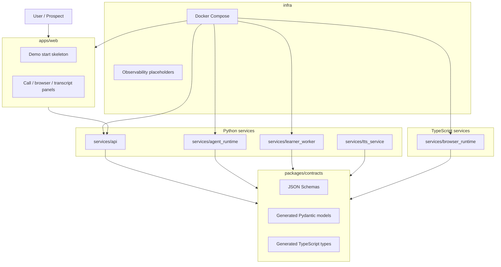
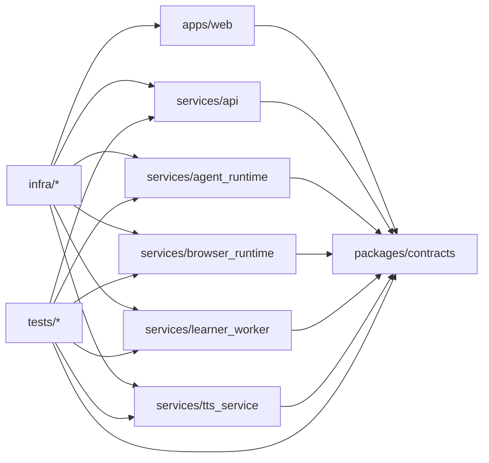
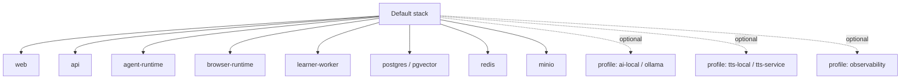
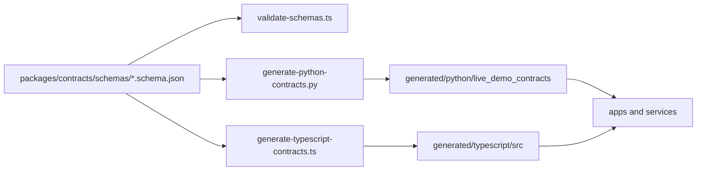

# Live Demo Agent

Monorepo foundation for a production-grade, low-latency, secure, deterministic, provider-agnostic AI product-demo agent platform.

Phase 1 provides the monorepo, contracts, tooling, and local stack foundation. It does not yet implement the live AI demo loop.

## What This Repo Is

The eventual system will run a live AI product-demo agent that opens a product URL in an isolated browser, learns the interface, speaks with a user in real time, controls the browser through safe actions, answers from grounded UI evidence, and creates CRM-ready sales intelligence.

This repository currently contains:

- Phase 0 architecture and product requirements.
- Phase 1 monorepo scaffold.
- Python and TypeScript workspace tooling.
- Shared JSON Schema contracts with generated Python and TypeScript outputs.
- Local Docker Compose stack for lightweight development.
- Observability placeholders.

## System Components



## Dependency Graph

The dependency graph is intentionally acyclic.



Forbidden directions:

- `packages/contracts` must not import apps or services.
- `services/api` must not import `apps/web`.
- `services/browser_runtime` must not import Python service internals.
- `apps/web` must not import backend secrets or provider adapters.

## Folder Structure

```text
.
|-- apps
|   `-- web
|-- architecture
|-- infra
|   |-- docker
|   `-- observability
|-- packages
|   `-- contracts
|       |-- schemas
|       |-- generated
|       `-- scripts
|-- services
|   |-- api
|   |-- agent_runtime
|   |-- browser_runtime
|   |-- learner_worker
|   `-- tts_service
|-- tests
|   |-- integration
|   `-- e2e
|-- docker-compose.yml
|-- Makefile
|-- package.json
|-- pnpm-workspace.yaml
|-- pyproject.toml
`-- .env.example
```

## Local Prerequisites

- Python `>=3.12,<3.14`.
- `uv` with workspace support. This repo was verified with `uv 0.11.7`.
- Node `>=20`. This repo was verified with Node `24.13.1`.
- pnpm `>=9`. This repo was verified with pnpm `10.30.1`.
- Docker and Docker Compose for the local stack.

## Local Setup

```bash
cp .env.example .env
pnpm install
uv sync --all-packages
make contracts
make lint
make test
docker compose up --build
```

`uv sync --all-packages` is supported by the local `uv 0.11.7` toolchain and syncs every Python workspace package.

## Common Commands

```bash
make install
make contracts
make lint
make format
make format-write
make typecheck
make test
make docker-config
make docker-up
make docker-down
make secrets-check
```

Python-only:

```bash
uv sync --all-packages
uv run ruff check .
uv run ruff format --check .
uv run mypy services packages/contracts/generated/python tests
uv run pytest
```

TypeScript-only:

```bash
pnpm install
pnpm lint
pnpm format
pnpm typecheck
pnpm test
```

## Docker Compose

Default lightweight stack:

```bash
docker compose up --build
```

Include local LLM runtime:

```bash
docker compose --profile ai-local up --build
```

Include local TTS service:

```bash
docker compose --profile tts-local up --build
```

Include observability stack:

```bash
docker compose --profile observability up --build
```

Include everything:

```bash
docker compose --profile ai-local --profile tts-local --profile observability up --build
```



The default stack does not start Ollama, Grafana, Prometheus, Loki, Jaeger, or local TTS.

## How Contracts Work

JSON Schema is the source of truth:



Run:

```bash
make contracts
git diff --exit-code packages/contracts/generated
```

Generated files are marked with "Do not edit manually."

## Provider Configuration Summary

Provider choices are configured with generic environment variables:

- `AI_TEXT_*`
- `AI_VISION_*`
- `AI_EMBEDDING_*`
- `AI_STT_*`
- `AI_TTS_*`
- `BROWSER_*`
- `TRANSPORT_*`

Vendor-specific secrets are backend-only. Do not expose provider keys to the frontend and do not add `NEXT_PUBLIC_` provider key variables.

## Security Notes

- `.env` and `.env.*` are ignored.
- `.env.example` contains local-only placeholder credentials; do not use them in production.
- Docker images do not copy `.env`.
- Frontend code must not receive provider API keys.
- Browser runtime does not run privileged and does not use host networking.
- Heavy local AI services are opt-in profiles.
- `make secrets-check` is a placeholder for adding gitleaks or equivalent in CI.

## Troubleshooting

If `uv sync --all-packages` fails because no compatible Python is installed, allow `uv` to install Python `3.12` or install Python `3.12` manually.

The contracts package uses `python3` for generation because this environment does not provide a `python` shim.

If `pnpm install` uses a different pnpm version, ensure it is at least pnpm `9`. The committed lockfile is generated with pnpm `10.30.1`.

If `docker compose config` fails because `.env` is missing, run:

```bash
cp .env.example .env
```

If Docker build fails on frozen lockfiles, rerun dependency installation and commit the updated lockfiles:

```bash
pnpm install
uv sync --all-packages
```

## Phase 1 Limitations

- Realtime voice and Pipecat pipeline are not implemented in Phase 1.
- Browser automation and Playwright control are not implemented in Phase 1.
- Product learning, summarization, and graph building are not implemented in Phase 1.
- CRM export is not implemented in Phase 1.
- Observability configs are placeholders until runtime metrics and traces are emitted.

## Architecture Docs

- [Phase 0 product requirements](architecture/phase_0_product_requirements.md)
- [Phase 0 system architecture](architecture/phase_0_system_architecture.md)
- [Phase 0 provider abstractions](architecture/phase_0_provider_abstractions.md)
- [Phase 0 environment contract](architecture/phase_0_environment_contract.md)
- [Phase 1 acceptance checklist](architecture/phase_1_acceptance_checklist.md)
