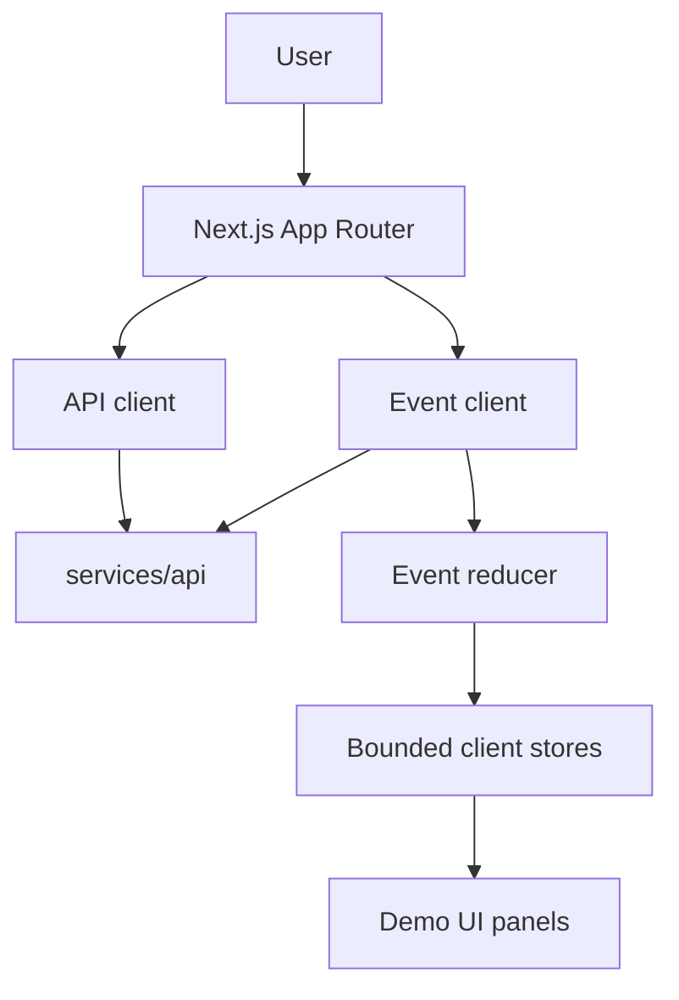
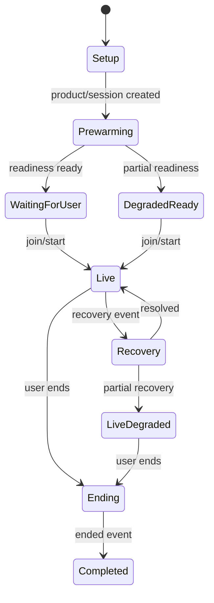
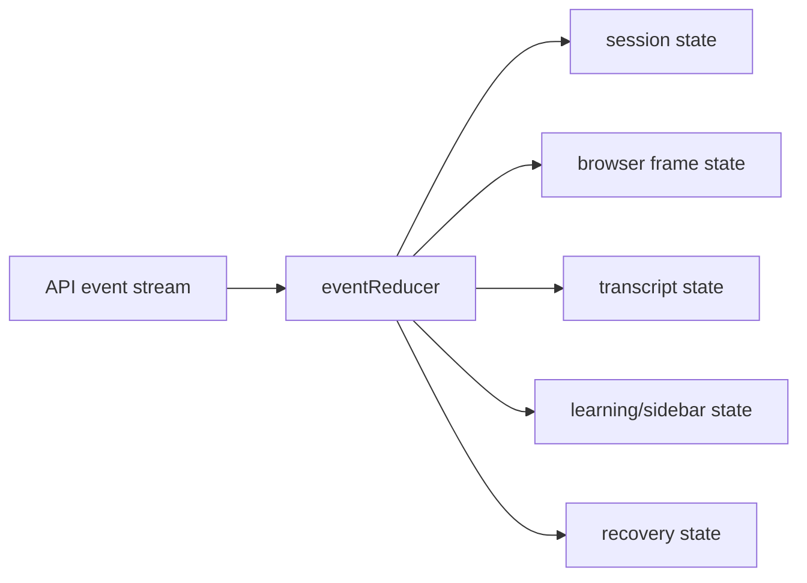
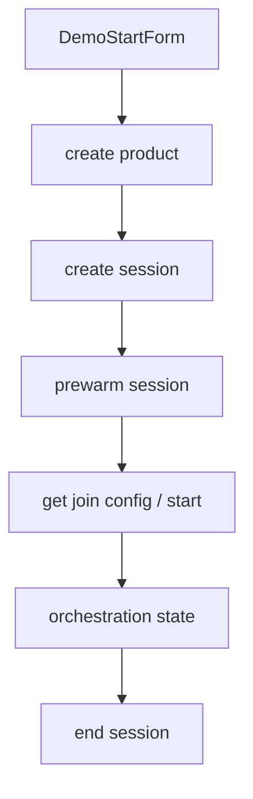

# Web App

`apps/web` is the Next.js frontend for starting and observing live demo sessions. It renders readiness, browser screen state, cursor/action events, transcript panels, learning/sidebar events, recipe progress, and session lifecycle state.

## Frontend Architecture



## Session UI Flow



## Event Reducer Inputs



The reducer consumes frontend-safe, typed orchestration and runtime events. It should not receive provider secrets, raw prompts, raw screenshots/base64, cookies, tokens, or internal service credentials.

## API Client Surface



## Verification

```bash
pnpm --filter @live-demo-agent/web lint
pnpm --filter @live-demo-agent/web typecheck
pnpm --filter @live-demo-agent/web test
```
