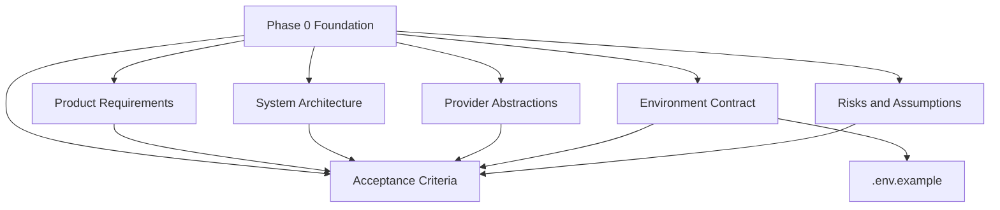
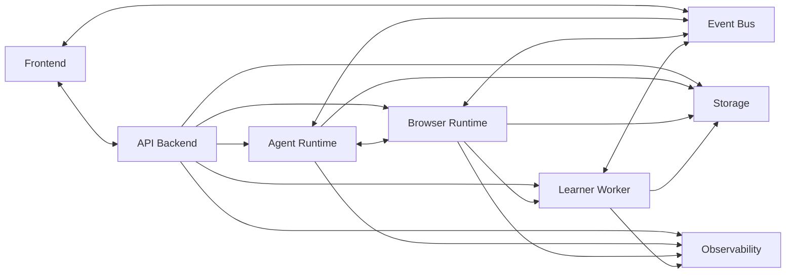
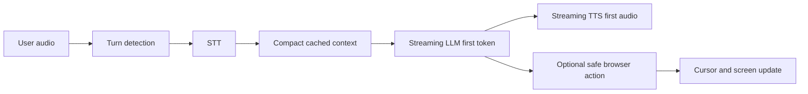
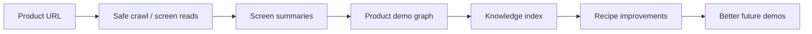
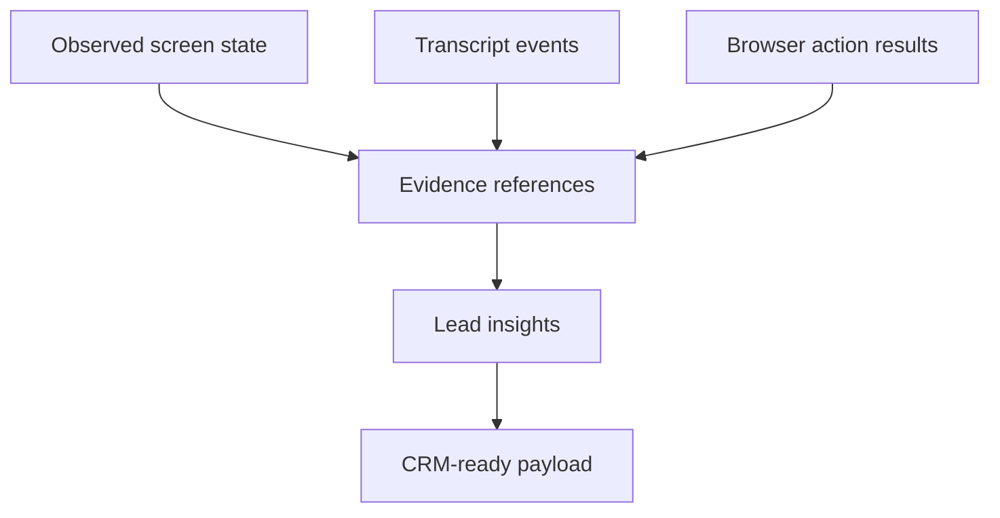
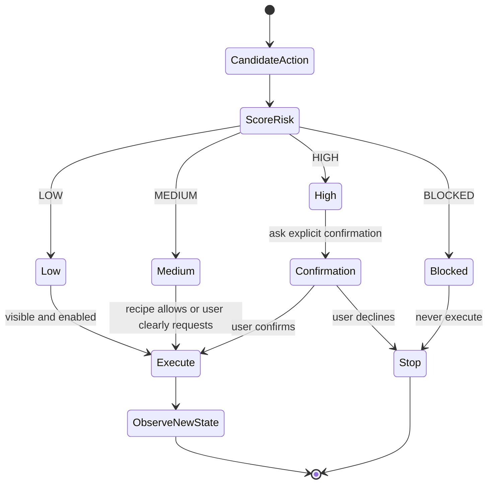
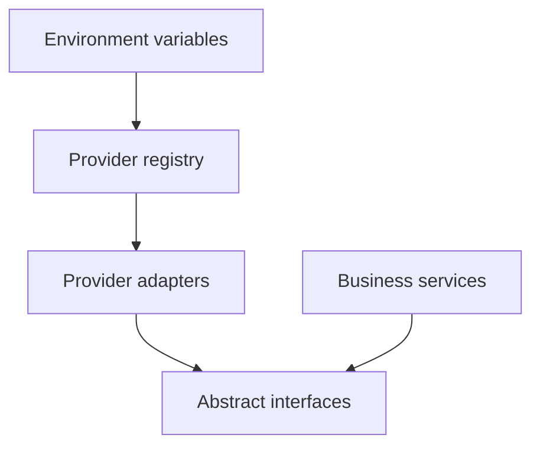

# Architecture Documentation

This directory contains the Phase 0 foundation for the live AI demo-agent platform. The documents are intended to be implementable directly by a junior engineer and defensible in a staff-level architecture review.

## Phase 0 Package

## Document Index

| Document                                                             | Main questions answered                                                                                     |
| -------------------------------------------------------------------- | ----------------------------------------------------------------------------------------------------------- |
| [phase_0_product_requirements.md](phase_0_product_requirements.md)   | What does the product do, how does the live demo feel, and what must never happen?                          |
| [phase_0_system_architecture.md](phase_0_system_architecture.md)     | Which services exist, what does each own, and what is on the hot path?                                      |
| [phase_0_provider_abstractions.md](phase_0_provider_abstractions.md) | How can NVIDIA NIM, OpenAI, Ollama, local models, and future providers swap without business-logic changes? |
| [phase_0_environment_contract.md](phase_0_environment_contract.md)   | Which environment variables exist, who reads them, and which are secrets?                                   |
| [phase_0_acceptance_criteria.md](phase_0_acceptance_criteria.md)     | What must be true before Phase 0 is accepted?                                                               |
| [phase_0_risks_and_assumptions.md](phase_0_risks_and_assumptions.md) | What can fail, what is assumed, and when is each mitigation implemented?                                    |
| [phase_1_acceptance_checklist.md](phase_1_acceptance_checklist.md)   | What must be true before Phase 1 monorepo setup is accepted?                                                |

## Architecture Views

### Runtime View

### Hot Path View

Hot-path rule: do not require crawling, full DOM injection, embeddings, or vision on every voice turn.

### Cold Path View

Cold-path rule: background learning can improve future turns but must not block first audio or live voice response.

## Data And Evidence Flow

Every extracted sales insight must reference a `transcript_event_id`, `browser_action_id`, or `screen_id`.

## Safety Flow

## Provider Switching View

Business services import interfaces only. Vendor-specific names belong inside adapters and environment variables.

## Recommended Reading Order

1. Start with [phase_0_product_requirements.md](phase_0_product_requirements.md).
2. Read [phase_0_system_architecture.md](phase_0_system_architecture.md) for service boundaries.
3. Read [phase_0_provider_abstractions.md](phase_0_provider_abstractions.md) before implementing any AI, browser, or transport integration.
4. Read [phase_0_environment_contract.md](phase_0_environment_contract.md) before adding configuration.
5. Use [phase_0_acceptance_criteria.md](phase_0_acceptance_criteria.md) as the implementation gate.
6. Review [phase_0_risks_and_assumptions.md](phase_0_risks_and_assumptions.md) before committing to Phase 1 scope.
