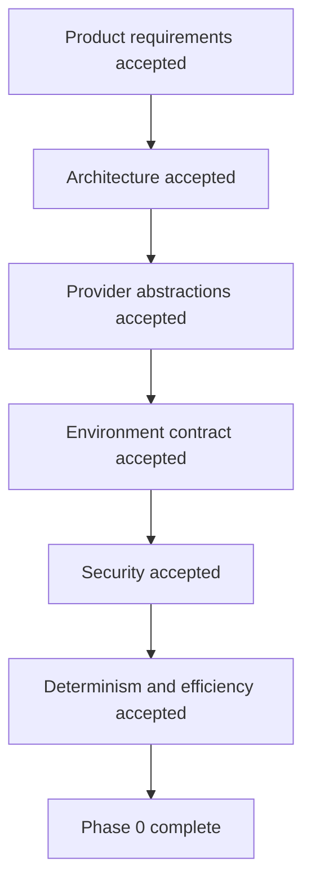

# Phase 0 Acceptance Criteria

The Phase 0 work is complete only if all criteria below are satisfied.

## Product Requirements Acceptance

[ ] Defines exact product behavior.
[ ] Covers zero-config URL mode.
[ ] Covers text guidance mode.
[ ] Covers screen-by-screen recipe mode.
[ ] Defines live browser control behavior.
[ ] Defines voice behavior and interruption behavior.
[ ] Defines cursor presentation behavior.
[ ] Defines safety behavior.
[ ] Defines no-hallucination behavior.
[ ] Defines lead summary and CRM-ready output.
[ ] Defines measurable latency targets.

## Architecture Acceptance

[ ] Defines all major services.
[ ] Defines service boundaries.
[ ] Defines hot path and cold path.
[ ] Includes Mermaid architecture diagram.
[ ] Includes Mermaid hot/cold path diagram.
[ ] Defines deterministic action hierarchy.
[ ] Defines core data structures.
[ ] Defines cybersecurity architecture constraints.
[ ] Does not put all logic into one monolith.
[ ] Does not require crawling or RAG in hot path.

## Provider Abstraction Acceptance

[ ] Defines provider categories:
    `AI_TEXT_PROVIDER`,
    `AI_VISION_PROVIDER`,
    `AI_EMBEDDING_PROVIDER`,
    `AI_STT_PROVIDER`,
    `AI_TTS_PROVIDER`,
    `BROWSER_PROVIDER`,
    `TRANSPORT_PROVIDER`.

[ ] Supports:
    `nvidia_nim`,
    `openai`,
    `ollama`,
    `custom_openai_compatible`,
    `local` providers.

[ ] Defines normalized provider interfaces.
[ ] Defines provider factory/registry.
[ ] Defines normalized errors.
[ ] Defines timeouts, retries, and circuit breakers.
[ ] Defines provider fallback behavior.
[ ] Prevents provider-specific SDK leakage into business logic.

## Environment Contract Acceptance

[ ] Provides complete `.env.example`.
[ ] Uses generic variable names.
[ ] Separates local/free mode from cloud/provider mode.
[ ] Includes AI, browser, DB, Redis, auth, observability, product URL, and safety settings.
[ ] Marks secrets clearly.
[ ] Ensures frontend never receives provider secrets.
[ ] Includes latency budget variables.
[ ] Includes safe defaults.

## Security Acceptance

[ ] Defines blocked browser actions.
[ ] Defines high-risk confirmation behavior.
[ ] Defines secret handling.
[ ] Defines domain/navigation policy.
[ ] Defines screenshot/artifact access control.
[ ] Defines audit logging requirements.
[ ] Defines input validation requirements.
[ ] Defines rate limiting requirements.

## Determinism and Efficiency Acceptance

[ ] Defines deterministic action scoring.
[ ] Defines execution threshold.
[ ] Defines bounded context limits.
[ ] Defines hot-path token budget.
[ ] Defines async learner separation.
[ ] Defines caching strategy.
[ ] Defines provider routing by latency/cost/quality.
[ ] Avoids unnecessary vision calls in hot path.
[ ] Avoids full DOM injection into LLM prompts.
