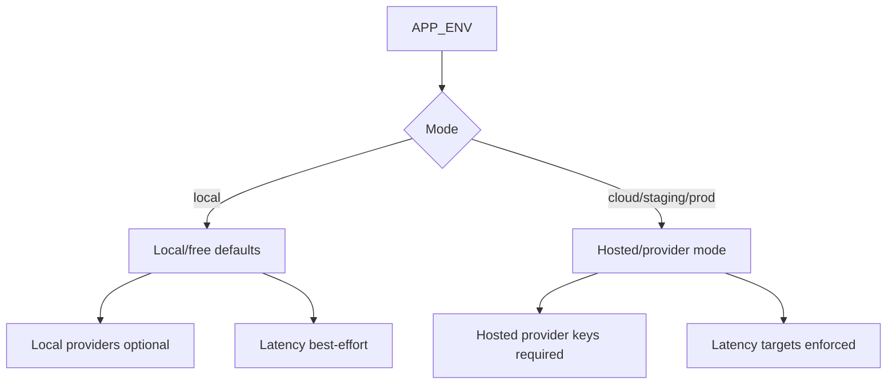
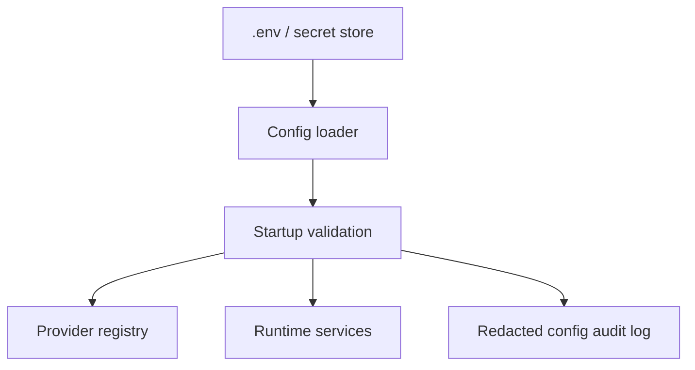

# Phase 0 Environment Variable Contract

## Objective

This contract defines all environment variables required to run the system locally and switch providers later without code changes. Core logic must read generic configuration names only. Vendor-specific variables are allowed only in provider-specific optional sections and must be consumed by provider adapters or integration adapters.

## Operating Modes



| Mode                | Purpose                                                     | Expected providers                                                                                | Requirement notes                                                                                 |
| ------------------- | ----------------------------------------------------------- | ------------------------------------------------------------------------------------------------- | ------------------------------------------------------------------------------------------------- |
| Local/free mode     | Developer runs the platform with local or free dependencies | `ollama`, `whisper_local`, `kokoro`, `small_webrtc`, `local_playwright`, MinIO, Redis, PostgreSQL | Hosted API keys optional unless selected provider requires them. Latency budgets are best-effort. |
| Cloud/provider mode | Low-latency hosted demo experience                          | Hosted text/STT/TTS/transport providers, managed browser optional                                 | Provider API keys required for selected hosted providers. Latency budgets are target SLOs.        |

## Naming Rules

- Use `AI_TEXT_*` for chat/completion LLMs.
- Use `AI_VISION_*` for screenshot/image understanding.
- Use `AI_EMBEDDING_*` for embeddings.
- Use `AI_STT_*` for speech-to-text.
- Use `AI_TTS_*` for text-to-speech.
- Use `BROWSER_*` for browser runtime.
- Use `TRANSPORT_*` for WebRTC/realtime transport.
- Use `LEARNER_*` for background product learner.
- Use `LATENCY_*` for measurable latency budgets.
- Use `DEFAULT_*` only for product/demo defaults.

Do not use vendor-specific names in core logic.

Bad:

```dotenv
NVIDIA_MODEL=
OPENAI_TEMPERATURE=
CARTESIA_VOICE=
```

Good:

```dotenv
AI_TEXT_MODEL=
AI_TEXT_TEMPERATURE=
AI_TTS_VOICE=
```

Vendor-specific variables are allowed only for provider-specific optional sections:

```dotenv
DAILY_API_KEY=
LIVEKIT_API_SECRET=
HUBSPOT_ACCESS_TOKEN=
SALESFORCE_CLIENT_ID=
```

## Security Rules

- Variables ending in `_API_KEY`, `_SECRET`, `_TOKEN`, `_ACCESS_KEY`, `_SECRET_KEY`, `_CLIENT_SECRET`, `JWT_SECRET`, and `SESSION_SECRET` are secrets.
- Secrets are backend-only and must never be exposed to frontend bundles, browser logs, or event payloads.
- `PUBLIC_BASE_URL` and non-secret UI configuration may be exposed to frontend.
- Provider base URLs are non-secret but should still be validated.
- Environment values must be captured in redacted startup logs for auditability.

## Variable Groups



### APP

Purpose: Application identity, public/API URLs, and developer demo defaults.

| Variable                 | Required local | Required cloud | Default                 | Security | Read by       |
| ------------------------ | -------------- | -------------- | ----------------------- | -------- | ------------- |
| `APP_ENV`                | Yes            | Yes            | `local`                 | Public   | all services  |
| `APP_NAME`               | Yes            | Yes            | `live-demo-agent`       | Public   | all services  |
| `PUBLIC_BASE_URL`        | Yes            | Yes            | `http://localhost:3000` | Public   | frontend, API |
| `API_BASE_URL`           | Yes            | Yes            | `http://localhost:8000` | Public   | frontend, API |
| `DEFAULT_PRODUCT_URL`    | Optional       | Optional       | sample product URL      | Public   | frontend, API |
| `DEFAULT_PRODUCT_NAME`   | Optional       | Optional       | empty                   | Public   | frontend, API |
| `DEFAULT_TARGET_PERSONA` | Optional       | Optional       | empty                   | Public   | frontend, API |

### DATABASE

Purpose: Durable relational state and vector storage.

| Variable                        | Required local | Required cloud | Default              | Security                               | Read by                                      |
| ------------------------------- | -------------- | -------------- | -------------------- | -------------------------------------- | -------------------------------------------- |
| `DATABASE_URL`                  | Yes            | Yes            | local PostgreSQL URL | Secret because it includes credentials | API, agent runtime, browser runtime, learner |
| `DATABASE_POOL_SIZE`            | Yes            | Yes            | `10`                 | Public                                 | API, workers                                 |
| `DATABASE_MAX_OVERFLOW`         | Yes            | Yes            | `20`                 | Public                                 | API, workers                                 |
| `DATABASE_POOL_TIMEOUT_SECONDS` | Yes            | Yes            | `30`                 | Public                                 | API, workers                                 |

### REDIS

Purpose: Ephemeral live state, event streams, locks, and short-lived session cache.

| Variable                    | Required local | Required cloud | Default                | Security                           | Read by                                      |
| --------------------------- | -------------- | -------------- | ---------------------- | ---------------------------------- | -------------------------------------------- |
| `REDIS_URL`                 | Yes            | Yes            | `redis://redis:6379/0` | Secret if credentials are embedded | API, agent runtime, browser runtime, learner |
| `REDIS_SESSION_TTL_SECONDS` | Yes            | Yes            | `86400`                | Public                             | API, runtime services                        |
| `REDIS_EVENT_STREAM_MAXLEN` | Yes            | Yes            | `10000`                | Public                             | API, runtime services                        |

### OBJECT STORAGE

Purpose: Screenshots, recordings, traces, and large artifacts.

| Variable                          | Required local | Required cloud     | Default                | Security | Read by                       |
| --------------------------------- | -------------- | ------------------ | ---------------------- | -------- | ----------------------------- |
| `OBJECT_STORAGE_PROVIDER`         | Yes            | Yes                | `minio`                | Public   | API, browser runtime, learner |
| `OBJECT_STORAGE_ENDPOINT`         | Yes            | Yes                | `http://minio:9000`    | Public   | API, browser runtime, learner |
| `OBJECT_STORAGE_ACCESS_KEY`       | Yes            | Yes                | `minioadmin`           | Secret   | API, browser runtime, learner |
| `OBJECT_STORAGE_SECRET_KEY`       | Yes            | Yes                | `minioadmin`           | Secret   | API, browser runtime, learner |
| `OBJECT_STORAGE_BUCKET`           | Yes            | Yes                | `demo-agent-artifacts` | Public   | API, browser runtime, learner |
| `OBJECT_STORAGE_REGION`           | Yes            | Yes                | `local`                | Public   | API, browser runtime, learner |
| `OBJECT_STORAGE_FORCE_PATH_STYLE` | Yes            | Provider-dependent | `true`                 | Public   | storage adapter               |

### AUTH AND SECURITY

Purpose: Local auth, token settings, CORS, and rate limits.

| Variable                               | Required local | Required cloud | Default                 | Security | Read by                      |
| -------------------------------------- | -------------- | -------------- | ----------------------- | -------- | ---------------------------- |
| `AUTH_PROVIDER`                        | Yes            | Yes            | `local`                 | Public   | API                          |
| `JWT_SECRET`                           | Yes            | Yes            | placeholder             | Secret   | API                          |
| `JWT_ISSUER`                           | Yes            | Yes            | `live-demo-agent`       | Public   | API                          |
| `JWT_AUDIENCE`                         | Yes            | Yes            | `live-demo-agent-users` | Public   | API                          |
| `ACCESS_TOKEN_TTL_SECONDS`             | Yes            | Yes            | `3600`                  | Public   | API                          |
| `SESSION_SECRET`                       | Yes            | Yes            | placeholder             | Secret   | API, frontend server runtime |
| `CORS_ALLOWED_ORIGINS`                 | Yes            | Yes            | `http://localhost:3000` | Public   | API                          |
| `RATE_LIMIT_SESSION_CREATE_PER_MINUTE` | Yes            | Yes            | `10`                    | Public   | API                          |
| `RATE_LIMIT_PROVIDER_CALLS_PER_MINUTE` | Yes            | Yes            | `120`                   | Public   | API, provider registry       |

### AI TEXT PROVIDER

Purpose: Chat/completion model used by realtime host, structured generation, safety classification, and summaries.

| Variable                      | Required local                       | Required cloud           | Default             | Security             | Read by                                   |
| ----------------------------- | ------------------------------------ | ------------------------ | ------------------- | -------------------- | ----------------------------------------- |
| `AI_TEXT_PROVIDER`            | Yes                                  | Yes                      | `nvidia_nim`        | Public               | provider registry, agent runtime, learner |
| `AI_TEXT_BASE_URL`            | Provider-dependent                   | Provider-dependent       | NVIDIA NIM base URL | Public               | text adapter                              |
| `AI_TEXT_API_KEY`             | Only if provider requires key        | Yes for hosted providers | empty               | Secret; backend only | text adapter                              |
| `AI_TEXT_MODEL`               | Yes unless adapter has local default | Yes                      | empty               | Public               | text adapter                              |
| `AI_TEXT_TEMPERATURE`         | Yes                                  | Yes                      | `0.0`               | Public               | text adapter                              |
| `AI_TEXT_TOP_P`               | Yes                                  | Yes                      | `1.0`               | Public               | text adapter                              |
| `AI_TEXT_MAX_OUTPUT_TOKENS`   | Yes                                  | Yes                      | `512`               | Public               | text adapter                              |
| `AI_TEXT_TIMEOUT_MS`          | Yes                                  | Yes                      | `8000`              | Public               | text adapter                              |
| `AI_TEXT_ENABLE_STREAMING`    | Yes                                  | Yes                      | `true`              | Public               | text adapter                              |
| `AI_TEXT_ENABLE_TOOL_CALLING` | Yes                                  | Yes                      | `true`              | Public               | text adapter                              |
| `AI_TEXT_ENABLE_FALLBACK`     | Optional                             | Optional                 | `false`             | Public               | provider registry                         |
| `AI_TEXT_FALLBACK_PROVIDER`   | Optional                             | Optional                 | `ollama`            | Public               | provider registry                         |

### AI VISION PROVIDER

Purpose: Screenshot/image understanding used as fallback or asynchronous enrichment.

| Variable                         | Required local                | Required cloud           | Default    | Security             | Read by                    |
| -------------------------------- | ----------------------------- | ------------------------ | ---------- | -------------------- | -------------------------- |
| `AI_VISION_PROVIDER`             | Yes                           | Yes                      | `disabled` | Public               | provider registry, learner |
| `AI_VISION_BASE_URL`             | Provider-dependent            | Provider-dependent       | empty      | Public               | vision adapter             |
| `AI_VISION_API_KEY`              | Only if provider requires key | Yes for hosted providers | empty      | Secret; backend only | vision adapter             |
| `AI_VISION_MODEL`                | Required if enabled           | Required if enabled      | empty      | Public               | vision adapter             |
| `AI_VISION_TIMEOUT_MS`           | Yes                           | Yes                      | `15000`    | Public               | vision adapter             |
| `AI_VISION_MAX_IMAGE_SIZE_BYTES` | Yes                           | Yes                      | `3000000`  | Public               | vision adapter             |
| `AI_VISION_USE_ONLY_AS_FALLBACK` | Yes                           | Yes                      | `true`     | Public               | learner, agent runtime     |

### AI EMBEDDING PROVIDER

Purpose: Product knowledge indexing and retrieval.

| Variable                     | Required local                | Required cloud           | Default               | Security             | Read by                                    |
| ---------------------------- | ----------------------------- | ------------------------ | --------------------- | -------------------- | ------------------------------------------ |
| `AI_EMBEDDING_PROVIDER`      | Yes                           | Yes                      | `ollama`              | Public               | provider registry, learner                 |
| `AI_EMBEDDING_BASE_URL`      | Provider-dependent            | Provider-dependent       | `http://ollama:11434` | Public               | embedding adapter                          |
| `AI_EMBEDDING_API_KEY`       | Only if provider requires key | Yes for hosted providers | empty                 | Secret; backend only | embedding adapter                          |
| `AI_EMBEDDING_MODEL`         | Yes                           | Yes                      | `nomic-embed-text`    | Public               | embedding adapter                          |
| `AI_EMBEDDING_DIMENSIONS`    | Yes                           | Yes                      | `768`                 | Public               | embedding adapter, DB migration validation |
| `AI_EMBEDDING_BATCH_SIZE`    | Yes                           | Yes                      | `32`                  | Public               | embedding adapter                          |
| `AI_EMBEDDING_TIMEOUT_MS`    | Yes                           | Yes                      | `15000`               | Public               | embedding adapter                          |
| `AI_EMBEDDING_CACHE_ENABLED` | Yes                           | Yes                      | `true`                | Public               | learner                                    |

### LOCAL OLLAMA

Purpose: Shared local model server settings for local/free mode.

| Variable                 | Required local                  | Required cloud | Default               | Security | Read by           |
| ------------------------ | ------------------------------- | -------------- | --------------------- | -------- | ----------------- |
| `OLLAMA_BASE_URL`        | If Ollama is selected           | No             | `http://ollama:11434` | Public   | Ollama adapters   |
| `OLLAMA_TEXT_MODEL`      | If Ollama text is selected      | No             | empty                 | Public   | text adapter      |
| `OLLAMA_EMBEDDING_MODEL` | If Ollama embedding is selected | No             | `nomic-embed-text`    | Public   | embedding adapter |
| `OLLAMA_TIMEOUT_MS`      | If Ollama is selected           | No             | `30000`               | Public   | Ollama adapters   |

### SPEECH TO TEXT PROVIDER

Purpose: Streaming and file transcription.

| Variable                 | Required local                | Required cloud           | Default         | Security             | Read by                          |
| ------------------------ | ----------------------------- | ------------------------ | --------------- | -------------------- | -------------------------------- |
| `AI_STT_PROVIDER`        | Yes                           | Yes                      | `whisper_local` | Public               | provider registry, agent runtime |
| `AI_STT_BASE_URL`        | Provider-dependent            | Provider-dependent       | empty           | Public               | STT adapter                      |
| `AI_STT_API_KEY`         | Only if provider requires key | Yes for hosted providers | empty           | Secret; backend only | STT adapter                      |
| `AI_STT_MODEL`           | Yes                           | Yes                      | `base`          | Public               | STT adapter                      |
| `AI_STT_LANGUAGE`        | Optional                      | Optional                 | `en`            | Public               | STT adapter                      |
| `AI_STT_DEVICE`          | Local mode only               | No                       | `cpu`           | Public               | local STT adapter                |
| `AI_STT_ENABLE_PARTIALS` | Yes                           | Yes                      | `true`          | Public               | agent runtime                    |
| `AI_STT_TIMEOUT_MS`      | Yes                           | Yes                      | `10000`         | Public               | STT adapter                      |

### TEXT TO SPEECH PROVIDER

Purpose: Streaming speech synthesis and interruption support.

| Variable                  | Required local                | Required cloud           | Default           | Security             | Read by                          |
| ------------------------- | ----------------------------- | ------------------------ | ----------------- | -------------------- | -------------------------------- |
| `AI_TTS_PROVIDER`         | Yes                           | Yes                      | `kokoro`          | Public               | provider registry, agent runtime |
| `AI_TTS_BASE_URL`         | Provider-dependent            | Provider-dependent       | `http://tts:8100` | Public               | TTS adapter                      |
| `AI_TTS_API_KEY`          | Only if provider requires key | Yes for hosted providers | empty             | Secret; backend only | TTS adapter                      |
| `AI_TTS_MODEL`            | Provider-dependent            | Provider-dependent       | empty             | Public               | TTS adapter                      |
| `AI_TTS_VOICE`            | Yes                           | Yes                      | `default`         | Public               | TTS adapter                      |
| `AI_TTS_SAMPLE_RATE`      | Yes                           | Yes                      | `24000`           | Public               | TTS adapter                      |
| `AI_TTS_ENABLE_STREAMING` | Yes                           | Yes                      | `true`            | Public               | TTS adapter                      |
| `AI_TTS_ENABLE_CACHE`     | Optional                      | Optional                 | `true`            | Public               | TTS adapter                      |
| `AI_TTS_TIMEOUT_MS`       | Yes                           | Yes                      | `10000`           | Public               | TTS adapter                      |

### REALTIME TRANSPORT

Purpose: Realtime voice/video session transport.

| Variable                     | Required local | Required cloud      | Default        | Security                 | Read by                               |
| ---------------------------- | -------------- | ------------------- | -------------- | ------------------------ | ------------------------------------- |
| `TRANSPORT_PROVIDER`         | Yes            | Yes                 | `small_webrtc` | Public                   | provider registry, API, agent runtime |
| `TRANSPORT_ROOM_TTL_SECONDS` | Yes            | Yes                 | `3600`         | Public                   | transport adapter                     |
| `TRANSPORT_ENABLE_VIDEO`     | Yes            | Yes                 | `true`         | Public                   | transport adapter                     |
| `TRANSPORT_ENABLE_AUDIO`     | Yes            | Yes                 | `true`         | Public                   | transport adapter                     |
| `DAILY_API_KEY`              | No             | If Daily selected   | empty          | Secret                   | Daily adapter                         |
| `DAILY_DOMAIN`               | No             | If Daily selected   | empty          | Public                   | Daily adapter                         |
| `DAILY_ROOM_URL`             | No             | Optional            | empty          | Public or session-scoped | Daily adapter                         |
| `LIVEKIT_URL`                | No             | If LiveKit selected | empty          | Public                   | LiveKit adapter                       |
| `LIVEKIT_API_KEY`            | No             | If LiveKit selected | empty          | Secret                   | LiveKit adapter                       |
| `LIVEKIT_API_SECRET`         | No             | If LiveKit selected | empty          | Secret                   | LiveKit adapter                       |

### PIPECAT AGENT RUNTIME

Purpose: Realtime agent runtime behavior and turn-taking.

| Variable                              | Required local | Required cloud | Default  | Security | Read by       |
| ------------------------------------- | -------------- | -------------- | -------- | -------- | ------------- |
| `PIPECAT_LOG_LEVEL`                   | Yes            | Yes            | `info`   | Public   | agent runtime |
| `PIPECAT_ENABLE_INTERRUPTION`         | Yes            | Yes            | `true`   | Public   | agent runtime |
| `PIPECAT_ENABLE_SMART_TURN`           | Yes            | Yes            | `true`   | Public   | agent runtime |
| `PIPECAT_VAD_PROVIDER`                | Yes            | Yes            | `silero` | Public   | agent runtime |
| `PIPECAT_VAD_CONFIDENCE`              | Yes            | Yes            | `0.7`    | Public   | agent runtime |
| `PIPECAT_MAX_SILENCE_MS`              | Yes            | Yes            | `800`    | Public   | agent runtime |
| `PIPECAT_MAX_AGENT_MONOLOGUE_SECONDS` | Yes            | Yes            | `10`     | Public   | agent runtime |

### BROWSER PROVIDER

Purpose: Isolated browser automation and normalized screen reads.

| Variable                            | Required local | Required cloud | Default            | Security | Read by                            |
| ----------------------------------- | -------------- | -------------- | ------------------ | -------- | ---------------------------------- |
| `BROWSER_PROVIDER`                  | Yes            | Yes            | `local_playwright` | Public   | provider registry, browser runtime |
| `BROWSER_HEADLESS`                  | Yes            | Yes            | `true`             | Public   | browser runtime                    |
| `BROWSER_VIEWPORT_WIDTH`            | Yes            | Yes            | `1440`             | Public   | browser runtime                    |
| `BROWSER_VIEWPORT_HEIGHT`           | Yes            | Yes            | `900`              | Public   | browser runtime                    |
| `BROWSER_TIMEOUT_MS`                | Yes            | Yes            | `15000`            | Public   | browser runtime                    |
| `BROWSER_ACTION_TIMEOUT_MS`         | Yes            | Yes            | `5000`             | Public   | browser runtime                    |
| `BROWSER_NAVIGATION_TIMEOUT_MS`     | Yes            | Yes            | `15000`            | Public   | browser runtime                    |
| `BROWSER_MAX_CONCURRENT_SESSIONS`   | Yes            | Yes            | `3`                | Public   | browser runtime                    |
| `BROWSER_ENABLE_SCREENSHOTS`        | Yes            | Yes            | `true`             | Public   | browser runtime                    |
| `BROWSER_SCREENSHOT_FORMAT`         | Yes            | Yes            | `webp`             | Public   | browser runtime                    |
| `BROWSER_SCREENSHOT_QUALITY`        | Yes            | Yes            | `70`               | Public   | browser runtime                    |
| `BROWSER_ALLOWED_DOMAINS`           | Optional       | Recommended    | empty              | Public   | browser runtime                    |
| `BROWSER_BLOCK_EXTERNAL_NAVIGATION` | Yes            | Yes            | `true`             | Public   | browser runtime                    |
| `BROWSER_CLOSE_AFTER_SESSION`       | Yes            | Yes            | `true`             | Public   | browser runtime                    |

### CURSOR AND PRESENTATION

Purpose: Synthetic cursor and element-highlight UX.

| Variable                        | Required local | Required cloud | Default        | Security | Read by                   |
| ------------------------------- | -------------- | -------------- | -------------- | -------- | ------------------------- |
| `CURSOR_ENABLE_OVERLAY`         | Yes            | Yes            | `true`         | Public   | frontend, browser runtime |
| `CURSOR_MOVE_MIN_DURATION_MS`   | Yes            | Yes            | `250`          | Public   | browser runtime, frontend |
| `CURSOR_MOVE_MAX_DURATION_MS`   | Yes            | Yes            | `700`          | Public   | browser runtime, frontend |
| `CURSOR_EASING`                 | Yes            | Yes            | `easeOutCubic` | Public   | frontend                  |
| `CURSOR_CLICK_RIPPLE_ENABLED`   | Yes            | Yes            | `true`         | Public   | frontend                  |
| `ELEMENT_HIGHLIGHT_DURATION_MS` | Yes            | Yes            | `1200`         | Public   | frontend, browser runtime |

### DEMO SAFETY POLICY

Purpose: Browser action guardrails and risk thresholds.

| Variable                             | Required local | Required cloud | Default             | Security | Read by                        |
| ------------------------------------ | -------------- | -------------- | ------------------- | -------- | ------------------------------ |
| `ALLOW_DESTRUCTIVE_ACTIONS`          | Yes            | Yes            | `false`             | Public   | browser runtime, API           |
| `REQUIRE_CONFIRMATION_FOR_HIGH_RISK` | Yes            | Yes            | `true`              | Public   | browser runtime, agent runtime |
| `ACTION_EXECUTION_SCORE_THRESHOLD`   | Yes            | Yes            | `0.72`              | Public   | browser runtime                |
| `DEFAULT_NEVER_CLICK`                | Yes            | Yes            | blocked labels list | Public   | browser runtime                |
| `ALLOW_FILE_UPLOADS`                 | Yes            | Yes            | `false`             | Public   | browser runtime                |
| `ALLOW_DOWNLOADS`                    | Yes            | Yes            | `false`             | Public   | browser runtime                |
| `ALLOW_PAYMENT_PAGES`                | Yes            | Yes            | `false`             | Public   | browser runtime                |
| `ALLOW_EXTERNAL_EMAIL_ACTIONS`       | Yes            | Yes            | `false`             | Public   | browser runtime                |

### PRODUCT LEARNER

Purpose: Background crawling, summarization, graph building, and indexing.

| Variable                            | Required local | Required cloud | Default | Security | Read by      |
| ----------------------------------- | -------------- | -------------- | ------- | -------- | ------------ |
| `LEARNER_ENABLED`                   | Yes            | Yes            | `true`  | Public   | learner, API |
| `LEARNER_MAX_PAGES_PER_PRODUCT`     | Yes            | Yes            | `20`    | Public   | learner      |
| `LEARNER_MAX_DEPTH`                 | Yes            | Yes            | `2`     | Public   | learner      |
| `LEARNER_REQUEST_TIMEOUT_MS`        | Yes            | Yes            | `10000` | Public   | learner      |
| `LEARNER_SCREEN_SUMMARY_TIMEOUT_MS` | Yes            | Yes            | `15000` | Public   | learner      |
| `LEARNER_BACKGROUND_CONCURRENCY`    | Yes            | Yes            | `2`     | Public   | learner      |
| `LEARNER_USE_VISION_FALLBACK`       | Yes            | Yes            | `false` | Public   | learner      |

### MEMORY AND CONTEXT

Purpose: Bounded hot-path context and retrieval controls.

| Variable                           | Required local | Required cloud | Default  | Security | Read by                        |
| ---------------------------------- | -------------- | -------------- | -------- | -------- | ------------------------------ |
| `CONTEXT_MAX_RECENT_TURNS`         | Yes            | Yes            | `8`      | Public   | agent runtime                  |
| `CONTEXT_MAX_SAFE_ACTIONS`         | Yes            | Yes            | `8`      | Public   | agent runtime, browser runtime |
| `CONTEXT_MAX_RETRIEVED_FACTS`      | Yes            | Yes            | `5`      | Public   | agent runtime, learner         |
| `CONTEXT_MAX_TOKENS_HOT_PATH`      | Yes            | Yes            | `3000`   | Public   | agent runtime                  |
| `KNOWLEDGE_RETRIEVAL_TOP_K`        | Yes            | Yes            | `5`      | Public   | learner, agent runtime         |
| `KNOWLEDGE_RETRIEVAL_MIN_SCORE`    | Yes            | Yes            | `0.72`   | Public   | learner, agent runtime         |
| `SCREEN_SUMMARY_CACHE_TTL_SECONDS` | Yes            | Yes            | `604800` | Public   | browser runtime, learner       |

### POST DEMO INTELLIGENCE

Purpose: Lead summary generation and CRM export.

| Variable                   | Required local | Required cloud         | Default | Security             | Read by                  |
| -------------------------- | -------------- | ---------------------- | ------- | -------------------- | ------------------------ |
| `LEAD_SUMMARY_ENABLED`     | Yes            | Yes                    | `true`  | Public               | learner/post-demo worker |
| `CRM_EXPORT_PROVIDER`      | Yes            | Yes                    | `mock`  | Public               | CRM adapter              |
| `CRM_EXPORT_ENABLED`       | Yes            | Yes                    | `false` | Public               | CRM adapter              |
| `CRM_WEBHOOK_URL`          | Optional       | If webhook selected    | empty   | Secret or restricted | CRM adapter              |
| `HUBSPOT_ACCESS_TOKEN`     | No             | If HubSpot selected    | empty   | Secret               | HubSpot adapter          |
| `SALESFORCE_CLIENT_ID`     | No             | If Salesforce selected | empty   | Secret               | Salesforce adapter       |
| `SALESFORCE_CLIENT_SECRET` | No             | If Salesforce selected | empty   | Secret               | Salesforce adapter       |
| `SALESFORCE_REFRESH_TOKEN` | No             | If Salesforce selected | empty   | Secret               | Salesforce adapter       |

### OBSERVABILITY

Purpose: Logs, metrics, traces, and debugging.

| Variable                      | Required local | Required cloud | Default                      | Security | Read by       |
| ----------------------------- | -------------- | -------------- | ---------------------------- | -------- | ------------- |
| `LOG_LEVEL`                   | Yes            | Yes            | `info`                       | Public   | all services  |
| `LOG_FORMAT`                  | Yes            | Yes            | `json`                       | Public   | all services  |
| `ENABLE_TRACING`              | Yes            | Yes            | `true`                       | Public   | all services  |
| `OTEL_SERVICE_NAME`           | Yes            | Yes            | `live-demo-agent`            | Public   | all services  |
| `OTEL_EXPORTER_OTLP_ENDPOINT` | Optional       | Yes            | `http://otel-collector:4317` | Public   | all services  |
| `OTEL_EXPORTER_OTLP_PROTOCOL` | Optional       | Yes            | `grpc`                       | Public   | all services  |
| `PROMETHEUS_ENABLED`          | Yes            | Yes            | `true`                       | Public   | API, runtimes |
| `PROMETHEUS_PORT`             | Yes            | Yes            | `9090`                       | Public   | API, runtimes |
| `JAEGER_ENABLED`              | Yes            | Yes            | `true`                       | Public   | all services  |
| `LOKI_ENABLED`                | Yes            | Yes            | `true`                       | Public   | all services  |

### LATENCY BUDGETS

Purpose: Measurable latency targets for tests, dashboards, and alerts.

| Variable                                      | Required local | Required cloud | Default | Security | Read by                        |
| --------------------------------------------- | -------------- | -------------- | ------- | -------- | ------------------------------ |
| `LATENCY_FIRST_AUDIO_P50_TARGET_MS`           | Yes            | Yes            | `900`   | Public   | observability, agent runtime   |
| `LATENCY_FIRST_AUDIO_P95_TARGET_MS`           | Yes            | Yes            | `1500`  | Public   | observability, agent runtime   |
| `LATENCY_CONTEXT_BUILD_TARGET_MS`             | Yes            | Yes            | `50`    | Public   | observability, agent runtime   |
| `LATENCY_BROWSER_ACTION_VALIDATION_TARGET_MS` | Yes            | Yes            | `50`    | Public   | observability, browser runtime |
| `LATENCY_CURSOR_EVENT_TARGET_MS`              | Yes            | Yes            | `100`   | Public   | observability, browser runtime |
| `LATENCY_SCREEN_READ_TARGET_MS`               | Yes            | Yes            | `800`   | Public   | observability, browser runtime |

### DEVELOPMENT

Purpose: Local development toggles.

| Variable                  | Required local | Required cloud | Default | Security | Read by           |
| ------------------------- | -------------- | -------------- | ------- | -------- | ----------------- |
| `DEV_ENABLE_DEBUG_PANEL`  | Optional       | No             | `true`  | Public   | frontend, API     |
| `DEV_ENABLE_FAKE_USER`    | Optional       | No             | `false` | Public   | frontend, API     |
| `DEV_ENABLE_MOCK_LLM`     | Optional       | No             | `false` | Public   | provider registry |
| `DEV_ENABLE_MOCK_STT`     | Optional       | No             | `false` | Public   | provider registry |
| `DEV_ENABLE_MOCK_TTS`     | Optional       | No             | `false` | Public   | provider registry |
| `DEV_ENABLE_MOCK_BROWSER` | Optional       | No             | `false` | Public   | provider registry |

## Startup Validation Rules

- Fail startup if a selected hosted provider requires an API key and its key is empty.
- Fail startup if `AI_EMBEDDING_DIMENSIONS` does not match the configured vector index.
- Fail startup if `ACTION_EXECUTION_SCORE_THRESHOLD` is outside `0.0` through `1.0`.
- Fail startup if JWT or session secrets still use placeholder values outside local mode.
- Warn if `BROWSER_ALLOWED_DOMAINS` is empty in cloud mode.
- Warn if destructive actions are enabled.
- Warn if tracing is disabled outside local mode.
- Redact secrets in all config validation logs.
