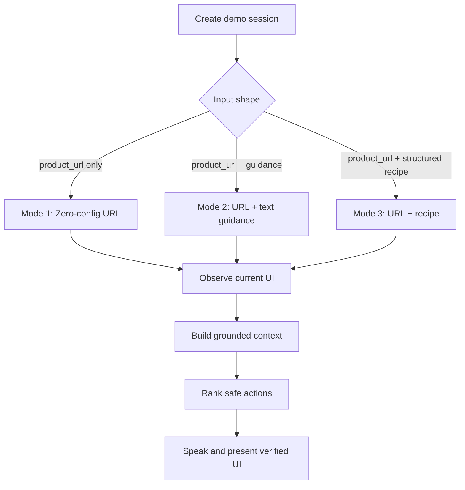
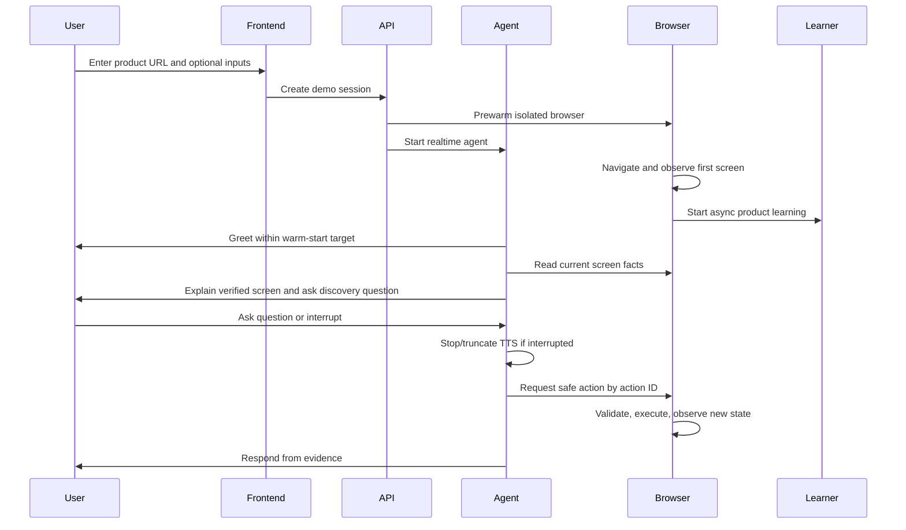
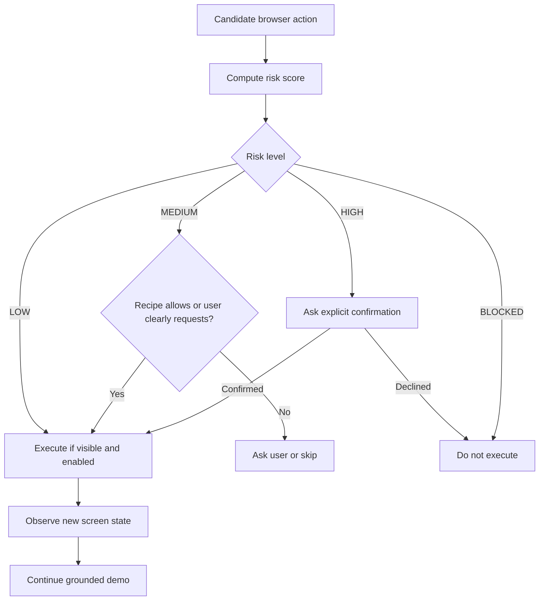
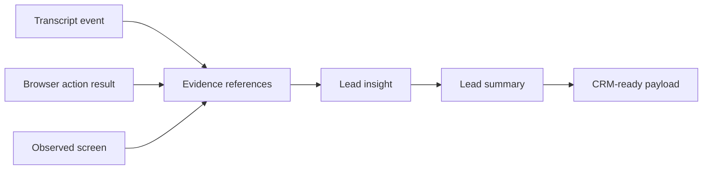

# Phase 0 Product Requirements

## Product Definition

The product is a live AI demo agent that joins a real-time voice/video session, opens a configured product URL in an isolated browser, learns the interface, presents the product conversationally, controls the browser through validated safe actions, answers questions grounded in the live UI and approved knowledge, adapts the demo to the user's role and intent, and generates CRM-ready lead intelligence after the session.

## Product Goals

- Run a credible live product demo from any reachable product URL.
- Minimize response latency while keeping browser actions deterministic and auditable.
- Ground every product claim in visible UI, approved guidance, approved recipes, retrieved knowledge, or prior observed state.
- Allow provider switching without changing business logic.
- Keep browser authority outside the LLM.
- Produce transcript, lead intelligence, evidence references, and CRM-ready output after the demo.

## Operating Modes



### Mode 1: Zero-Config URL Mode

Input:

```json
{
  "product_url": "https://example.com"
}
```

Behavior:

- Open `product_url` in one isolated controlled browser context.
- Read DOM, accessibility tree, visible text, buttons, links, inputs, and screenshot.
- Infer product category and first-screen purpose from observed evidence.
- Generate a provisional demo path from visible navigation and safe actions.
- Speak only from visible or evidenced information.
- Use cautious language when confidence is low.
- Avoid risky or blocked actions unless an explicit user confirmation flow allows them.

Required first-turn style:

> "I'm opening the product now. I'll start with what I can verify on screen and adapt as we explore."

### Mode 2: URL + Text Guidance Mode

Input:

```json
{
  "product_url": "https://example.com",
  "product_name": "string",
  "target_persona": "string",
  "positioning": "string",
  "demo_goals": ["string"],
  "what_to_show": ["string"],
  "what_to_avoid": ["string"],
  "common_questions": ["string"],
  "objection_notes": ["string"]
}
```

Behavior:

- Use guidance to shape the talk track, discovery questions, and demo priorities.
- Use `what_to_avoid` to reduce irrelevant or unsafe exploration.
- Convert guidance into a draft structured demo recipe in a later phase.
- Verify visible UI before making claims about current product behavior.
- Treat guidance as approved knowledge only for claims explicitly stated in the guidance.
- Resolve conflicts in favor of live UI evidence and safety policy.

### Mode 3: URL + Screen-By-Screen Recipe Mode

Input:

```json
{
  "product_url": "https://example.com",
  "structured_demo_recipe": {
    "recipe_id": "string",
    "steps": []
  }
}
```

Behavior:

- Follow the recipe as the preferred deterministic path.
- Match recipe steps to live UI elements using labels, roles, accessibility names, URL path, and element fingerprints.
- Track step status: `pending`, `active`, `completed`, `skipped`, `failed`, `blocked`.
- Recover if a step cannot be found by rereading the screen, scrolling, using known graph edges, or asking the user.
- Never click blocked actions.
- Ask explicit confirmation for high-risk actions.
- Emit recipe-step evidence for the transcript and lead intelligence pipeline.

## Live User Experience



1. User opens the demo page.
2. User enters product URL and optional guidance or recipe.
3. System validates input and creates a demo session.
4. Backend prewarms browser and configured AI providers.
5. Agent joins the voice session through the configured transport.
6. Agent greets the user.
7. Agent starts learning the product from the first observed screen.
8. Browser viewport appears in the frontend.
9. Cursor overlay shows human-like movement.
10. Agent explains the current screen using grounded evidence.
11. Agent asks one short discovery question.
12. User asks a question or gives direction.
13. Agent answers from evidence or shows relevant UI.
14. Agent uses safe browser actions only.
15. Agent adapts based on user role, stated intent, and observed interest.
16. Agent handles interruption by stopping or truncating TTS.
17. Agent ends with a concise recap.
18. System generates transcript, lead summary, and CRM-ready payload.

## Voice Requirements

### Behavior

- Agent first greeting must begin within 1.5 seconds after session start in warm state.
- Agent should start first audio response at p50 <= 900 ms after user turn end in optimized mode.
- Agent should start first audio response at p95 <= 1500 ms after user turn end in optimized mode.
- Agent must support user interruption and barge-in.
- Agent responses should normally be 1-3 sentences.
- Agent must not monologue for more than 10 seconds without checking in.
- Agent must stop or truncate TTS when the user interrupts.
- Agent must prefer a short acknowledgement plus action when browser work takes longer than one voice turn.

### Hot-Path Latency Formula

```text
T_response =
  T_turn_detection
+ T_STT
+ T_context_build
+ T_LLM_first_token
+ T_TTS_first_audio
+ T_network_playout
```

### Target Budgets

| Metric | Target |
| --- | --- |
| p50 first audio latency after user turn end | <= 900 ms |
| p95 first audio latency after user turn end | <= 1500 ms |
| Context build latency from cache | <= 50 ms |
| Browser action validation latency | <= 50 ms |
| Cursor event emission latency | <= 100 ms |
| First greeting in warm state | <= 1500 ms |

Local/free mode is best-effort. Optimized provider/API mode is the target mode for these budgets.

## Browser-Control Requirements

### Required Behavior

- Create one isolated browser context per demo session.
- Open arbitrary product URLs after URL validation and domain policy checks.
- Extract normalized visible UI state after navigation and every action.
- Execute browser actions only through validated action IDs.
- Let the LLM choose from precomputed safe actions, not raw selectors.
- Never allow the LLM to directly execute JavaScript.
- Never give raw unrestricted selectors to the LLM as executable authority.
- Browser controller must validate every command before execution.
- Browser controller must observe and persist new screen state after every action.

### Required Safe Browser Actions

- `read_current_screen`
- `highlight_element`
- `click_element`
- `type_into_element`
- `type_demo_text`
- `scroll`
- `go_back`
- `navigate_to_allowed_url`
- `wait_for_idle`
- `take_screenshot`

### Forbidden By Default

- `delete`
- `remove`
- `send`
- `invite`
- `publish`
- `purchase`
- `payment`
- `billing`
- `upgrade`
- `account settings`
- `export sensitive data`
- `connect integration`
- `external navigation`
- `file upload`
- `download sensitive data`

## Human-Like Cursor Requirements

Actual browser action:

- Browser provider, such as Playwright, performs deterministic action execution.

Visual cursor:

- Frontend renders a synthetic cursor overlay from backend cursor events.

Reason:

- Real OS cursor movement is unreliable in headless and cloud environments.
- Synthetic cursor movement gives a human-like presentation without sacrificing deterministic browser execution.

Required cursor events:

- `cursor.move`
- `cursor.click`
- `cursor.ripple`
- `element.highlight`
- `element.unhighlight`
- `action.started`
- `action.completed`

Cursor performance:

- Cursor movement event must be sent before click execution.
- Cursor movement duration should be 250-700 ms depending on distance.
- Cursor path must use deterministic easing, such as `easeOutCubic` or a quadratic Bezier curve.
- Cursor target must default to element bounding-box center unless configured otherwise.
- Cursor event emission must target <= 100 ms from action start.

## Product Learning Requirements

The learner must eventually:

- Read the first screen.
- Extract product name if visible.
- Infer product category with confidence.
- Identify primary navigation.
- Identify forms, buttons, links, filters, cards, tables, charts, and modals.
- Detect safe actions.
- Detect risky actions.
- Generate a provisional demo route.
- Build a product/demo graph over time.
- Store reusable screen summaries.
- Update confidence from successful and failed actions.

### Product Graph Data Model

`ScreenNode`:

```yaml
screen_id: string
product_id: string
url: string
url_path: string
title: string
screen_hash: string
summary: string
visible_text: list[string]
elements: list[UIElement]
safe_actions: list[SafeAction]
risk_actions: list[SafeAction]
confidence: float
```

`ActionEdge`:

```yaml
edge_id: string
product_id: string
from_screen_id: string
to_screen_id: string
action_type: string
action_label: string
element_fingerprint: string
risk_level: LOW | MEDIUM | HIGH | BLOCKED
success_count: integer
failure_count: integer
confidence: float
average_latency_ms: integer
```

Screen hash:

```text
screen_hash = Hash(
    normalize(url_path)
  + normalize(visible_text_keywords)
  + normalize(accessibility_tree_signature)
  + normalize(layout_signature)
)
```

Hash requirement:

- Use a stable non-cryptographic hash for speed.
- Handle collisions by comparing `product_id`, normalized URL path, title, visible text signature, and layout signature.

## Safety Requirements



### Deterministic Risk Levels

| Risk level | Examples |
| --- | --- |
| LOW | highlight, scroll, open dashboard, open reports, change harmless filters |
| MEDIUM | type demo text, change local filters, open modal, select dropdown |
| HIGH | submit form, export data, invite user, connect integration, change setting |
| BLOCKED | delete, payment, billing, publish, send email, remove data, destructive action |

### Decision Table

| Risk level | Decision |
| --- | --- |
| LOW | Execute if visible and enabled. |
| MEDIUM | Execute if recipe allows it or user intent clearly requests it. |
| HIGH | Ask explicit confirmation before execution. |
| BLOCKED | Do not execute. |

### Action Risk Score

```text
risk_score(action) =
  w_label * label_risk
+ w_role * role_risk
+ w_context * surrounding_text_risk
+ w_recipe * recipe_forbidden_match
+ w_domain * domain_risk
```

Default weights:

```text
w_label = 0.35
w_role = 0.15
w_context = 0.25
w_recipe = 0.20
w_domain = 0.05
```

Action is blocked if:

- `risk_score >= 0.85`
- OR label matches `DEFAULT_NEVER_CLICK`
- OR action violates recipe policy
- OR action navigates outside the allowed domain without confirmation

## No-Hallucination Requirements

The agent may make product claims only if sourced from one of:

- Current visible screen.
- Extracted DOM or accessibility text.
- Approved text guidance.
- Approved demo recipe.
- Retrieved product knowledge.
- Previous observed browser state.

Required uncertain-inference language:

- "From what I can see, this appears to be..."
- "I can verify this part on screen..."
- "I don't see that option yet, but I can look for it."

Prohibited unsupported claim example:

- The agent must not say "This integrates with Salesforce" unless Salesforce is visible, documented in approved guidance, documented in the approved recipe, retrieved from approved knowledge, or observed in prior browser state.

## Lead Summary Requirements



Final output shape:

```json
{
  "session_id": "string",
  "product_id": "string",
  "lead": {
    "name": null,
    "email": null,
    "company": null,
    "role": null
  },
  "demo_summary": {
    "duration_seconds": 0,
    "features_shown": [],
    "questions_asked": [],
    "screens_visited": [],
    "recipe_steps_completed": []
  },
  "qualification": {
    "pain_points": [],
    "use_cases": [],
    "objections": [],
    "buying_signals": [],
    "urgency_level": "unknown",
    "confidence": 0.0
  },
  "recommended_follow_up": "string",
  "crm_payload": {
    "provider": "mock",
    "objects": []
  }
}
```

Every extracted insight must reference evidence:

- `transcript_event_id`
- `browser_action_id`
- `screen_id`

Lead intelligence rules:

- Do not infer personal data that was not provided by the user, transcript, authenticated profile, or approved CRM context.
- Keep unsupported qualification fields empty or `unknown`.
- Store insight confidence as a number from `0.0` to `1.0`.
- Emit CRM payload through a provider adapter, starting with `mock`.

## Multi-Provider Requirements

- All AI, browser, and realtime transport providers must be selected by environment variables.
- Business logic must depend on abstract provider interfaces only.
- NVIDIA NIM, OpenAI, Ollama, local models, and custom OpenAI-compatible providers must all fit behind the same text, vision, and embedding interfaces.
- Local/free mode must be runnable without paid hosted AI services when local dependencies are installed.
- Cloud/fast mode must support hosted low-latency providers and managed realtime transport without code changes.

## Observability and Auditability

Required event categories:

- Session lifecycle events.
- Provider health events.
- Audio turn events.
- Latency traces.
- LLM request metadata without secrets or full prompts in default logs.
- Browser observation events.
- Browser action validation events.
- Browser action execution events.
- Cursor events.
- Safety decisions.
- User confirmation decisions.
- Lead insight evidence links.

Audit requirements:

- Persist high-risk action confirmation requests and outcomes.
- Persist blocked action attempts.
- Persist provider fallback events.
- Persist browser action command and result metadata.
- Redact secrets, API keys, cookies, auth headers, passwords, tokens, and sensitive input values from logs.
