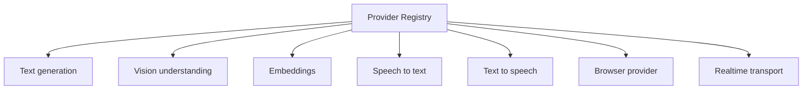
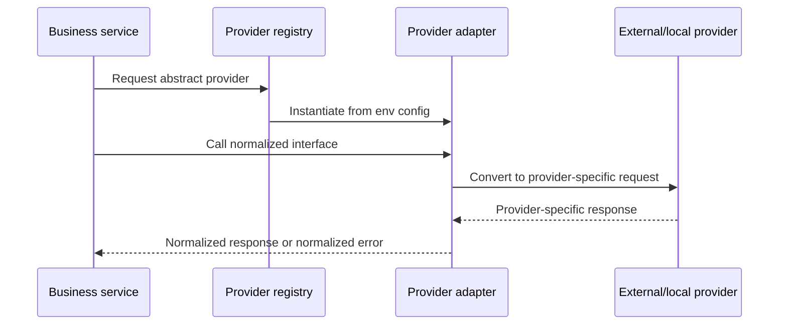
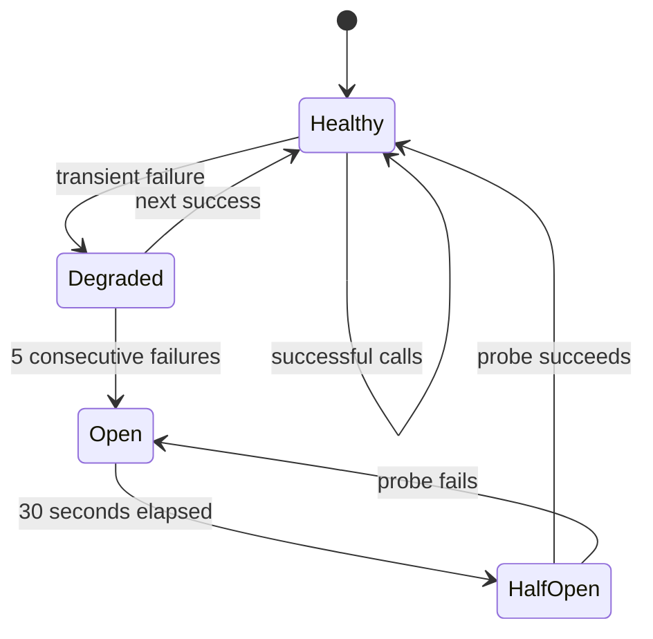
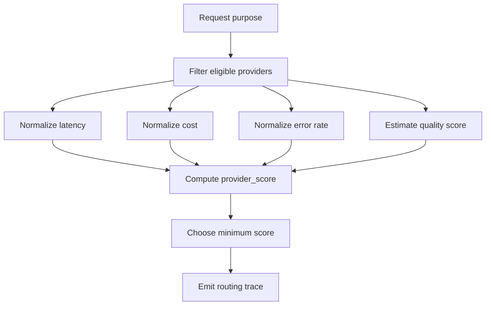

# Phase 0 Provider Abstraction Strategy

## Objective

The provider layer makes AI, browser, and realtime transport services swappable without changing business logic. Agents, planners, context builders, API routers, and learners import abstract interfaces only. Vendor-specific SDKs, request objects, response objects, authentication, and error handling live inside provider adapters.

## Provider Categories and Supported Values



| Category | Supported values |
| --- | --- |
| `AI_TEXT_PROVIDER` | `nvidia_nim`, `openai`, `ollama`, `custom_openai_compatible`, `local` |
| `AI_VISION_PROVIDER` | `nvidia_nim`, `openai`, `ollama`, `custom_openai_compatible`, `local`, `disabled` |
| `AI_EMBEDDING_PROVIDER` | `nvidia_nim`, `openai`, `ollama`, `custom_openai_compatible`, `local` |
| `AI_STT_PROVIDER` | `whisper_local`, `whisper_cpp`, `openai`, `deepgram`, `custom` |
| `AI_TTS_PROVIDER` | `kokoro`, `piper`, `cartesia`, `elevenlabs`, `openai`, `custom` |
| `BROWSER_PROVIDER` | `local_playwright`, `remote_playwright`, `browserbase`, `custom` |
| `TRANSPORT_PROVIDER` | `small_webrtc`, `daily`, `livekit`, `websocket`, `custom` |

NVIDIA NIM is configured through the same generic `AI_TEXT_*`, `AI_VISION_*`, and `AI_EMBEDDING_*` variables as every other OpenAI-compatible provider. Core business logic must never import an NVIDIA-specific client.

## Provider Abstraction Rules

- Business logic imports only abstract interfaces.
- Provider adapters implement interfaces.
- Provider-specific request and response objects are converted at the adapter boundary.
- Environment variables select providers at startup.
- No direct provider SDK usage inside agents, planners, context builders, learners, or API routers.
- All providers must implement `health_check()`.
- All network providers must support timeout, retry, and circuit-breaker settings.
- Streaming providers must expose a normalized async stream interface.
- Tool calling must use normalized tool-call structures.
- Provider errors must be normalized into common error classes.
- Provider fallback must be explicit, configured, observable, and auditable.
- Provider adapters must redact secrets from logs and exceptions.

## Common Types

```python
class ProviderHealth:
    provider_name: str
    category: str
    status: "healthy" | "degraded" | "unhealthy"
    latency_ms: int | None
    checked_at: str
    message: str | None

class ToolDefinition:
    name: str
    description: str
    input_schema: dict

class ToolCall:
    tool_call_id: str
    name: str
    arguments: dict

class AudioFrame:
    session_id: str
    sample_rate: int
    channels: int
    pcm_bytes: bytes
    timestamp_ms: int

class EmbeddingVector:
    text_hash: str
    vector: list[float]
    dimensions: int
    metadata: dict
```

## Text Generation Provider

```python
class TextGenerationProvider:
    provider_name: str
    model_name: str

    async def health_check(self) -> ProviderHealth:
        ...

    async def generate(
        self,
        request: TextGenerationRequest,
    ) -> TextGenerationResponse:
        ...

    async def stream(
        self,
        request: TextGenerationRequest,
    ) -> AsyncIterator[TextGenerationChunk]:
        ...

    async def generate_with_tools(
        self,
        request: ToolCallingRequest,
    ) -> ToolCallingResponse:
        ...
```

Required request shape:

```json
{
  "messages": [],
  "system_prompt": "string",
  "temperature": 0.0,
  "top_p": 1.0,
  "max_output_tokens": 512,
  "response_format": "json_schema",
  "tools": [],
  "tool_choice": "auto",
  "timeout_ms": 8000,
  "metadata": {
    "session_id": "string",
    "purpose": "realtime_host"
  }
}
```

Default deterministic hot-path settings:

```text
temperature = 0.0
top_p = 1.0
max_output_tokens <= 256 for normal voice turn
timeout_ms <= 8000
```

Text output requirements:

- Stream chunks must include `text_delta`, optional normalized `tool_call_delta`, `finish_reason`, and provider timing metadata.
- Tool calls must use normalized `ToolCall` objects.
- JSON outputs must be validated against a schema before business logic consumes them.
- Prompt construction happens outside provider adapters; provider adapters only transmit normalized requests.

## Vision Understanding Provider

```python
class VisionUnderstandingProvider:
    async def health_check(self) -> ProviderHealth:
        ...

    async def describe_image(
        self,
        request: VisionDescriptionRequest,
    ) -> VisionDescriptionResponse:
        ...

    async def extract_ui_facts(
        self,
        request: UiVisionExtractionRequest,
    ) -> UiVisionExtractionResponse:
        ...
```

Vision provider rule:

- Use vision only as fallback or async enrichment.
- Do not use vision on every hot-path turn unless explicitly configured.
- Prefer DOM and accessibility extraction before screenshot reasoning.
- Store screenshot URI and image hash, not raw image bytes, in default request metadata.

## Embedding Provider

```python
class EmbeddingProvider:
    async def health_check(self) -> ProviderHealth:
        ...

    async def embed_texts(
        self,
        texts: list[str],
        metadata: dict,
    ) -> list[EmbeddingVector]:
        ...
```

Embedding requirements:

- Batch embeddings.
- Cache by content hash.
- Store vector dimension in provider config.
- Reject mismatched vector dimensions at startup.
- Do not run embedding search in the hot path unless the user asks a detailed product question.

## Speech-To-Text Provider

```python
class SpeechToTextProvider:
    async def health_check(self) -> ProviderHealth:
        ...

    async def transcribe_stream(
        self,
        audio_stream: AsyncIterator[AudioFrame],
    ) -> AsyncIterator[TranscriptChunk]:
        ...

    async def transcribe_file(
        self,
        audio_uri: str,
    ) -> Transcript:
        ...
```

STT requirements:

- Support partial transcripts if available.
- Mark final transcripts clearly.
- Include timestamps if available.
- Normalize confidence scores to `0.0` through `1.0`.
- Mark language and provider model on transcript metadata.

## Text-To-Speech Provider

```python
class TextToSpeechProvider:
    async def health_check(self) -> ProviderHealth:
        ...

    async def synthesize_stream(
        self,
        request: TtsRequest,
    ) -> AsyncIterator[AudioFrame]:
        ...

    async def stop(self, session_id: str) -> None:
        ...
```

TTS requirements:

- Support streaming audio if available.
- Support interruption cancellation.
- Cache common short utterances if configured.
- Emit first-audio latency.
- `stop(session_id)` must be idempotent.

## Browser Provider

```python
class BrowserProvider:
    async def create_session(
        self,
        request: CreateBrowserSessionRequest,
    ) -> BrowserSession:
        ...

    async def navigate(
        self,
        session_id: str,
        url: str,
    ) -> ScreenState:
        ...

    async def read_current_screen(
        self,
        session_id: str,
    ) -> ScreenState:
        ...

    async def execute_action(
        self,
        session_id: str,
        command: BrowserActionCommand,
    ) -> BrowserActionResult:
        ...

    async def close_session(
        self,
        session_id: str,
    ) -> None:
        ...
```

Browser requirements:

- Browser provider returns normalized screen state.
- Business logic never depends on Playwright-specific `Locator` objects.
- Action IDs are resolved inside browser runtime.
- Browser provider must return element bounds needed by the synthetic cursor overlay.
- Browser provider must enforce action timeout and navigation timeout.

## Realtime Transport Provider

```python
class RealtimeTransportProvider:
    async def create_room_or_session(
        self,
        request: CreateTransportSessionRequest,
    ) -> TransportSession:
        ...

    async def get_join_config(
        self,
        session_id: str,
    ) -> TransportJoinConfig:
        ...

    async def close(
        self,
        session_id: str,
    ) -> None:
        ...
```

Transport requirements:

- Local mode starts with `small_webrtc`.
- Managed mode can use Daily or LiveKit later.
- Agent code must not care which transport is active.
- Join config sent to frontend must never contain provider admin secrets.

## Provider Factory



```python
class ProviderRegistry:
    def get_text_provider(self) -> TextGenerationProvider:
        ...

    def get_vision_provider(self) -> VisionUnderstandingProvider:
        ...

    def get_embedding_provider(self) -> EmbeddingProvider:
        ...

    def get_stt_provider(self) -> SpeechToTextProvider:
        ...

    def get_tts_provider(self) -> TextToSpeechProvider:
        ...

    def get_browser_provider(self) -> BrowserProvider:
        ...

    def get_transport_provider(self) -> RealtimeTransportProvider:
        ...
```

Selection must be driven by environment variables.

Example:

```dotenv
AI_TEXT_PROVIDER=nvidia_nim
AI_TEXT_BASE_URL=https://integrate.api.nvidia.com/v1
AI_TEXT_MODEL=meta/llama-3.1-70b-instruct
```

Allowed business-code usage:

```python
text_provider = provider_registry.get_text_provider()
```

Forbidden business-code usage:

```python
nvidia_client = NvidiaClient(...)
```

outside the provider adapter.

## Normalized Error Model

Common errors:

- `ProviderConfigurationError`
- `ProviderAuthenticationError`
- `ProviderRateLimitError`
- `ProviderTimeoutError`
- `ProviderUnavailableError`
- `ProviderBadRequestError`
- `ProviderResponseValidationError`
- `ProviderStreamingError`

Every provider error must include:

```yaml
provider_name: string
model_name: string
operation: string
retryable: boolean
status_code: integer | null
safe_message: string
internal_message: string
trace_id: string
```

Error rules:

- Never leak API keys or raw provider secrets.
- `safe_message` is safe for user-facing logs.
- `internal_message` is backend-only and still must be secret-redacted.
- Retry decisions use `retryable`, not string matching.

## Retry and Circuit Breaker Policy



AI network provider timeout:

| Path | Timeout |
| --- | --- |
| Hot path | 8000 ms |
| Cold path | 30000 ms |

Retries:

| Path | Retries |
| --- | --- |
| Hot path | 0 or 1 retry maximum |
| Cold path | 2 retries maximum |

Backoff:

- Exponential backoff with jitter.
- Hot-path retry delay must not exceed the first-audio latency budget unless fallback speech is emitted first.

Circuit breaker:

- Open after 5 consecutive failures.
- Half-open after 30 seconds.
- Emit `provider.circuit_opened` and `provider.circuit_half_open` events.

Fallback:

```dotenv
AI_TEXT_FALLBACK_PROVIDER=ollama
AI_TEXT_ENABLE_FALLBACK=true
```

- Fallback only if configured.
- Fallback must not silently change output quality in audited runs.
- Log provider fallback as an event with original provider, fallback provider, operation, trace ID, and reason.

## Cost and Latency-Aware Model Routing



Use the cheapest sufficient provider/model for each purpose.

Purposes:

- `realtime_host`
- `screen_summary`
- `recipe_generation`
- `lead_summary`
- `embedding`
- `vision_fallback`
- `safety_classification`

Routing cost function:

```text
provider_score =
  alpha * normalized_latency
+ beta * normalized_cost
+ gamma * normalized_error_rate
- delta * quality_score
```

Choose the provider with the minimum score among eligible providers that satisfy required capabilities.

Default hot-path weights:

```text
alpha = 0.45
beta = 0.20
gamma = 0.25
delta = 0.10
```

Default cold-path quality weights:

```text
alpha = 0.20
beta = 0.20
gamma = 0.20
delta = 0.40
```

Eligibility rules:

- `realtime_host` requires streaming text output and optional normalized tool calling.
- `screen_summary` may run asynchronously and may use a slower but cheaper model.
- `lead_summary` requires structured JSON validation.
- `embedding` requires configured vector dimension to match database dimension.
- `vision_fallback` requires image support and artifact access.
- `safety_classification` must support deterministic JSON output with temperature `0.0`.

## Adapter Placement

Provider adapter modules should be grouped by category:

```text
providers/
  text/
  vision/
  embedding/
  stt/
  tts/
  browser/
  transport/
```

Each adapter must include:

- Config validation.
- Health check.
- Request conversion.
- Response conversion.
- Error normalization.
- Timeout handling.
- Optional retry/circuit-breaker integration.
- Unit tests with mocked provider responses in later phases.
