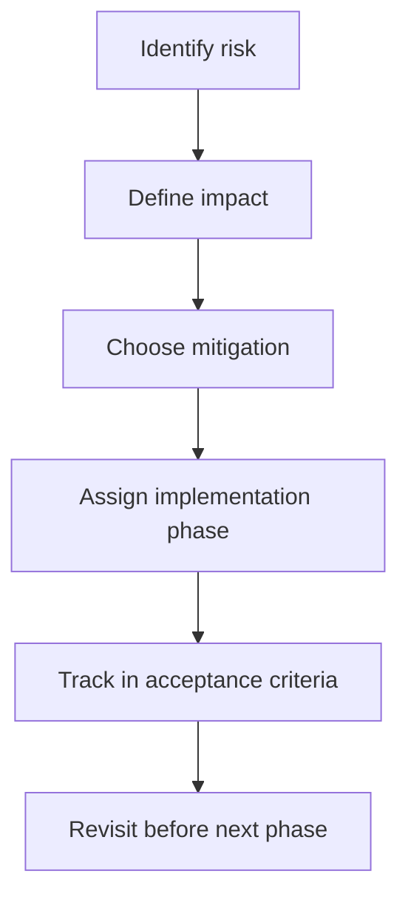

# Phase 0 Risks and Assumptions

## Assumptions

- The first production implementation will use a web frontend, FastAPI backend, Pipecat agent runtime, and a Playwright-compatible browser provider.
- Hosted AI providers may be used for low latency, but local/free mode must remain possible for development.
- Product URLs are supplied by authorized users.
- Login-only products require a separate authentication approach in later phases.
- The LLM is treated as a planner and narrator, not as an authority to execute raw browser code.

## Risks

| Risk | Description | Impact | Mitigation | Phase where mitigation is implemented |
| --- | --- | --- | --- | --- |
| Any-product uncertainty | Any-product URL mode cannot guarantee perfect demos for all products because UI structure, copy, and flows vary widely. | Agent may miss important flows or give a shallow demo. | Use cautious language, current-screen grounding, safe action candidates, product graph learning, and optional guidance/recipe modes. | Phase 1 for basic grounding, Phase 2 for learner graph, Phase 3 for recipe improvements |
| Login-only products | Products behind login require credentials, SSO, or pre-authenticated browser sessions. | Demo may stop at login screen and be unable to show product value. | Support explicit pre-auth session setup, credential vault integration, and clear "login required" state. Never ask the LLM to handle passwords directly. | Phase 2 or later |
| Canvas/WebGL-heavy UIs | DOM and accessibility extraction may be incomplete for canvas, WebGL, remote desktops, or heavily custom widgets. | Agent may not understand visible UI from DOM alone. | Use screenshot and vision fallback as async enrichment or configured hot-path fallback. Encourage recipe mode for hard UIs. | Phase 2 |
| Local model latency | Local models may not meet latency targets on weak hardware. | Voice experience may feel slow or interrupted. | Mark local/free mode best-effort, expose latency debug panel, support hosted provider switching through env vars. | Phase 1 |
| Dynamic UI automation failure | Browser automation can fail due to changing layouts, animations, delayed data, overlays, or virtualized lists. | Clicks may fail or screen state may be stale. | Reread screen after every action, use element fingerprints, wait for idle, retry safe reads, ask user when confidence is low. | Phase 1 |
| Provider latency/rate limits | AI providers may have latency spikes, outages, or rate limits. | First-audio SLOs may fail and sessions may degrade. | Normalize provider errors, add timeouts, circuit breakers, configured fallback, and provider health checks. | Phase 1 |
| Product claim hallucination | The agent may be tempted to infer features not visible or approved. | Sales trust, compliance, and user safety risk. | Enforce evidence policy, grounded context builder, uncertainty language, and lead-insight evidence references. | Phase 1 |
| Unsafe browser control | Real browser control can submit forms, change settings, send messages, or perform destructive actions. | Data loss, account changes, privacy incidents, or unwanted transactions. | Use safe action IDs, deterministic risk scoring, blocked default actions, confirmation for high risk, no arbitrary JS execution. | Phase 1 |
| Sensitive screenshots | Screenshots may contain customer data, PII, tokens, or proprietary information. | Privacy and compliance exposure. | Artifact access control, redaction policy, retention limits, restricted object storage, no public URLs by default. | Phase 1 for controls, Phase 2 for redaction improvements |
| Multi-tenant isolation | Production multi-tenancy requires strong isolation and RBAC. | Cross-tenant data exposure risk. | Tenant-scoped sessions, products, artifacts, DB rows, event streams, and browser contexts; RBAC-ready schemas. | Phase 2 |
| Recipe drift | A saved recipe may stop matching the product after UI changes. | Demo steps may fail or become unsafe. | Store element fingerprints, screen hashes, completion criteria, and fallback recovery; update success/failure counts. | Phase 2 |
| Cost growth | Vision, large LLMs, and frequent embeddings can increase cost. | Unit economics may be poor at scale. | Route by purpose using latency/cost/error/quality score, cache summaries and embeddings, avoid vision in default hot path. | Phase 2 |
| Prompt/data leakage | Guidance, transcripts, and UI text may contain confidential data. | Data exposure to providers or logs. | Provider allowlist, redacted logs, retention policy, optional local mode, and explicit provider data-handling review. | Phase 1 and security hardening later |
| Transport compatibility | Realtime transport behavior differs across local WebRTC, Daily, LiveKit, and websocket modes. | Audio/video joining or interruption behavior may vary. | Normalize transport interface and keep agent runtime transport-agnostic. Test each adapter against common session lifecycle contract. | Phase 1 for local, later for managed transports |
