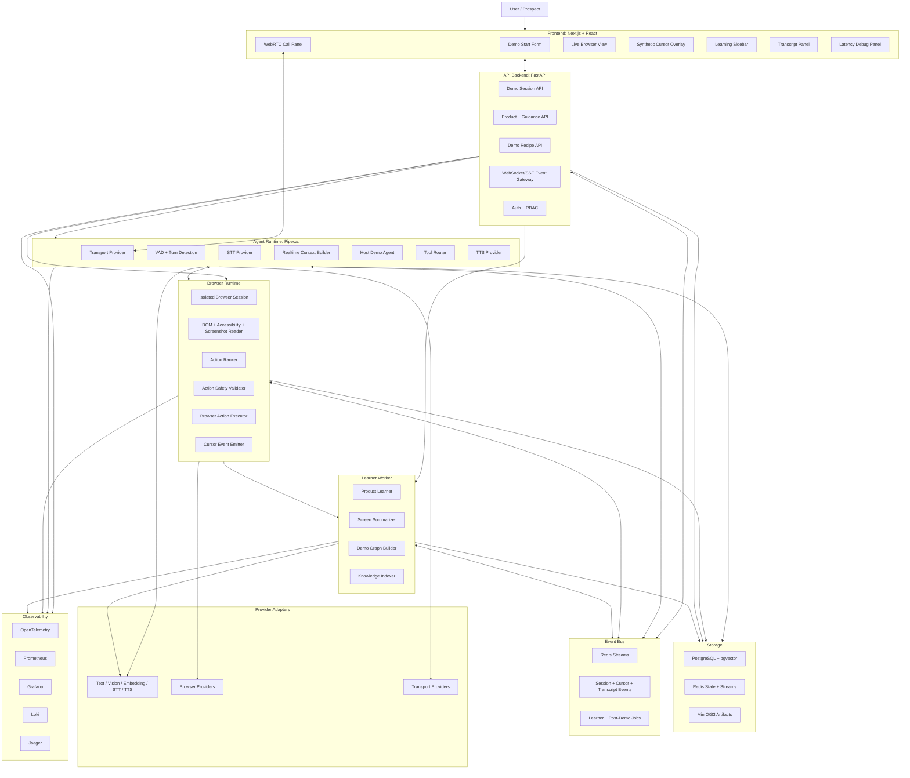
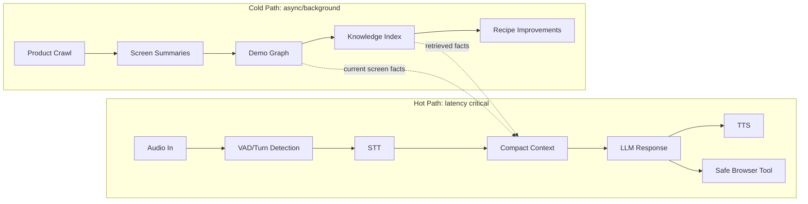
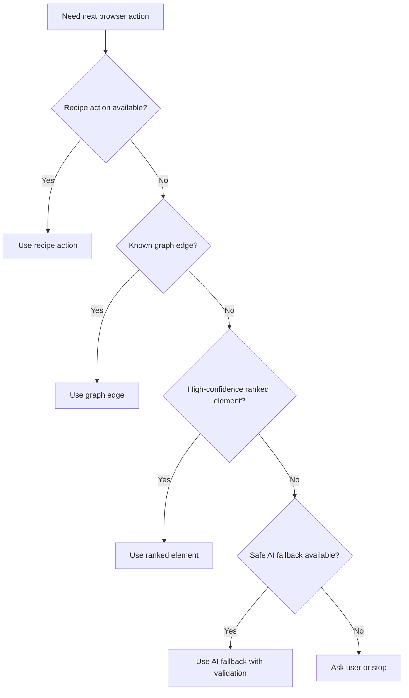

# Phase 0 System Architecture and Service Boundaries

## Architecture Summary

The system is split into a latency-critical realtime path and asynchronous learning/analytics paths. The frontend presents the call, browser viewport, cursor overlay, transcript, and debug state. The API backend owns session lifecycle and persisted mutations. The Pipecat agent runtime owns realtime voice orchestration. The browser runtime owns isolated browser sessions, screen reading, action ranking, validation, execution, and cursor events. The learner worker builds product knowledge asynchronously. Provider adapters isolate all vendor-specific SDKs and protocols from business logic.

Official provider assumptions verified during Phase 0:

- NVIDIA NIM LLM APIs expose OpenAI-compatible `/v1/chat/completions` endpoints with streaming and tool-calling support: https://docs.nvidia.com/nim/large-language-models/latest/api-reference.html
- Pipecat is an open-source Python framework/ecosystem for real-time voice and multimodal agents that orchestrates transports, AI services, and audio processing: https://docs.pipecat.ai/overview/pipecat

## Architecture Diagram



## Service Responsibilities

| Service               | Runtime                                          | Primary responsibilities                                                                                                         | Owns data?                                      | Latency sensitivity            | Scaling strategy                                             | Failure mode                                                            | Security considerations                                                        |
| --------------------- | ------------------------------------------------ | -------------------------------------------------------------------------------------------------------------------------------- | ----------------------------------------------- | ------------------------------ | ------------------------------------------------------------ | ----------------------------------------------------------------------- | ------------------------------------------------------------------------------ |
| Frontend web app      | Next.js/React                                    | Demo start UI, WebRTC client, browser viewport, cursor overlay, transcript, learning sidebar, latency debug panel                | No                                              | High for UI events and media   | Stateless horizontal web scaling/CDN                         | Reconnect event stream and transport session                            | No provider secrets, no direct browser authority, sanitize rendered transcript |
| API backend           | FastAPI                                          | Session API, product/guidance API, recipe API, auth/RBAC, event gateway, persisted mutations                                     | Yes, system of record metadata                  | Medium                         | Stateless app replicas behind load balancer                  | Return typed errors, allow client reconnect                             | Validates inputs, rate limits, owns auth, never exposes secrets                |
| Pipecat agent runtime | Python/Pipecat                                   | Realtime transport, VAD, STT, context builder, host agent, tool router, TTS, interruptions                                       | No durable ownership; writes events             | Critical                       | Session workers, one active agent pipeline per session       | Graceful session close or fallback provider                             | Backend-only secrets, bounded prompts, no direct browser JS execution          |
| Browser runtime       | Python/Node service using provider adapter       | Isolated browser session, DOM/accessibility/screenshot reads, action ranking, safety validation, action execution, cursor events | Owns ephemeral browser state and action records | High for live actions          | Pool browser workers, cap sessions per worker                | Action failure event, reread screen, ask user                           | Per-session context, no shared cookies, domain policy, redaction               |
| Learner worker        | Python worker                                    | Product learner, screen summarizer, demo graph builder, knowledge indexer, recipe improvement candidates                         | Writes product graph and knowledge artifacts    | Low for live voice path        | Background worker queue concurrency                          | Job retry or skip; never block hot path                                 | Uses least privilege, artifact access control, redacts screenshots/text        |
| Storage layer         | PostgreSQL + pgvector, Redis, MinIO/S3           | Durable relational data, vectors, ephemeral state/streams, screenshots, recordings, traces                                       | Yes                                             | Medium                         | Managed storage, read replicas later, Redis clustering later | Backpressure and degraded mode                                          | Encryption at rest, TTLs, bucket policies, DB roles                            |
| Event bus             | Redis Streams initially                          | Session events, browser events, cursor events, transcript events, worker jobs                                                    | Ephemeral event stream                          | High for cursor/session events | Stream partitioning by session/product                       | Replay from stream within TTL; drop noncritical debug events under load | No secrets in event payloads, per-session authorization                        |
| Observability stack   | OpenTelemetry, Prometheus, Grafana, Loki, Jaeger | Metrics, logs, traces, latency budgets, provider errors, action audits                                                           | Observability data only                         | Medium                         | Collector fanout, sampling                                   | Local logs fallback                                                     | Redaction, retention limits, restricted access                                 |
| Provider adapters     | Backend services/libraries                       | Normalize AI, browser, and transport providers behind abstract interfaces                                                        | No                                              | Varies by provider category    | One adapter instance per configured provider                 | Health check failure, circuit breaker, typed errors                     | Secrets stay in backend env; no vendor types leak to business logic            |

## Service Boundary Rules

- Frontend never calls AI providers directly.
- Frontend never controls the browser directly.
- Agent runtime never executes arbitrary browser code.
- Agent runtime calls browser tools through normalized commands only.
- Browser runtime never makes independent product claims.
- Learner worker never blocks live voice hot path.
- Provider adapters never leak vendor-specific types into business logic.
- API backend owns persisted system-of-record mutations.
- Redis owns ephemeral live state only.
- PostgreSQL owns durable relational state.
- Object storage owns screenshots, recordings, traces, and large artifacts.
- Event gateway authorizes each session event stream subscription.
- No service logs secrets, cookies, tokens, raw auth headers, or password fields.

## Hot Path and Cold Path

Hot path:

```text
User audio
-> VAD / turn detection
-> STT
-> context builder
-> host agent LLM
-> TTS
-> audio output
-> optional safe browser action
```

Cold path:

```text
URL crawling
-> product learning
-> screen summarization
-> knowledge indexing
-> demo graph updates
-> post-demo analytics
```



Hot-path acceptance rules:

- Hot path must not require website crawling.
- Hot path must not require embedding search unless the user asks a detailed question.
- Hot path must not include full DOM.
- Hot path context must be bounded by token budget.
- Hot path context must include only current screen summary, recent turns, approved facts, safe action candidates, and relevant recipe state.

## Deterministic Action Hierarchy

Decision order:

1. Recipe-defined action.
2. Known demo graph edge.
3. Deterministic element ranker.
4. AI browser fallback.
5. Ask user or stop.



Action score:

```text
score(action) =
  0.30 * user_intent_match
+ 0.25 * recipe_step_match
+ 0.15 * element_label_match
+ 0.10 * visibility_score
+ 0.10 * historical_success
+ 0.10 * demo_value
- 0.35 * risk_score
- 0.10 * latency_cost
```

Execute only if:

```text
score(action) >= ACTION_EXECUTION_SCORE_THRESHOLD
AND risk_level in allowed_risk_levels
AND element.visible = true
AND element.enabled = true
AND policy_decision = allowed
```

Recommended default:

```text
ACTION_EXECUTION_SCORE_THRESHOLD=0.72
```

## Core Data Structures

| Structure            | Purpose                            | Required fields                                                                                                                                        | Owner service                | Persistence location                                                 | Hot-path availability       |
| -------------------- | ---------------------------------- | ------------------------------------------------------------------------------------------------------------------------------------------------------ | ---------------------------- | -------------------------------------------------------------------- | --------------------------- |
| DemoSession          | Tracks a live demo session         | `session_id`, `product_id`, `status`, `mode`, `created_at`, `started_at`, `ended_at`, `transport_session_id`, `browser_session_id`, `latency_trace_id` | API backend                  | PostgreSQL, Redis live state                                         | Yes, cached in Redis        |
| ProductConfig        | Defines product URL and defaults   | `product_id`, `product_url`, `product_name`, `allowed_domains`, `created_by`, `created_at`                                                             | API backend                  | PostgreSQL                                                           | Yes, cached                 |
| ProductGuidance      | Stores approved text guidance      | `guidance_id`, `product_id`, `target_persona`, `positioning`, `demo_goals`, `what_to_show`, `what_to_avoid`, `common_questions`, `objection_notes`     | API backend                  | PostgreSQL                                                           | Yes, compact version cached |
| DemoRecipe           | Defines deterministic demo path    | `recipe_id`, `product_id`, `version`, `steps`, `policy`, `created_at`                                                                                  | API backend                  | PostgreSQL                                                           | Yes                         |
| DemoStep             | One recipe step                    | `step_id`, `order`, `goal`, `expected_screen`, `target_element_hint`, `allowed_actions`, `blocked_actions`, `completion_criteria`                      | API backend                  | PostgreSQL as recipe JSON/relational rows                            | Yes                         |
| ScreenState          | Current observed browser state     | `screen_id`, `session_id`, `url`, `title`, `visible_text`, `elements`, `safe_actions`, `risk_actions`, `screenshot_uri`, `observed_at`                 | Browser runtime              | Redis current state, PostgreSQL event row, object storage screenshot | Yes                         |
| ScreenNode           | Reusable graph node                | `screen_id`, `product_id`, `url_path`, `title`, `screen_hash`, `summary`, `elements`, `safe_actions`, `risk_actions`, `confidence`                     | Learner worker               | PostgreSQL + pgvector as needed                                      | Yes, summary only           |
| UIElement            | Normalized visible element         | `element_id`, `role`, `label`, `text`, `bounds`, `visible`, `enabled`, `fingerprint`, `risk_level`, `action_ids`                                       | Browser runtime              | Redis current state, PostgreSQL graph snapshots                      | Yes, bounded list           |
| SafeAction           | Candidate user-presentable action  | `action_id`, `action_type`, `label`, `element_id`, `risk_level`, `score`, `requires_confirmation`, `reason`                                            | Browser runtime              | Redis current state, PostgreSQL action log                           | Yes                         |
| BrowserActionCommand | Command sent to browser runtime    | `command_id`, `session_id`, `action_id`, `action_type`, `input`, `requested_by`, `policy_context`, `created_at`                                        | Agent runtime/API backend    | PostgreSQL action log                                                | Yes                         |
| BrowserActionResult  | Result of browser execution        | `browser_action_id`, `command_id`, `status`, `screen_before_id`, `screen_after_id`, `latency_ms`, `error_code`, `safety_decision`                      | Browser runtime              | PostgreSQL action log, Redis event stream                            | Yes                         |
| TranscriptEvent      | User/agent utterance record        | `transcript_event_id`, `session_id`, `speaker`, `text`, `is_final`, `start_ms`, `end_ms`, `confidence`, `evidence_refs`                                | Agent runtime                | PostgreSQL, Redis live stream                                        | Yes                         |
| LeadInsight          | Evidence-backed sales intelligence | `insight_id`, `session_id`, `type`, `value`, `confidence`, `evidence_refs`, `created_at`                                                               | Learner worker/post-demo job | PostgreSQL                                                           | No, post-demo only          |
| ProviderConfig       | Normalized provider selection      | `category`, `provider_name`, `base_url`, `model_name`, `timeout_ms`, `supports_streaming`, `supports_tools`, `enabled`                                 | Provider registry            | Environment at startup, redacted config snapshot in logs             | Yes                         |
| LatencyTrace         | Timing details for one turn/action | `trace_id`, `session_id`, `operation`, `segments`, `provider_name`, `model_name`, `status`, `started_at`, `ended_at`                                   | Observability stack          | Tracing backend, PostgreSQL summary optional                         | Yes                         |

## Cybersecurity Architecture Requirements

- Use one isolated browser context per session.
- Never share cookies across tenants or sessions.
- Send no provider secrets to the frontend.
- Store API keys only in backend environment or managed secret storage.
- Enforce product URL validation before navigation.
- Enforce browser domain allowlist derived from product URL plus configured allowed domains.
- Block external navigation by default.
- Require explicit confirmation before allowed external navigation.
- Protect screenshots, recordings, traces, and artifacts with session-scoped access control.
- Redact secrets, tokens, cookies, auth headers, password fields, and sensitive input values from logs.
- Persist audit logs for high-impact actions, confirmation decisions, blocked actions, provider fallback, and safety policy overrides.
- Keep RBAC-ready ownership fields on sessions, products, recipes, artifacts, and lead intelligence.
- Apply least privilege DB roles and service credentials.
- Rate limit session creation and provider calls.
- Enforce timeouts for browser actions and AI calls.
- Validate product URL, guidance text length, recipe JSON schema, and allowed enum values.
- Treat downloaded files and uploaded files as disabled unless explicitly allowed.

## Observability Requirements

Minimum metrics:

- `demo_session_created_total`
- `demo_session_active_count`
- `voice_first_audio_latency_ms`
- `context_build_latency_ms`
- `provider_first_token_latency_ms`
- `tts_first_audio_latency_ms`
- `browser_action_validation_latency_ms`
- `browser_action_execution_latency_ms`
- `cursor_event_latency_ms`
- `provider_error_total`
- `provider_fallback_total`
- `blocked_action_total`
- `high_risk_confirmation_total`

Minimum trace spans:

- `session.create`
- `transport.join`
- `stt.transcribe_stream`
- `context.build`
- `llm.stream`
- `tts.synthesize_stream`
- `browser.read_screen`
- `browser.validate_action`
- `browser.execute_action`
- `learner.summarize_screen`
- `lead.generate_summary`
