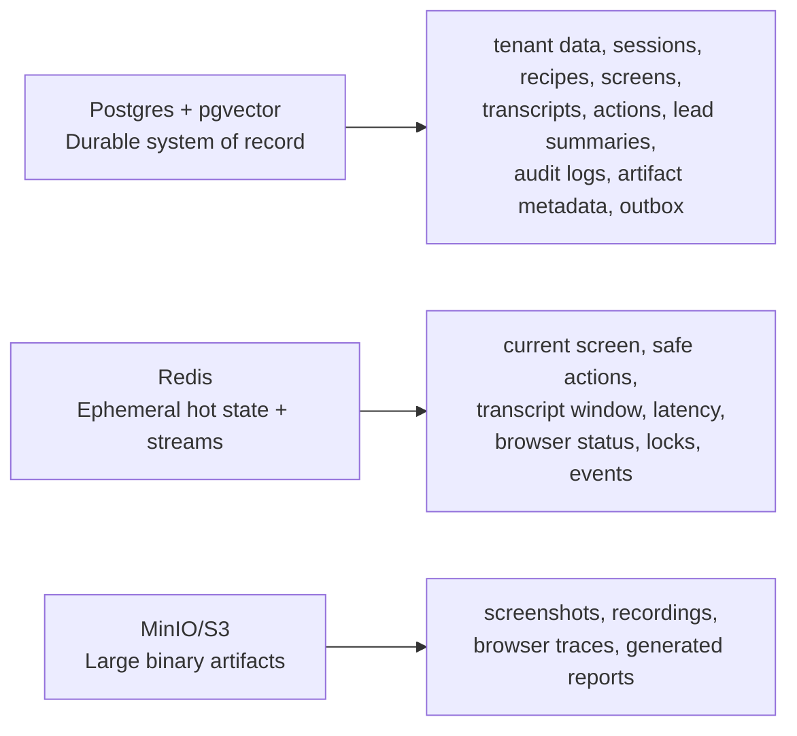

# Phase 2 Acceptance Checklist

Phase 2 implements the database, Redis live state, Redis Streams event bus, and object storage foundation. It does not implement the live AI voice agent, browser automation, product learner, or CRM integration.

## Storage Split



## Implemented

- [x] Postgres schema for all Phase 2 durable tables.
- [x] pgcrypto and pgvector extensions.
- [x] Deterministic constraint/index naming.
- [x] Alembic migration workflow with production guard.
- [x] `updated_at` trigger function and triggers for mutable tables.
- [x] Tenant-scoped `organization_id` on tenant data.
- [x] Soft deletes for user-facing mutable entities.
- [x] Append-only audit logs.
- [x] `event_outbox` table for durable event handoff.
- [x] Redis key builders under `live_demo:*`.
- [x] Redis live-state store for compact hot-path state.
- [x] Atomic Redis lock release through Lua compare-and-delete.
- [x] Redis Streams event bus with publish, subscribe, ack, global fanout, dead-letter helper, and idempotency helpers.
- [x] S3-compatible artifact store for MinIO.
- [x] Deterministic object key builders.
- [x] Artifact metadata repository.
- [x] Phase 2 tests for models, migrations, Redis keys, live state, event bus, and artifacts.

## Verification

```bash
cp .env.example .env
docker compose up -d postgres redis minio
uv sync --all-packages
pnpm install
make db-upgrade
make db-current
uv run pytest services/api/tests/test_db_models.py
uv run pytest services/api/tests/test_alembic_migrations.py
uv run pytest services/api/tests/test_redis_keys.py
uv run pytest services/api/tests/test_live_state_store.py
uv run pytest services/api/tests/test_event_bus.py
uv run pytest services/api/tests/test_artifact_store.py
make lint
make typecheck
```
