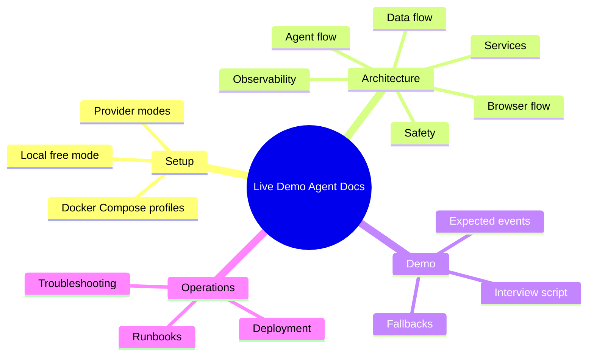

# Documentation Hub

This index is generated by `scripts/docs/generate_docs_index.py`.

## Audience Map

| Audience | Start here |
| --- | --- |
| New local developer | [setup/local-setup.md](setup/local-setup.md) |
| Staff/system-design reviewer | [architecture/system-design.md](architecture/system-design.md) |
| Interviewer or demo reviewer | [demo/interview-demo-script.md](demo/interview-demo-script.md) |
| Maintainer debugging issues | [troubleshooting/troubleshooting.md](troubleshooting/troubleshooting.md) |

## Capability Map

## Documents

### Setup

- [Docker Compose Profiles](setup/docker-compose-profiles.md)
- [Environment Variables](setup/environment-variables.md)
- [Local Free Mode](setup/local-free-mode.md)
- [Local Setup](setup/local-setup.md)
- [Local STT/TTS](setup/local-stt-tts.md)
- [NVIDIA NIM Mode](setup/nvidia-nim-mode.md)
- [Ollama Mode](setup/ollama-mode.md)

### Architecture

- [Agent Flow](architecture/agent-flow.md)
- [Browser Flow](architecture/browser-flow.md)
- [Data Flow](architecture/data-flow.md)
- [Deployment Architecture](architecture/deployment.md)
- [Architecture Diagrams](architecture/diagrams.md)
- [Memory and Context](architecture/memory-and-context.md)
- [Phase 14 Observability and Latency Engineering](architecture/observability-latency.md)
- [Observability](architecture/observability.md)
- [Architecture Overview](architecture/overview.md)
- [Post-Demo Intelligence](architecture/post-demo-intelligence.md)
- [Product Learner and Demo Graph](architecture/product-learner-and-demo-graph.md)
- [Security, Deployment, and Production Hardening](architecture/production-hardening.md)
- [Recipe Engine](architecture/recipe-engine.md)
- [Safety and Policy](architecture/safety-and-policy.md)
- [Service Boundaries](architecture/service-boundaries.md)
- [System Design](architecture/system-design.md)
- [Testing and Evaluation](architecture/testing-evaluation.md)
- [Voice Flow](architecture/voice-flow.md)

### Providers

- [Custom OpenAI-Compatible Provider](providers/custom-openai-compatible.md)
- [Embedding and Vision Providers](providers/embedding-and-vision-providers.md)
- [LLM Providers](providers/llm-providers.md)
- [NVIDIA NIM](providers/nvidia-nim.md)
- [Ollama](providers/ollama.md)
- [Provider Switching Guide](providers/provider-switching.md)
- [STT Providers](providers/stt-providers.md)
- [TTS Providers](providers/tts-providers.md)

### Recipes

- [Demo Recipe Guide](recipes/demo-recipe-guide.md)
- [Recipe Examples](recipes/recipe-examples.md)
- [Recipe Validation Errors](recipes/recipe-validation-errors.md)
- [Screen-by-Screen Recipe Guide](recipes/screen-by-screen-recipe-guide.md)
- [Text Guidance Guide](recipes/text-guidance-guide.md)

### Demo

- [Demo Checklist](demo/demo-checklist.md)
- [Expected Demo Events](demo/expected-demo-events.md)
- [Fallback Demo Script](demo/fallback-demo-script.md)
- [Interview Demo Script](demo/interview-demo-script.md)
- [Local Demo Script](demo/local-demo-script.md)

### Troubleshooting

- [Browser Failures](troubleshooting/browser-failures.md)
- [Common Error Codes](troubleshooting/common-error-codes.md)
- [Database, Redis, and MinIO](troubleshooting/database-redis-minio.md)
- [Docker Compose Troubleshooting](troubleshooting/docker-compose.md)
- [Microphone and WebRTC](troubleshooting/microphone-and-webrtc.md)
- [Observability Troubleshooting](troubleshooting/observability.md)
- [Provider Errors](troubleshooting/provider-errors.md)
- [Slow Local Hardware](troubleshooting/slow-local-hardware.md)
- [Troubleshooting](troubleshooting/troubleshooting.md)
- [TTS/STT Failures](troubleshooting/tts-stt-failures.md)

### Runbooks

- [Browser Worker Saturation Runbook](runbooks/browser-worker-saturation.md)
- [Debugging a Live Session](runbooks/debugging-live-session.md)
- [Deployment Runbook](runbooks/deployment.md)
- [Failed Browser Action Runbook](runbooks/failed-browser-action.md)
- [Failed Prewarm Runbook](runbooks/failed-prewarm.md)
- [First Demo Runbook](runbooks/first-demo-runbook.md)
- [High First-Audio Latency Runbook](runbooks/high-first-audio-latency.md)
- [Incident Response Runbook](runbooks/incident-response.md)
- [Recovery Mode Runbook](runbooks/recovery-mode.md)
- [Redis Backlog Runbook](runbooks/redis-backlog.md)
- [Rollback Runbook](runbooks/rollback.md)
- [Secret Rotation Runbook](runbooks/secret-rotation.md)
- [Unsafe Production Config Runbook](runbooks/unsafe-production-config.md)

### Development

- [Coding Standards](development/coding-standards.md)
- [Contributing](development/contributing.md)
- [Recommended Build Order](development/recommended-build-order.md)
- [Release Checklist](development/release-checklist.md)
- [Testing and Evals](development/testing-and-evals.md)

### Flows

- [User And Agent Flows](flows/user-agent-flow.md)

### Operations

- [Local Development And Verification](operations/local-development.md)

## Root Links

- [Root README](../README.md)
- [Architecture foundation](../architecture/README.md)
- [Contracts package](../packages/contracts/README.md)
- [Policy package](../packages/policies/README.md)
