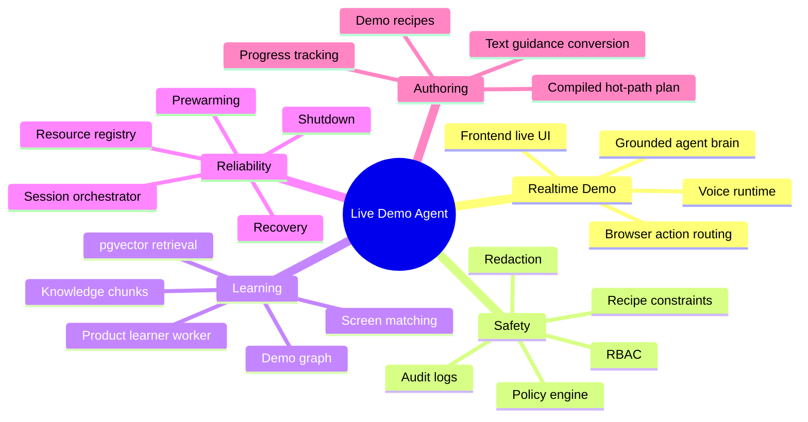
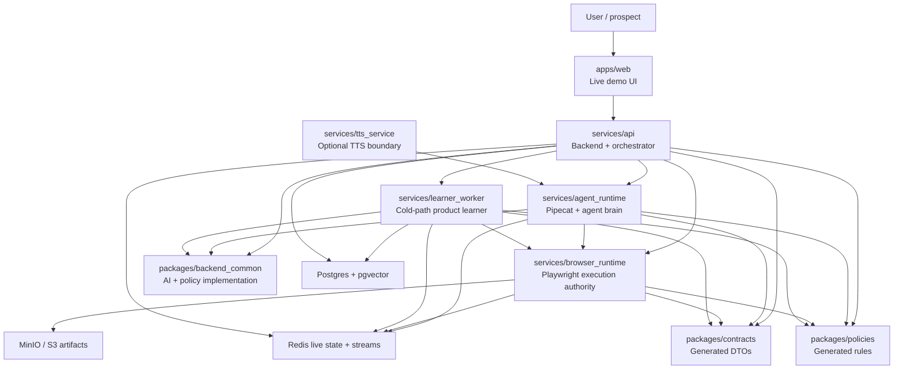
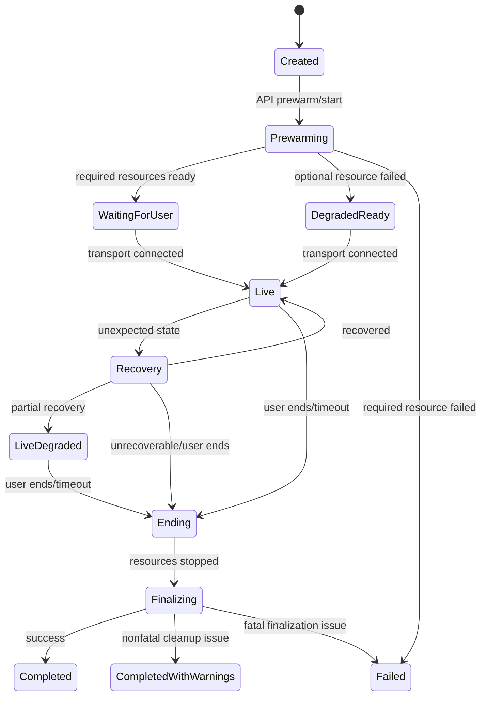
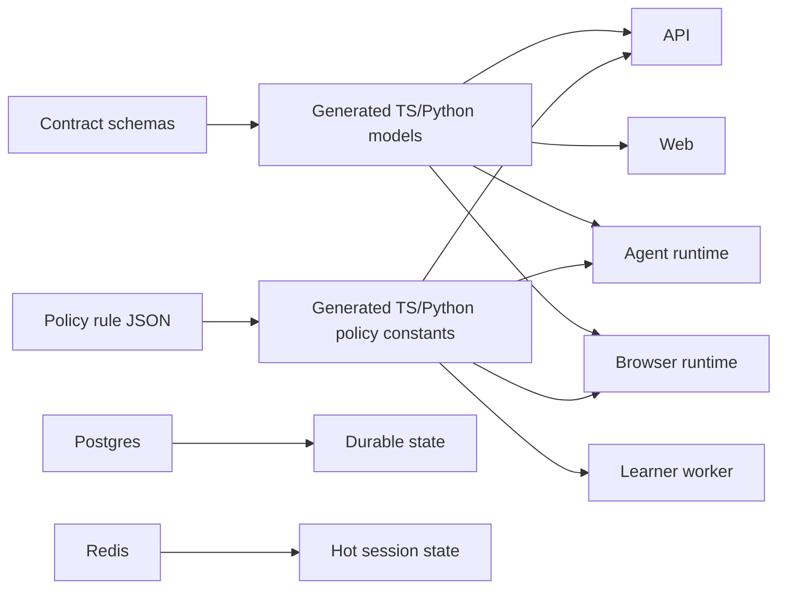

# Documentation Hub

This directory is the current architecture and operations map for the live AI product-demo agent platform.

The platform has two execution paths:

- Hot path: user speech, compact grounded context, agent decision, TTS, and safe browser actions.
- Cold path: learner jobs, product graph updates, recipe generation, embeddings, summaries, and post-session work.

## Reading Map

| Area | Document |
| --- | --- |
| System architecture | [architecture/system-design.md](architecture/system-design.md) |
| User and agent flows | [flows/user-agent-flow.md](flows/user-agent-flow.md) |
| Local development and verification | [operations/local-development.md](operations/local-development.md) |
| Phase 0 foundation | [../architecture/README.md](../architecture/README.md) |
| Shared contracts | [../packages/contracts/README.md](../packages/contracts/README.md) |
| Shared policy package | [../packages/policies/README.md](../packages/policies/README.md) |

## Product Capability Map

## Runtime System

## Main Session Lifecycle

## Source Of Truth Boundaries

Rules:

- Contract schemas are the DTO source of truth.
- Policy JSON is the policy rule source of truth.
- Postgres owns durable session, graph, recipe, audit, and knowledge records.
- Redis owns bounded live state, locks, streams, and hot-path caches.
- Browser runtime is the final browser execution authority.
- The LLM proposes intent; policy and browser runtime decide execution.

## Service READMEs

| Service | README |
| --- | --- |
| API / orchestrator | [../services/api/README.md](../services/api/README.md) |
| Agent runtime | [../services/agent_runtime/README.md](../services/agent_runtime/README.md) |
| Browser runtime | [../services/browser_runtime/README.md](../services/browser_runtime/README.md) |
| Learner worker | [../services/learner_worker/README.md](../services/learner_worker/README.md) |
| Frontend | [../apps/web/README.md](../apps/web/README.md) |
