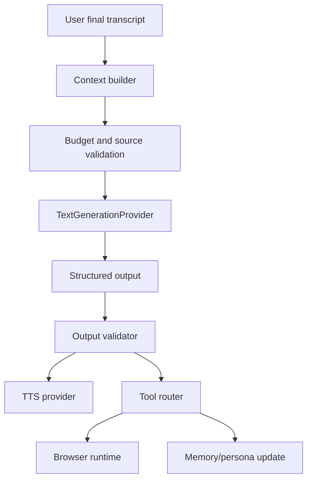

# Agent Flow

The agent runtime turns user speech or scripted test turns into grounded responses and optional browser commands.

Context includes current screen, safe actions, active recipe step, recent turns, persona state, product summary, safety rules, and a source map.

The agent must not:

- invent product capabilities;
- emit raw selectors;
- call Playwright directly;
- place raw screenshots, audio, cookies, or provider responses in prompts.
