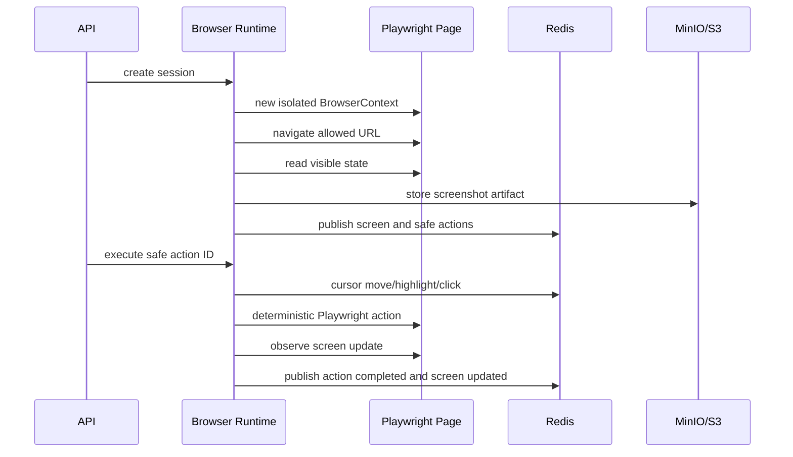

# Browser Flow

The browser runtime is the execution authority. It owns Playwright contexts, screen reads, safe action extraction, request blocking, cursor events, and cleanup.

Isolation rules:

- one BrowserContext per demo session;
- no shared cookies or storage;
- external navigation blocked unless configured;
- downloads and uploads blocked by default;
- context closed and temp files deleted on shutdown.
