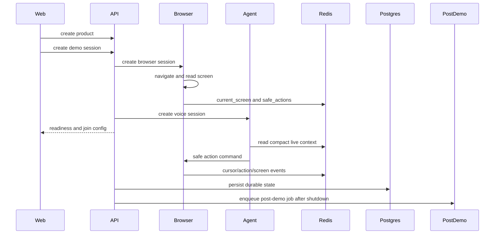

# Data Flow

## Main Flow

## Durable vs Live State

| Store | State | Reason |
| --- | --- | --- |
| Postgres | organizations, products, sessions, transcripts, actions, recipes, summaries, audit logs | durable source of truth |
| Redis | current screen, safe actions, locks, streams, bounded transcript window | low-latency live state |
| MinIO/S3 | screenshots, traces, generated artifacts | large binary storage |

Live state is allowed to expire. Durable session status and audit history are not.
