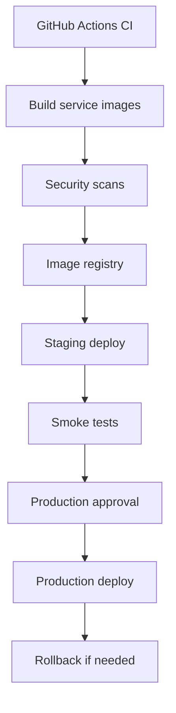

# Deployment Architecture

Deployment assets live under `infra/`.

Assets:

- hardened Dockerfiles in `infra/docker`;
- Compose variants in `infra/compose`;
- Kustomize manifests in `infra/k8s`;
- Helm chart scaffold in `infra/helm`;
- security scan config in `infra/security`;
- deployment scripts in `scripts/deploy`;
- Kubernetes validation scripts in `scripts/k8s`.

Production notes:

- managed Postgres and Redis are recommended;
- production secrets must come from Kubernetes Secrets or a secret manager;
- browser pods are memory-heavy and scale by active sessions;
- worker pods scale by queue depth;
- production traffic requires real provider credentials, ingress, TLS, domain policy, and capacity tuning.
