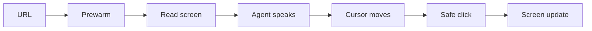
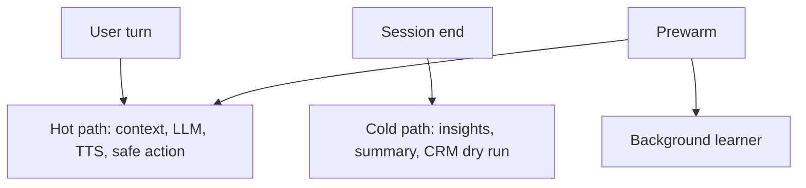
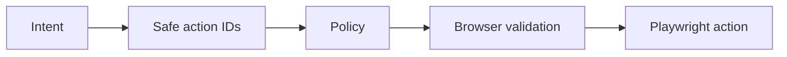

# Architecture Diagrams

This file collects the main diagrams used when explaining the system in an interview.

## Realtime Loop

```mermaid
flowchart LR
    URL["URL"] --> Prewarm["Prewarm"]
    Prewarm --> Screen["Read screen"]
    Screen --> Voice["Agent speaks"]
    Voice --> Cursor["Cursor moves"]
    Cursor --> Action["Safe click"]
    Action --> Update["Screen update"]
```

## Hot and Cold Paths

```mermaid
flowchart TB
    Turn["User turn"] --> Hot["Hot path: context, LLM, TTS, safe action"]
    End["Session end"] --> Cold["Cold path: insights, summary, CRM dry run"]
    Prewarm["Prewarm"] --> Hot
    Prewarm --> ColdLearner["Background learner"]
```

## Safety Gate

```mermaid
flowchart LR
    Intent["Intent"] --> SafeIDs["Safe action IDs"]
    SafeIDs --> Policy["Policy"]
    Policy --> Browser["Browser validation"]
    Browser --> Playwright["Playwright action"]
```
