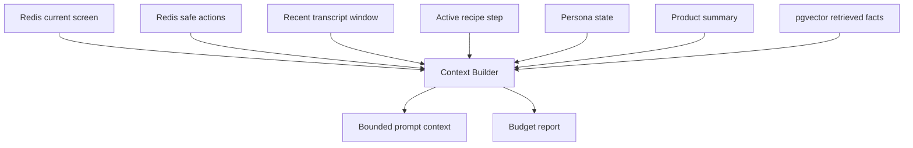

# Memory and Context

The context builder keeps the realtime prompt compact, grounded, source-attributed, and budget-safe.

Rules:

- Required sections are retained before optional retrieved facts.
- Low-priority facts are dropped first when the token budget is tight.
- Every claim-bearing section needs source type, source ID, and confidence.
- Raw DOM, HTML, screenshot bytes, audio, cookies, local storage, and provider responses are excluded.

The hot path reads compact Redis state first. Postgres and vector retrieval are bounded fallbacks.
