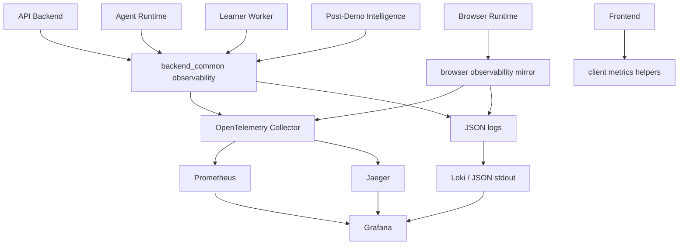
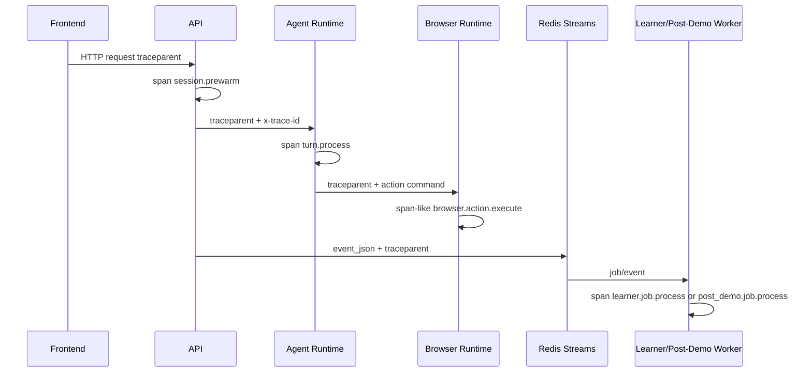
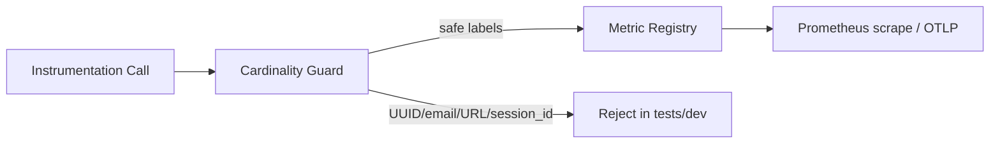
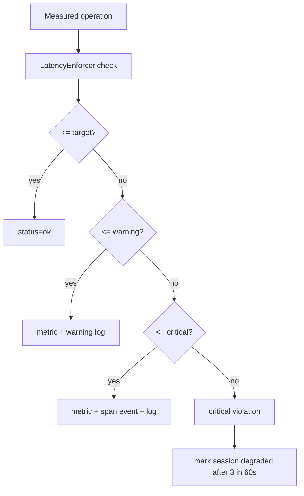
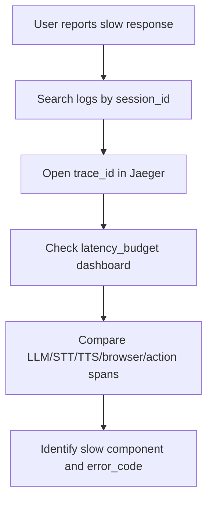

# Phase 14 Observability and Latency Engineering

Phase 14 adds a shared telemetry layer for tracing, metrics, JSON logs, dashboards,
and latency budget checks. It is local-first and vendor-neutral.

## Architecture



## Trace Propagation

Every request or job carries W3C `traceparent` when available. `x-trace-id` is
kept as a debugging mirror for logs and API responses.



Spans must not include raw prompt, transcript, screenshot, audio, cookies, tokens,
or full URL query strings.

## Metrics and Cardinality

Prometheus metric names use the `live_demo_` prefix. Histograms are used for
latency, counters for monotonic events, and gauges for active counts.

Allowed labels are bounded enums such as `service`, `environment`, `operation`,
`provider`, `purpose`, `action_type`, `risk_level`, `result`, and `error_code`.
Labels must never include `session_id`, `trace_id`, `turn_id`, email, full URL,
prompt text, or transcript text.



## Structured Logs

All service logs are JSON. IDs needed for incident debugging live in the log
body, not in Prometheus labels.

```json
{
  "timestamp": "2026-06-21T12:00:00.000Z",
  "level": "info",
  "service": "agent-runtime",
  "environment": "local",
  "event_type": "turn.completed",
  "trace_id": "4bf92f3577b34da6a3ce929d0e0e4736",
  "session_id": "00000000-0000-0000-0000-000000000010",
  "latency_ms": 812.4,
  "success": true,
  "metadata": {
    "phase": "OVERVIEW"
  }
}
```

Redaction removes authorization headers, cookies, API keys, tokens, passwords,
raw prompts, raw transcripts, screenshots, audio, and DOM/HTML content.

## Latency Budgets



Default hot-path budgets:

| Operation | Target | Warning | Critical |
| --- | ---: | ---: | ---: |
| `context_build` | 50 ms | 100 ms | 250 ms |
| `llm_realtime_host` | 900 ms | 1500 ms | 3000 ms |
| `first_audio` | 900 ms | 1500 ms | 3000 ms |
| `stt_final` | 800 ms | 1500 ms | 3000 ms |
| `tts_first_audio` | 500 ms | 1000 ms | 2000 ms |
| `browser_action_total` | 1000 ms | 3000 ms | 5000 ms |
| `screen_read` | 800 ms | 2000 ms | 5000 ms |
| `event_publish` | 20 ms | 100 ms | 250 ms |
| `interruption_stop_tts` | 150 ms | 250 ms | 500 ms |

## Dashboards

Grafana dashboards are provisioned from:

```text
infra/observability/grafana/provisioning
infra/observability/grafana/dashboards
```

Dashboards:

- Realtime UX
- Browser Reliability
- Agent Quality
- Infrastructure Health
- Cost and Usage
- Session Debug
- Latency Budget

## Run Local Stack

```bash
cp .env.example .env
make up-observability
make obs-dashboards-validate
```

Local endpoints:

- Prometheus: `$NEXT_PUBLIC_PROMETHEUS_URL`
- Grafana: `$NEXT_PUBLIC_GRAFANA_URL`
- Jaeger: `$NEXT_PUBLIC_JAEGER_URL`
- Loki: `$NEXT_PUBLIC_LOKI_URL`

## Debug A Slow Session



Use Prometheus for aggregate latency and Loki/Jaeger for session-specific
debugging. Prometheus intentionally has no `session_id` label.

## Debug A Failed Browser Action

1. Search logs for `event_type=browser.action.failed`.
2. Open the linked `trace_id`.
3. Check `browser.action.execute` span attributes: action type, risk level, result.
4. Check `live_demo_browser_actions_total{result="failed"}` and policy block panels.
5. Confirm no raw selector or secret was logged.

## Debug First-Audio Latency

1. Check `live_demo_first_audio_latency_seconds` p95.
2. Compare `turn.context_build`, `turn.llm_request`, and `voice.tts_first_audio`.
3. Check budget violations for `llm_realtime_host` and `tts_first_audio`.
4. Check provider degradation logs.

## Limitations

Phase 14 implements local open-source observability. It does not configure a paid
observability vendor, production retention, alert routing, or long-term metrics
storage. The TypeScript browser runtime uses lightweight span-like helpers and
Prometheus-compatible metrics without adding a heavy OpenTelemetry JS dependency.
