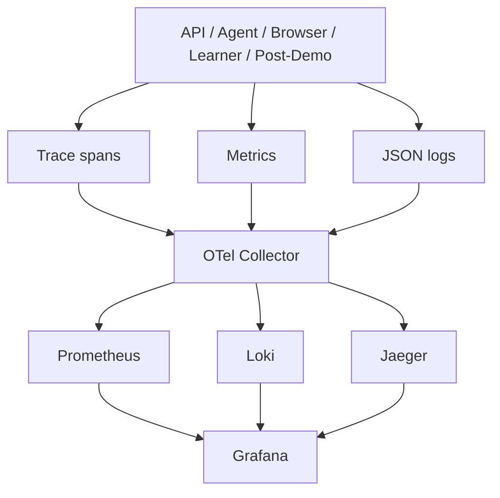

# Observability

Phase 14 adds local open-source observability: OpenTelemetry traces, Prometheus metrics, structured JSON logs, Grafana dashboards, and latency budgets.



Run:

```bash
make up-observability
```

Dashboards:

- realtime UX;
- browser reliability;
- agent quality;
- infrastructure health;
- cost/usage;
- session debug;
- latency budget.

No prompt text, raw transcript, screenshots, audio, cookies, provider keys, or API keys should appear in telemetry.
