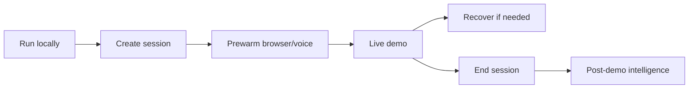

# Architecture Overview

Live Demo Agent is a distributed realtime system with a strict separation between presentation, orchestration, reasoning, browser execution, learning, storage, safety, and observability.

Start with [system-design.md](system-design.md), then use the focused guides:

- [service-boundaries.md](service-boundaries.md)
- [data-flow.md](data-flow.md)
- [agent-flow.md](agent-flow.md)
- [browser-flow.md](browser-flow.md)
- [voice-flow.md](voice-flow.md)
- [memory-and-context.md](memory-and-context.md)
- [safety-and-policy.md](safety-and-policy.md)
- [observability.md](observability.md)
- [deployment.md](deployment.md)

The most important architectural invariant is that the LLM proposes, while policy and browser runtime decide.
