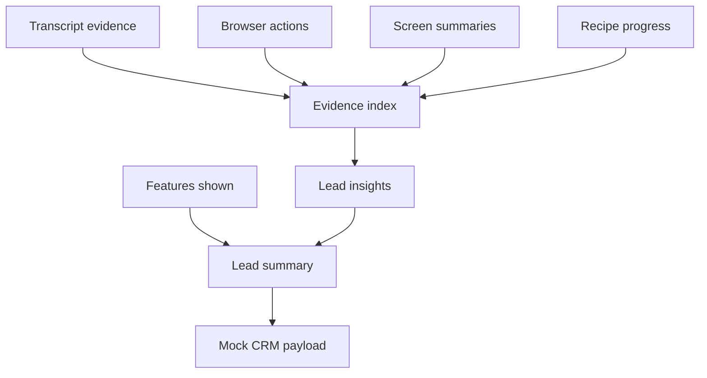

# Post-Demo Intelligence

Post-demo intelligence runs after session shutdown. It extracts evidence-backed sales insights and builds a CRM-ready mock payload.

Rules:

- Every insight must reference evidence.
- LLM output is untrusted until schema-validated and evidence-checked.
- CRM payloads are redacted before export.
- Mock CRM export does not call external systems.
- HubSpot and Salesforce adapters are skeletons unless a later phase implements and live-tests them.

Full AI lead intelligence can be expanded in later phases without changing the evidence model.
