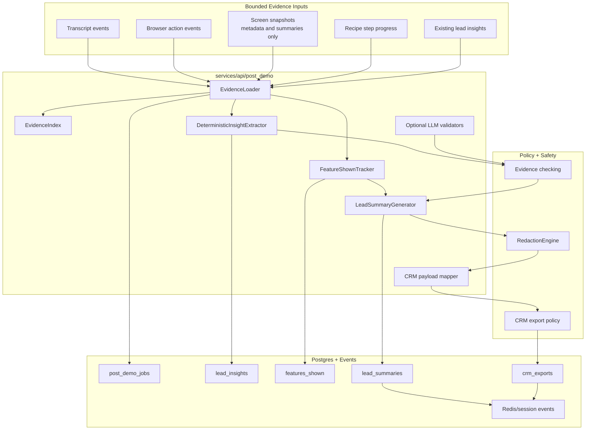
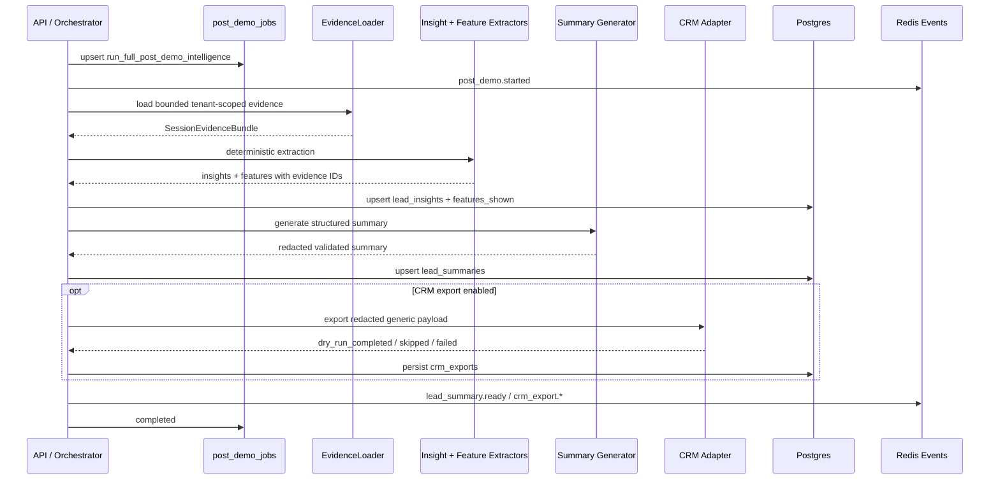
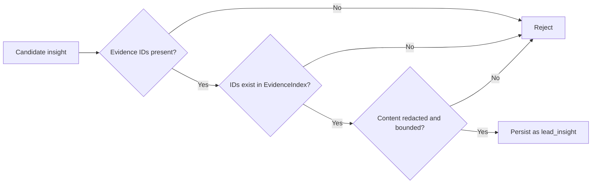
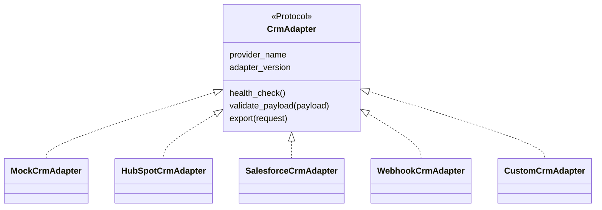
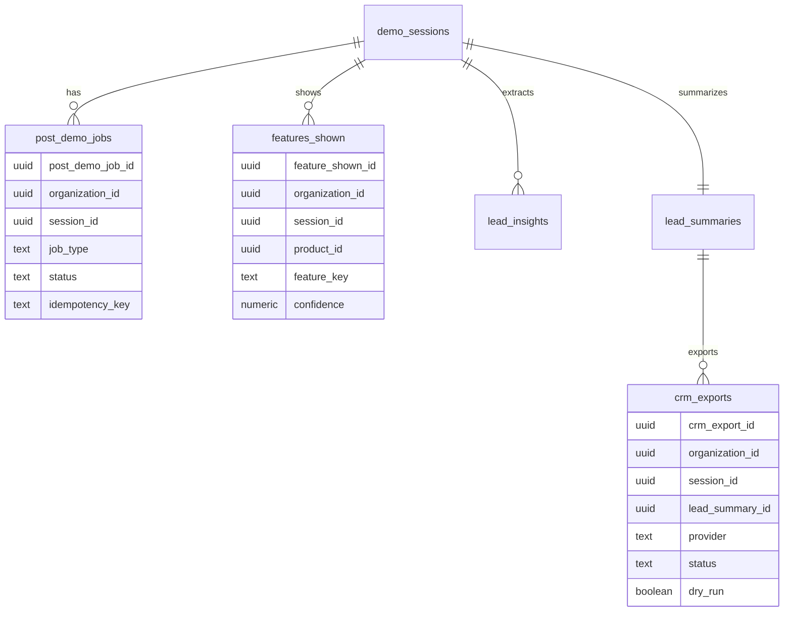

# Post-Demo Intelligence

Phase 13 adds the cold-path intelligence system that runs after a demo session ends. It extracts only evidence-backed sales insights, generates a structured lead summary, tracks product areas shown, and prepares a redacted CRM-ready payload.

It does not block live shutdown, does not send real HubSpot/Salesforce data, and does not persist unsupported claims as facts.

## Architecture



## Job Flow



## Evidence Rules



Rules:

- Every persisted insight carries transcript, browser-action, screen, or recipe-step evidence.
- LLM output is treated as candidate data only and must pass schema and evidence validation.
- Summaries are generated from extracted insights, tracked features, counts, and evidence references.
- No raw screenshots, raw audio, cookies, tokens, provider responses, or raw prompts are included.

## CRM Adapter Boundary



Phase 13 fully implements only the mock adapter. HubSpot, Salesforce, webhook, and custom adapters are registered skeletons that validate configuration and fail honestly without claiming live export support.

## Durable Tables



## Security Notes

- CRM export defaults to `mock` and `CRM_EXPORT_DRY_RUN=true`.
- Mock export writes a local redacted JSON artifact and makes no external network call.
- Real CRM adapters must not send data until a later implementation explicitly enables and verifies them.
- Webhook URLs are checked for HTTPS and private/internal host restrictions outside local mode.
- Contact email preservation is limited to explicit lead/session fields. Transcript-derived emails remain subject to redaction.
- Screenshot pixel redaction is not implemented here; only text and metadata redaction are applied.

## Verification

```bash
make post-demo-test
make post-demo-test-integration
```
