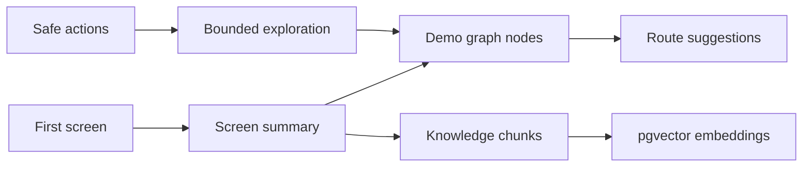

# Product Learner and Demo Graph

The learner is cold path. It improves future demos but never blocks first speech.

Responsibilities:

- summarize screens from bounded evidence;
- detect product categories;
- build demo graph nodes and edges;
- store knowledge chunks;
- support route generation and screen matching.

The learner can degrade without preventing the user from joining a prewarmed session.
