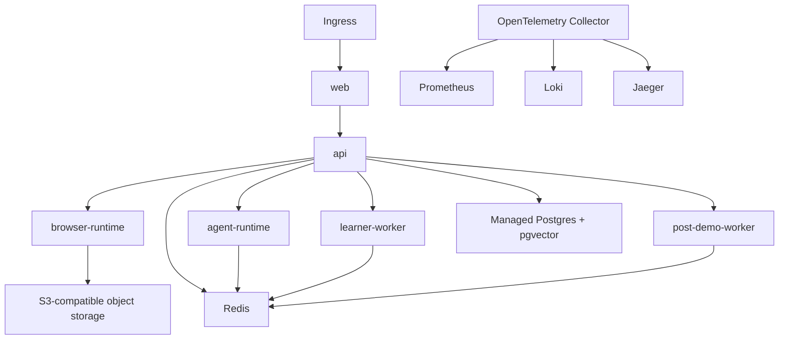
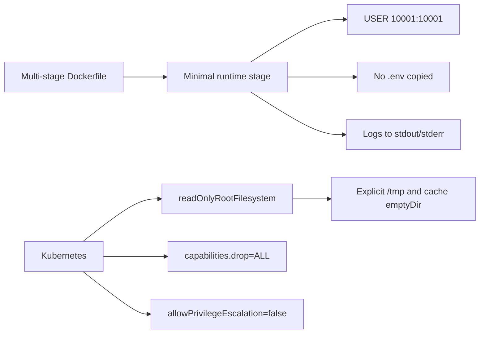
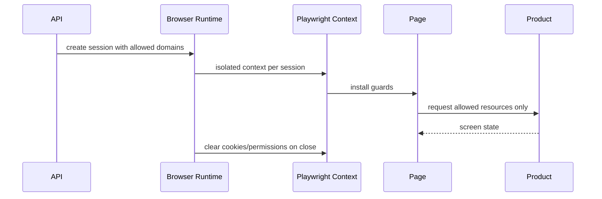
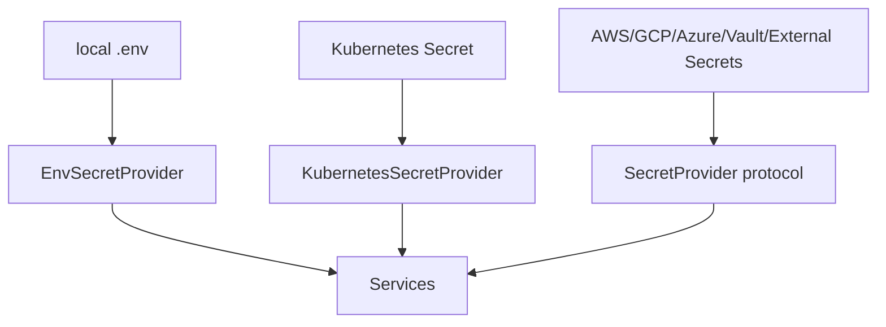
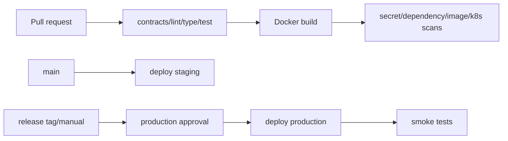
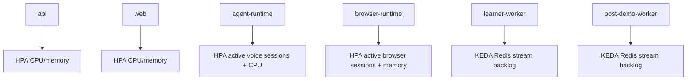
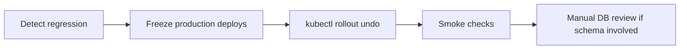

# Security, Deployment, and Production Hardening

Phase 16 packages the platform for staging and production without changing product behavior.

## Production Topology

Managed Postgres and managed Redis are recommended for production. The in-cluster Redis
manifest is suitable for staging or self-managed installations.

## Container Hardening

## Browser Sandboxing

Production startup fails if Chromium no-sandbox, local product URLs, downloads, uploads,
payment pages, destructive actions, or external navigation are enabled.

## Secrets

Phase 16 loads secrets at startup. Rotation requires a rolling restart until live reload is
implemented.

## CI/CD

## Autoscaling

Scale-down is stabilized for hot-path services. Agent and browser pods use preStop hooks and
termination grace periods so active sessions can drain.

## Rollback

Database migrations are forward-only by default. Automatic DB downgrades are not performed.
