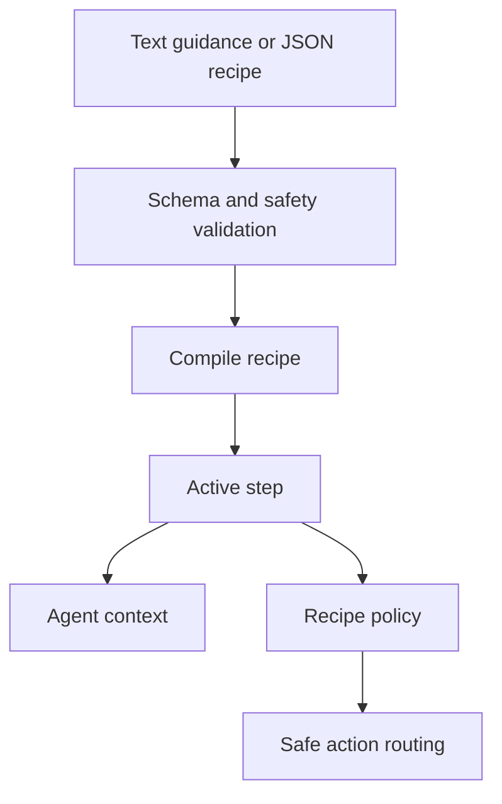

# Recipe Engine

Recipes make demos more reliable by turning goals, talk tracks, hints, and safety constraints into a compiled plan.

Recipe modes:

- URL only: best for exploration.
- URL plus text guidance: faster authoring with better direction.
- URL plus JSON recipe: best for deterministic demos.

Generated recipes are drafts until validated. Raw selectors and JavaScript are rejected.
