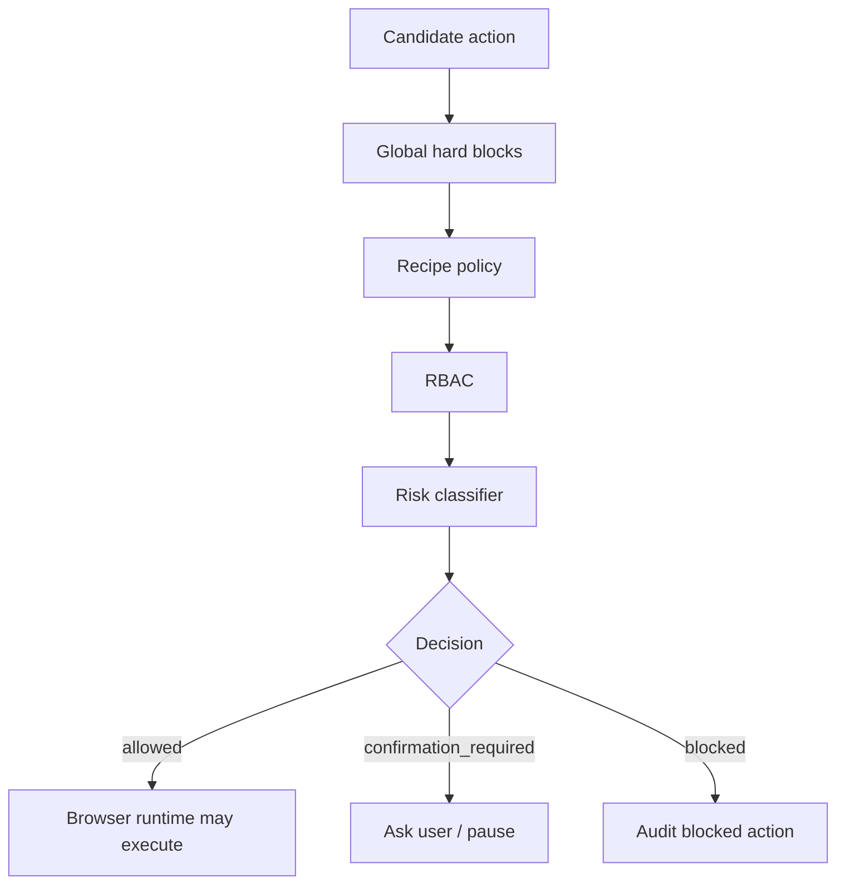

# Safety and Policy

Safety is enforced before browser execution and during post-demo export.

Hard blocks include destructive actions, raw JavaScript, raw CSS/XPath selectors, billing/payment flows, sensitive credential fields, unsafe private-network navigation, and unsafe downloads/uploads.

Recipe policy can:

- forbid additional labels through `never_click`;
- restrict domains;
- restrict allowed form fields;
- require confirmation for specific actions;
- constrain the action set for a recipe step.

Recipe policy cannot override global hard blocks.
