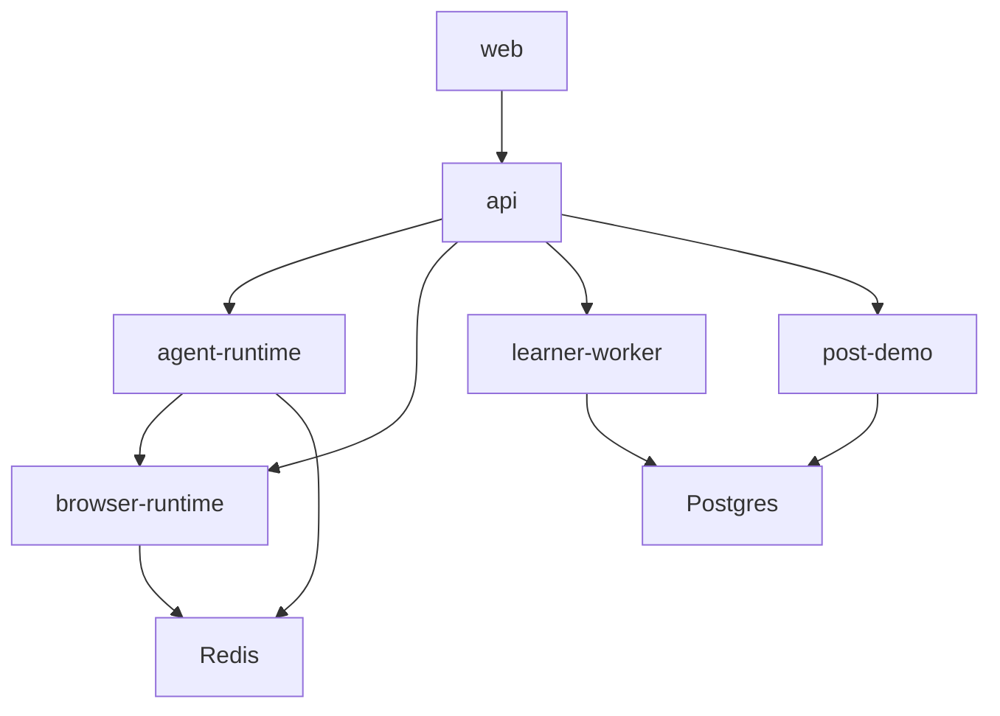

# Service Boundaries

Each service owns a narrow responsibility. Cross-service contracts use generated DTOs from `packages/contracts` where available.

| Service | Owns | Does not own |
| --- | --- | --- |
| web | UI rendering, event consumption, user actions | provider secrets, direct browser runtime calls |
| api | tenant-scoped APIs, session orchestration, durable state transitions | Playwright execution, raw voice media |
| agent-runtime | voice loop, context builder, LLM output validation, tool routing | browser action execution authority |
| browser-runtime | browser contexts, screen read, safe actions, cursor events | durable business state |
| learner-worker | graph, knowledge, route learning | first audio or live turn blocking |
| post-demo intelligence | evidence-backed insights, summaries, mock CRM payload | live CRM writes by default |

Forbidden directions:

- `web` must not import backend secrets or provider adapters.
- `browser-runtime` must not import Python API internals.
- `agent-runtime` must not execute raw Playwright actions.
- `packages/contracts` must not depend on services.
