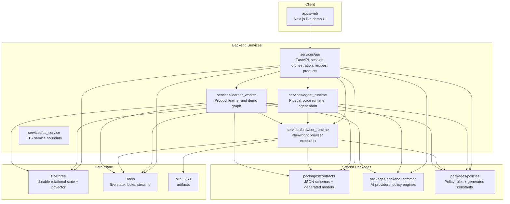
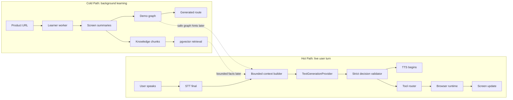
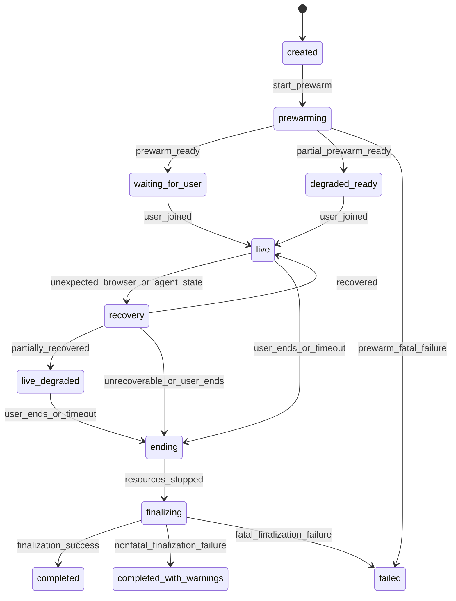
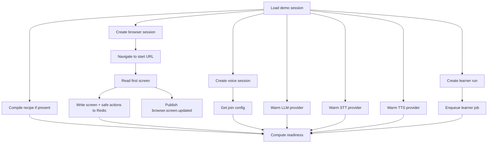
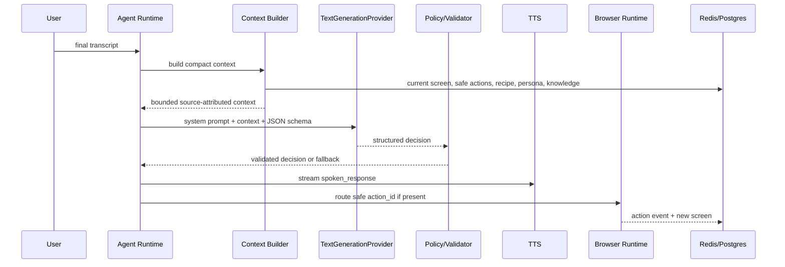
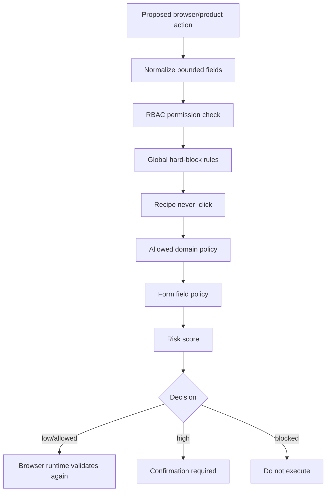
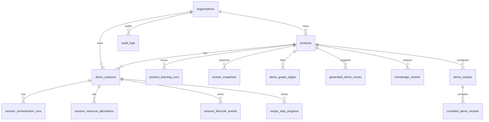
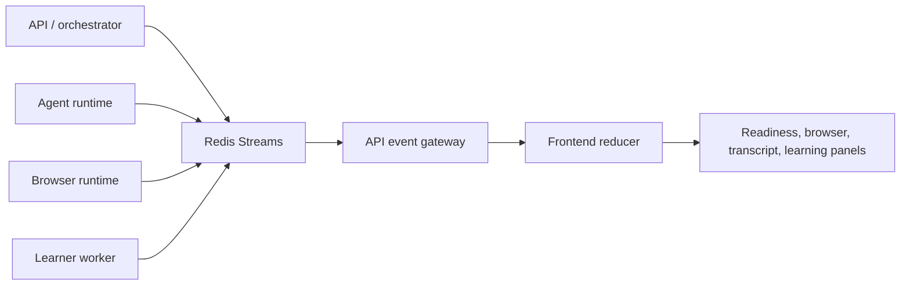
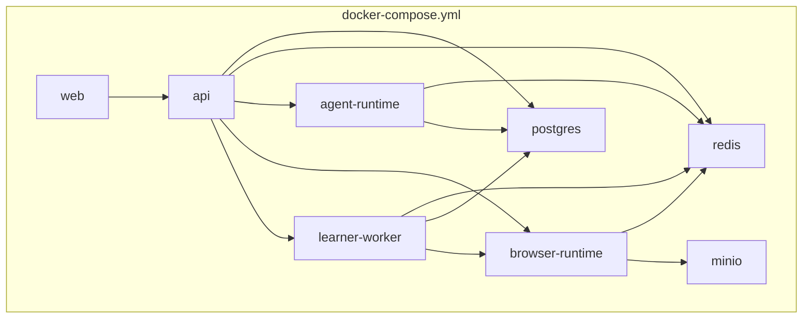

# System Design

This document explains the system as it exists through Phase 12. It is intentionally implementation-oriented: each box maps to a package, service, table group, Redis key group, or runtime boundary in the repository.

## C4-Style Container View

## Hot Path Versus Cold Path

Invariant: cold-path work can improve future context, but first audio and live agent turns do not wait for learner completion.

## Session Orchestration State Machine

Durable session statuses remain compatible with existing API contracts; runtime-only states are stored in orchestration state and frontend events.

## Prewarm DAG

Required browser work gates readiness. Provider warmup and learner enqueue are bounded optional contributors unless settings require otherwise.

## Agent Turn Control Flow

The LLM never receives raw browser authority, raw selectors, arbitrary JavaScript, cookies, screenshots, or unbounded DOM.

## Policy Enforcement Stack

Recipe policy can make execution stricter, but cannot bypass global hard blocks.

## Data Persistence Map

## Event Flow

Frontend-visible events are typed and redacted. They carry status, resource IDs, safe messages, counts, and trace IDs, not prompts, provider secrets, raw audio, cookies, screenshots, or tokens.

## Deployment View

The API treats runtime dependencies as orchestration resources. Readiness can degrade instead of forcing all optional dependencies to block local boot.

