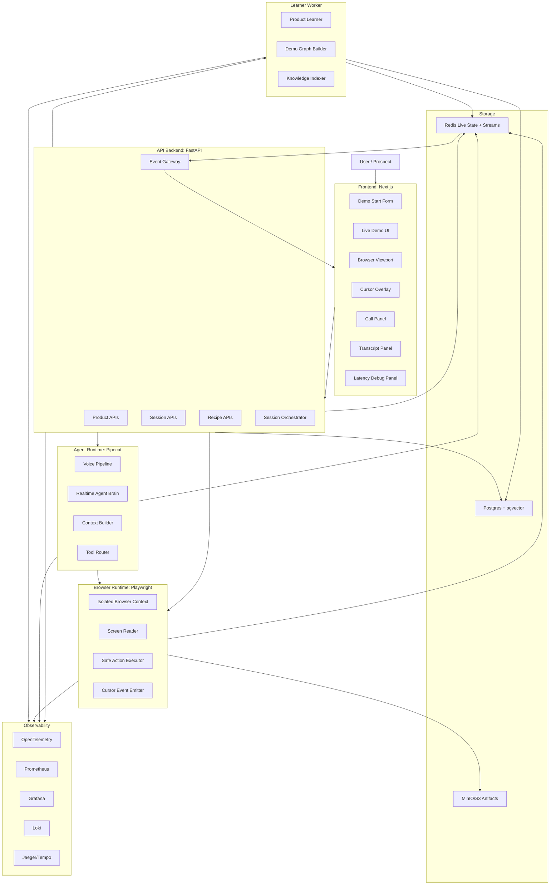
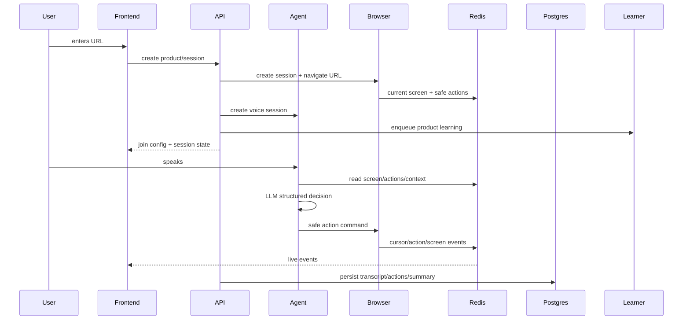
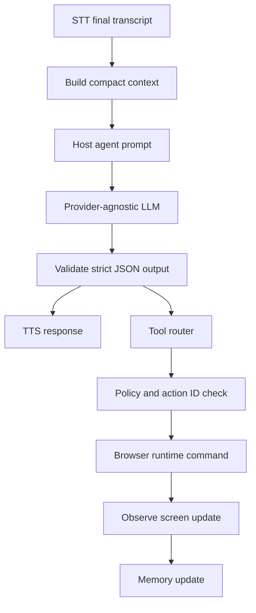
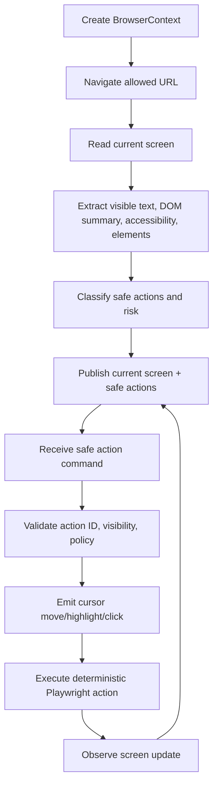
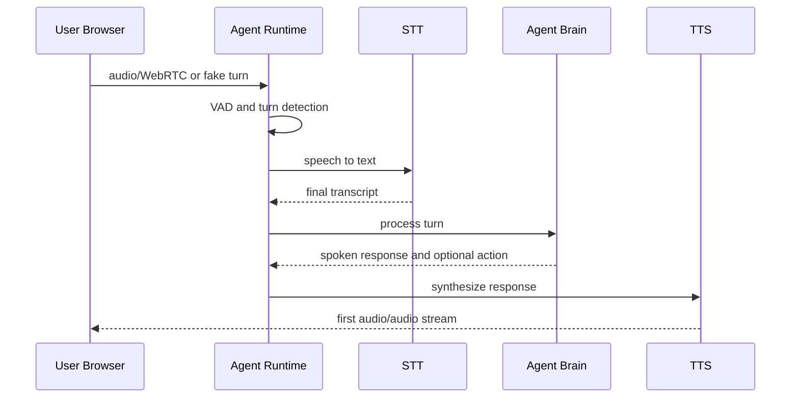
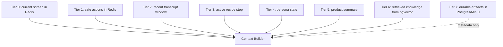
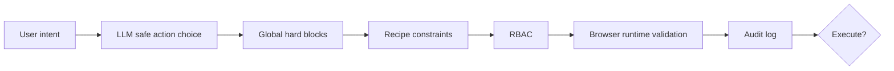
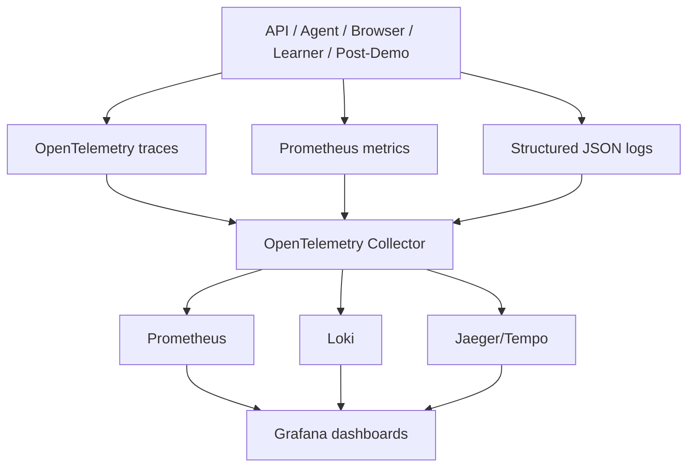

# System Design

Live Demo Agent is a realtime AI sales-engineer runtime. It opens a real product URL in an isolated controlled browser, learns the product screen, speaks with the user over voice, moves a synthetic cursor, executes safe browser actions, answers questions grounded in the live UI and approved knowledge, and generates post-demo sales intelligence.

## System Overview

## Core Boundaries

The system is deliberately split so fast realtime operations do not wait on slow learning, provider enrichment, or post-demo analysis.

| Service | Language/runtime | Responsibilities | Owns durable data? | Redis usage | Latency sensitivity | Scaling strategy | Security constraints |
| --- | --- | --- | --- | --- | --- | --- | --- |
| web | Next.js/React | Live UI, browser frame, cursor overlay, transcript panels | no | reads via API events | medium | HTTP/CPU | no backend secrets in `NEXT_PUBLIC_*` |
| api | FastAPI/Python | Products, sessions, orchestration, RBAC, event gateway | yes | locks, live state, streams | high for session APIs | HPA request/CPU | tenant-scoped queries and audit |
| agent-runtime | Python/Pipecat | Voice pipeline, context builder, agent brain, tool routing | transcript/action writes through APIs or repos | screen/actions/transcript window | very high | active calls/CPU | no raw browser authority |
| browser-runtime | TypeScript/Playwright | Browser contexts, screen read, safe actions, cursor events | artifact metadata through API/storage | browser status/events | high | active sessions/memory | sandbox, domain restrictions, no downloads |
| learner-worker | Python | Product graph, knowledge chunks, screen matching | yes | job state/events | low/cold path | queue depth | never blocks first audio |
| post-demo-worker | Python/API module | Insights, features shown, summary, mock CRM export | yes | job/events | low/cold path | queue depth | evidence and redaction required |
| tts-service | Python/service boundary | Optional local TTS | no | none or events | high if enabled | CPU/GPU | no provider keys in frontend |
| postgres | Postgres + pgvector | Durable system of record | yes | n/a | medium | managed DB preferred | tenant isolation |
| redis | Redis | Live state, streams, locks | ephemeral | n/a | high | managed Redis preferred | bounded keys/streams |
| minio | S3-compatible | Screenshots and artifacts | artifacts only | n/a | medium | object storage | no public raw secrets |
| observability | OTel/Prometheus/Loki/Grafana/Jaeger | Traces, metrics, logs, dashboards | telemetry | n/a | non-blocking | optional profile | no secrets in telemetry |

## End-to-End Data Flow

## Session Lifecycle

Prewarming starts browser creation, URL load, first screen read, provider warmup, recipe compilation, voice session readiness, and learner enqueue before the user joins. Learner completion is never required before first audio.

## Agent Flow

Rules:

- The LLM does not get raw browser authority.
- The LLM chooses from bounded safe action IDs.
- Output validation rejects invalid structure and unsupported high-risk claims.
- The tool router sends browser commands only through the browser runtime.

## Browser Flow

The cursor is synthetic and visual. Playwright performs deterministic actions. This gives the demo a human-like presentation without relying on the real OS cursor.

## Voice Flow

Pipecat is the voice/multimodal pipeline foundation. Pipecat describes itself as an open-source ecosystem for realtime voice and multimodal AI agents: [Pipecat introduction](https://docs.pipecat.ai/overview/introduction).

## Memory and Context

Hot-path context is compact and bounded. Raw DOM, raw HTML, screenshots, audio, cookies, local storage, and provider responses are not placed in prompts.

## Safety Model

Recipe policy can make a demo stricter; it cannot override global hard blocks. Raw selectors, arbitrary JavaScript, destructive actions, billing/payment actions, and sensitive credential fields fail closed.

## Observability

To debug slow first audio:

1. Open the realtime UX dashboard.
2. Find first-audio p95.
3. Open the trace for the session.
4. Compare STT, context build, LLM, TTS, and first audio spans.
5. Check `latency_budget.violation` logs.

## Hot Path vs Cold Path

| Path | Includes | Must not wait for |
| --- | --- | --- |
| Hot path | STT final, context build, LLM decision, TTS first audio, safe browser action | learner completion, post-demo summary, embeddings, CRM export |
| Cold path | learner jobs, graph updates, summaries, CRM dry-run export, eval artifacts | live user speech |

The engineering choice is deliberate: the user experience must feel fast and human, so slow enrichment work stays in the background.
