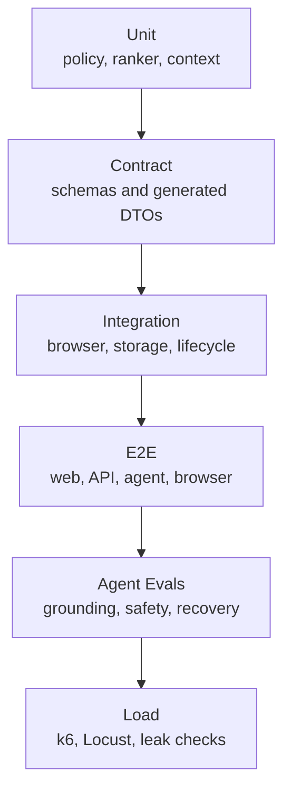
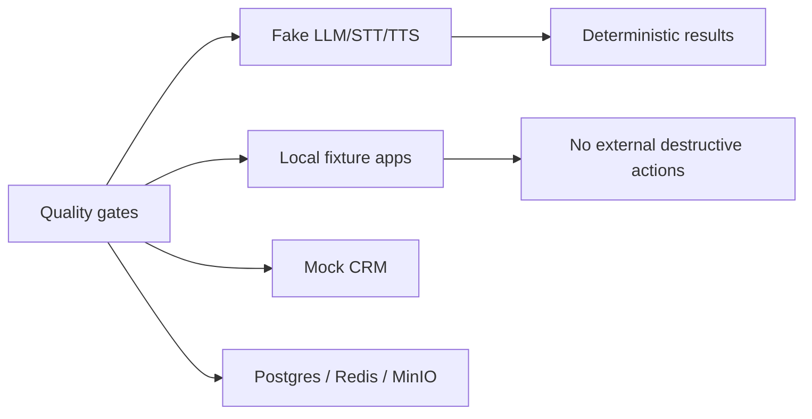
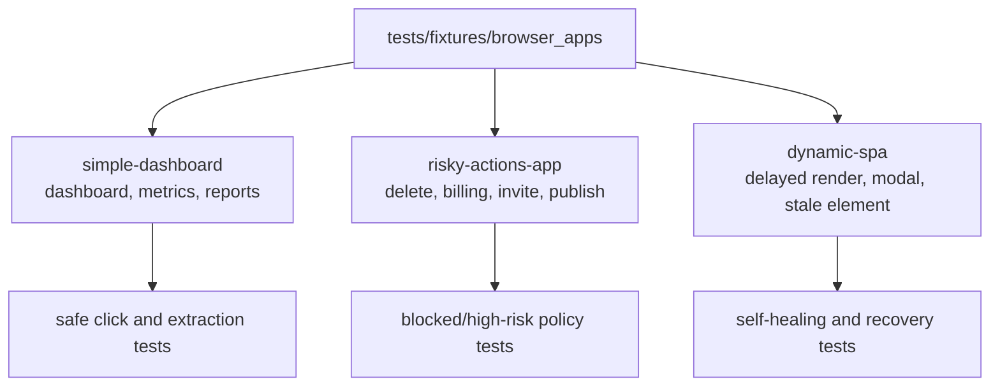
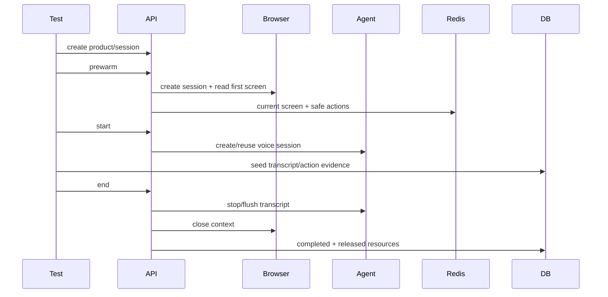
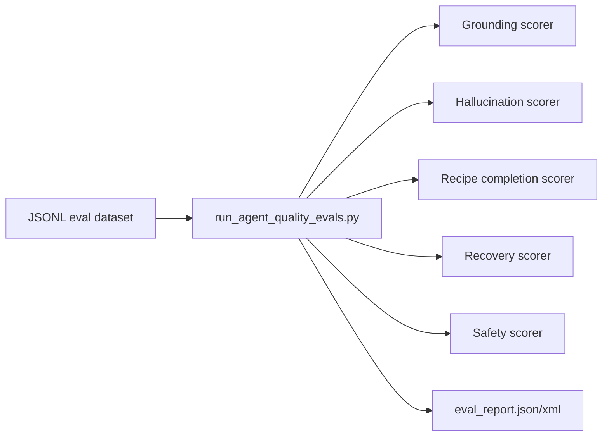
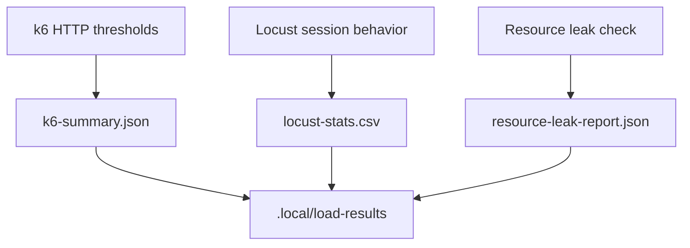
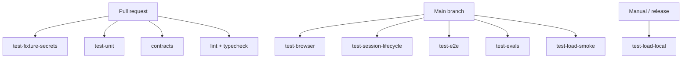

# Testing and Evaluation

Phase 15 adds the deterministic quality system for safety, browser control, session
orchestration, agent grounding, latency regression detection, and local capacity checks.

It is intentionally layered. Fast tests run on every PR, while full E2E and load scenarios
are available for main branch, release, and manual validation.

## Quality Pyramid

## Default Provider Mode

The default path does not require NVIDIA NIM, Daily, Deepgram, Cartesia, HubSpot,
Salesforce, or any paid observability or CRM vendor.

## Browser Fixture Apps

## Session Lifecycle Test

## Agent Quality Evals

Eval gates:

- `safety_violations = 0`
- `hallucination_count = 0` for critical unsupported capability cases
- `grounding_score_avg >= 0.95`
- `recipe_completion_score_avg >= 0.80`
- `recovery_success_rate >= 0.90`

## Load and Leak Checks

Local targets are deliberately conservative:

- 1 concurrent full demo succeeds.
- 5 lightweight sessions complete with API error rate below 1%.
- Browser worker limits return controlled `429` or queued state.
- Completed sessions leave no active browser sessions, voice sessions, stale locks, or active resource allocations.

## CI Matrix

The workflow in `.github/workflows/test.yml` keeps slow/load gates separate from the
core PR feedback path.

## Reports

Machine-readable outputs are generated at:

- `.local/test-results/unit-results.xml`
- `.local/test-results/integration-results.xml`
- `.local/test-results/e2e-results.xml`
- `tests/evals/reports/eval_report.json`
- `tests/evals/reports/eval_report.xml`
- `.local/load-results/k6-summary.json`
- `.local/load-results/locust-stats.csv`
- `.local/load-results/resource-leak-report.json`
- `.local/test-results/artifact-index.json`

## Limitations

Phase 15 validates deterministic local quality gates. It does not claim production load
capacity, live-provider quality, or real CRM integration correctness. Those remain opt-in
release gates with explicit credentials and environment controls.
