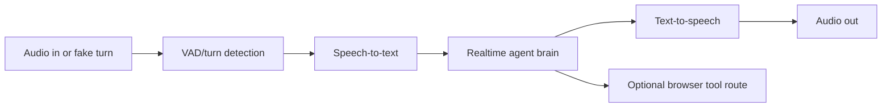

# Voice Flow

The voice loop is implemented in the agent runtime using Pipecat-style pipeline boundaries. Pipecat documents realtime voice/multimodal pipelines that can see, hear, and speak: [Pipecat introduction](https://docs.pipecat.ai/overview/introduction).

Local fake mode bypasses real microphone/provider complexity while exercising the same agent brain, tool routing, orchestration, and post-demo pipeline.

Real voice demo quality depends on transport, STT, TTS, network, provider latency, and local CPU/GPU resources.
