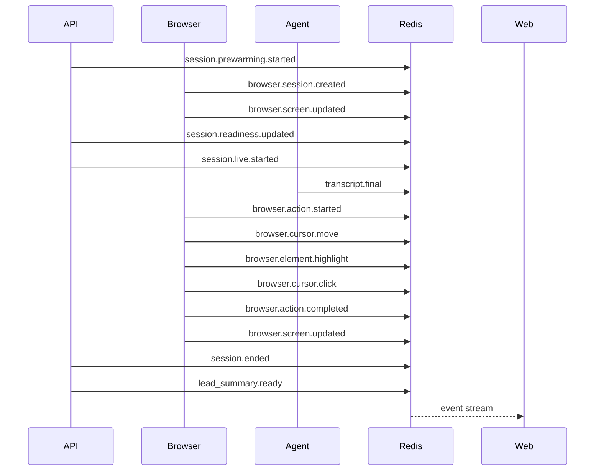

# Expected Demo Events

The event names below are safe frontend-visible event categories expected during a successful local demo.



Expected event list:

```text
session.prewarming.started
browser.session.created
browser.navigation.completed
browser.screen.updated
learner.started
session.readiness.updated
session.waiting_for_user
session.live.started
transcript.final
browser.action.started
browser.cursor.move
browser.element.highlight
browser.cursor.click
browser.action.completed
session.ending
session.ended
lead_summary.ready
crm_export.dry_run_completed
```
