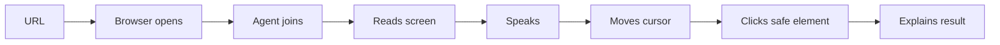

# Recommended Build Order

Build the system in this order:

1. Monorepo + Docker + env abstraction.
2. Database + contracts + event bus.
3. FastAPI session/product/recipe APIs.
4. Browser runtime with Playwright.
5. Frontend browser viewport + cursor overlay.
6. Pipecat voice runtime.
7. Generic LLM provider + NVIDIA NIM adapter.
8. Realtime context builder + host agent prompt.
9. Tool router + safe browser actions.
10. Product learner + demo graph.
11. Recipe engine.
12. Post-demo lead summary.
13. Observability.
14. Tests/evals.
15. Production hardening.
16. Documentation/demo script.

## Most Important Early Milestone

```text
User enters URL -> browser opens product -> agent joins voice call -> agent reads current screen -> agent speaks -> cursor moves -> agent clicks safe element -> agent explains result
```



Once that loop works, every other feature is an iterative improvement:

- learner improves route quality;
- recipes improve reliability;
- post-demo intelligence improves handoff;
- observability improves debugging;
- tests/evals protect behavior;
- production hardening makes it deployable.

Do not start with CRM integrations or large prompt systems. First prove the core browser/voice/action loop.
