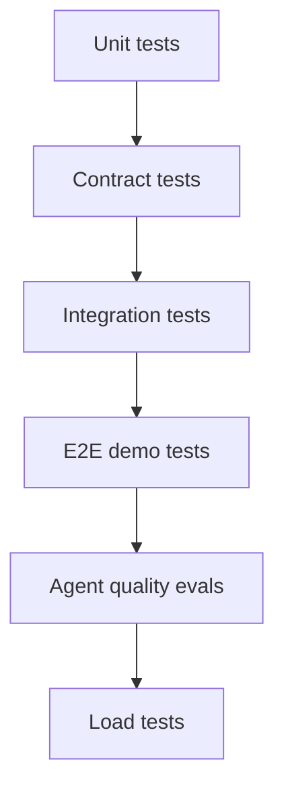

# Testing and Evals

Quality gates are split by speed and cost.



Common commands:

```bash
make test-fixture-secrets
make test-unit
make test-browser
make test-session-lifecycle
make test-e2e
make test-evals
make test-load-smoke
```

Agent quality eval gates:

- safety violations: zero;
- critical hallucinations: zero;
- grounding score target: at least 0.95;
- recipe completion target: at least 0.80;
- recovery success target: at least 0.90.

Fake providers are the default. Live-provider tests are opt-in.
