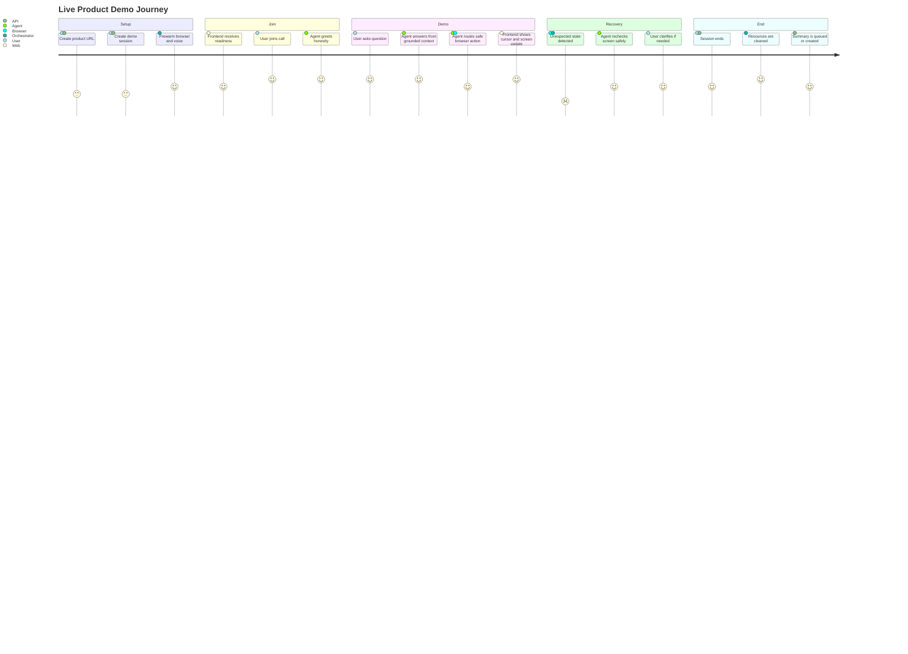
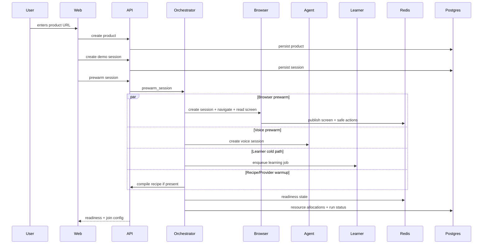
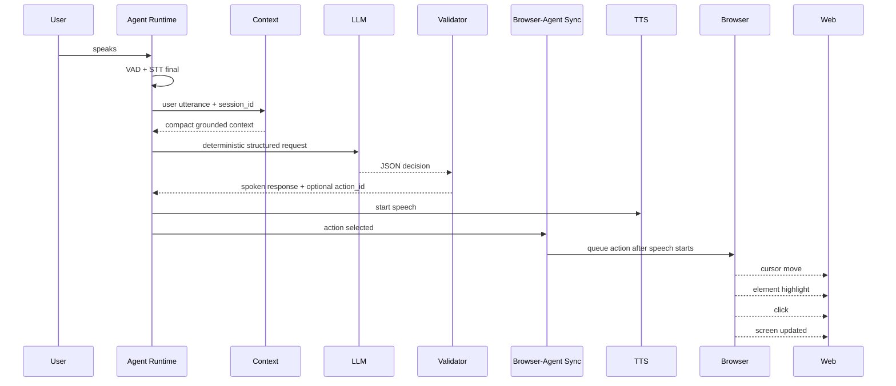
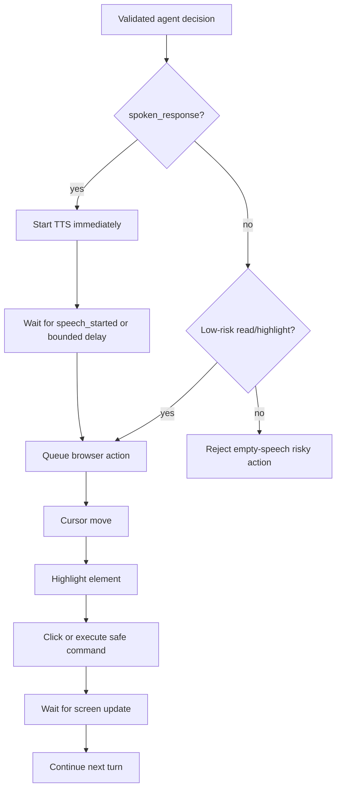
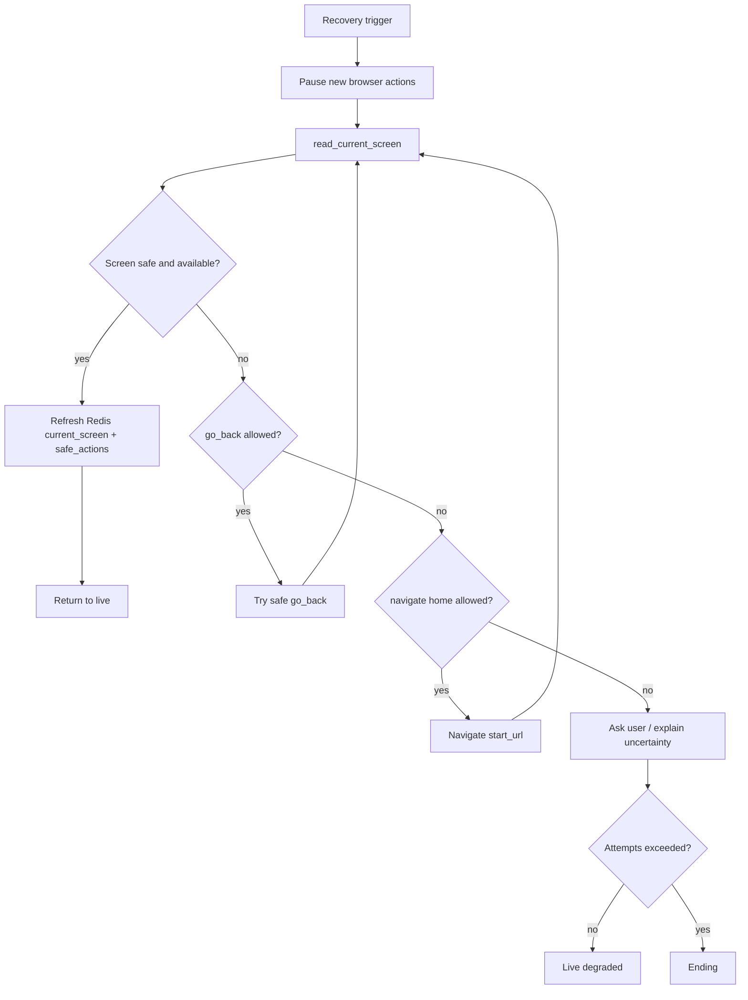
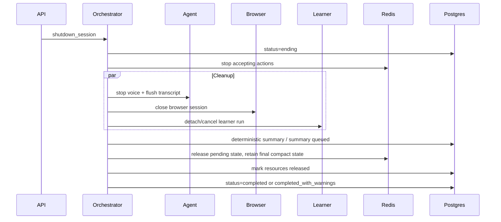
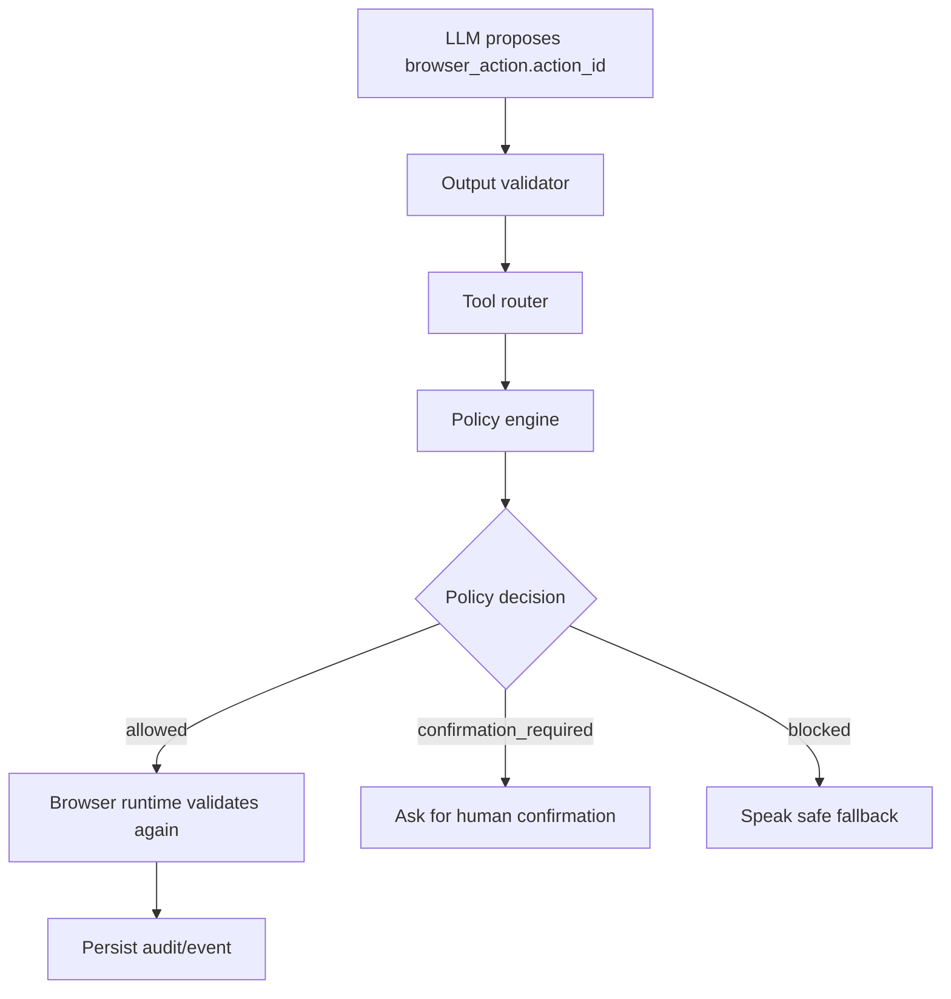

# User And Agent Flows

This document explains how a user moves through a demo and how the agent coordinates speech, screen state, browser actions, recipes, safety, and recovery.

## User Journey

## Demo Creation To Prewarm

## Live Agent Turn

## Browser Action UX Order

This gives the user a presenter-like rhythm: the agent begins speaking, then moves and clicks.

## Recipe-Guided Demo Loop

```mermaid
flowchart LR
    Progress["Recipe progress state"] --> Active["Active compiled step"]
    Active --> Match["Match step to current screen/actions"]
    Match --> Context["Agent context includes active step"]
    Context --> Decision["LLM chooses speech + safe action_id"]
    Decision --> Router["Tool router validates action_id"]
    Router --> Browser["Browser runtime executes"]
    Browser --> Result["Action/screen result"]
    Result --> Complete["Progress tracker evaluates completion"]
    Complete --> Progress
```

The hot path reads compiled recipe payloads, not raw large recipe JSON.

## Recovery Flow

Recovery actions are limited to safe screen read, highlight, go back, and home navigation.

## Shutdown Flow

Duplicate shutdown calls return the existing completed or ending state instead of repeating side effects.

## Safety Decision Flow

The LLM never chooses selectors, JavaScript, credentials, or unvalidated browser commands.
