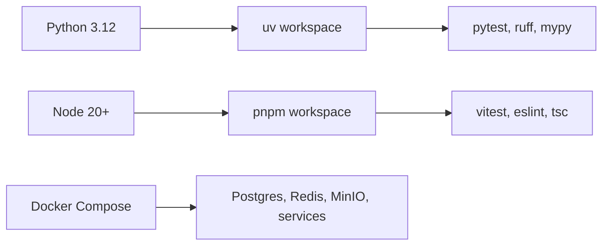
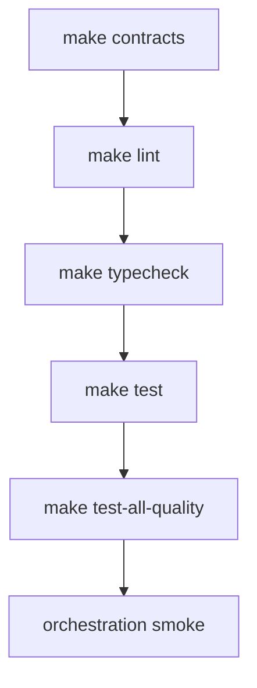
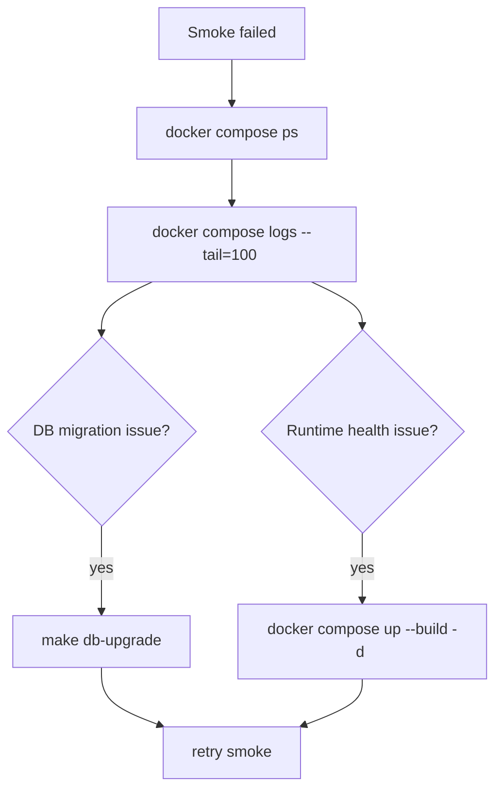
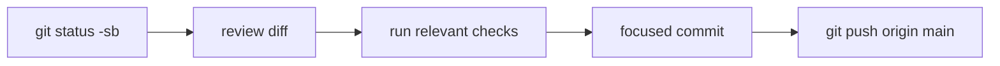

# Local Development And Verification

This guide covers the local workflow used to validate the repository through Phase 15.

## Toolchain



## First Setup

```bash
cp .env.example .env
uv sync --all-packages
pnpm install
docker compose up -d postgres redis minio
make db-upgrade
```

## Core Verification

```bash
make lint
make typecheck
make test
```

## Phase-Specific Verification

```bash
make agent-brain-test
make policy-test
make learner-test
make recipe-test
make orchestration-test
make post-demo-test
make obs-test
make test-fixture-secrets
make test-unit
make test-browser
make test-session-lifecycle
make test-e2e
make test-evals
make test-load-smoke
```



## Phase 15 Quality Workflow

```mermaid
flowchart LR
    Fixtures["fixture secret scan"] --> Unit["unit + contract tests"]
    Unit --> Browser["browser runtime integration"]
    Browser --> Lifecycle["session lifecycle"]
    Lifecycle --> E2E["scripted E2E demo"]
    E2E --> Evals["agent quality evals"]
    Evals --> Load["load smoke"]
    Load --> Reports["machine-readable reports"]
```



Fast local gate:

```bash
make test-fixture-secrets
make test-unit
make test-evals
make test-load-smoke
```

Full local quality gate:

```bash
make test-all-quality
```

Reports are written to `.local/test-results`, `.local/load-results`, and
`tests/evals/reports`.

## Full Local Orchestration Smoke

Start the local stack:

```bash
docker compose up --build -d api browser-runtime agent-runtime learner-worker web
make orchestration-smoke
```

Minimal session lifecycle:

```bash
ORG_ID=00000000-0000-0000-0000-000000000001

curl -X POST http://localhost:8000/api/v1/products \
  -H "Content-Type: application/json" \
  -H "X-Organization-ID: ${ORG_ID}" \
  -d '{
    "product_name": "Example Product",
    "product_url": "https://example.com",
    "default_persona": "founder"
  }'

curl -X POST http://localhost:8000/api/v1/demo-sessions/<session_id>/prewarm \
  -H "X-Organization-ID: ${ORG_ID}"

curl -X POST http://localhost:8000/api/v1/demo-sessions/<session_id>/start \
  -H "X-Organization-ID: ${ORG_ID}"

curl http://localhost:8000/api/v1/demo-sessions/<session_id>/orchestration-state \
  -H "X-Organization-ID: ${ORG_ID}"

curl -X POST http://localhost:8000/api/v1/demo-sessions/<session_id>/end \
  -H "X-Organization-ID: ${ORG_ID}"
```

## Debugging Service Health



Useful commands:

```bash
docker compose ps
docker compose logs --tail=100 api
docker compose logs --tail=100 browser-runtime
docker compose logs --tail=100 agent-runtime
docker compose logs --tail=100 learner-worker
make db-current
```

## Commit And Push Workflow



Keep commits focused by subsystem or documentation area. Avoid committing `.env`, local caches, container artifacts, or generated files that were not intentionally regenerated.
