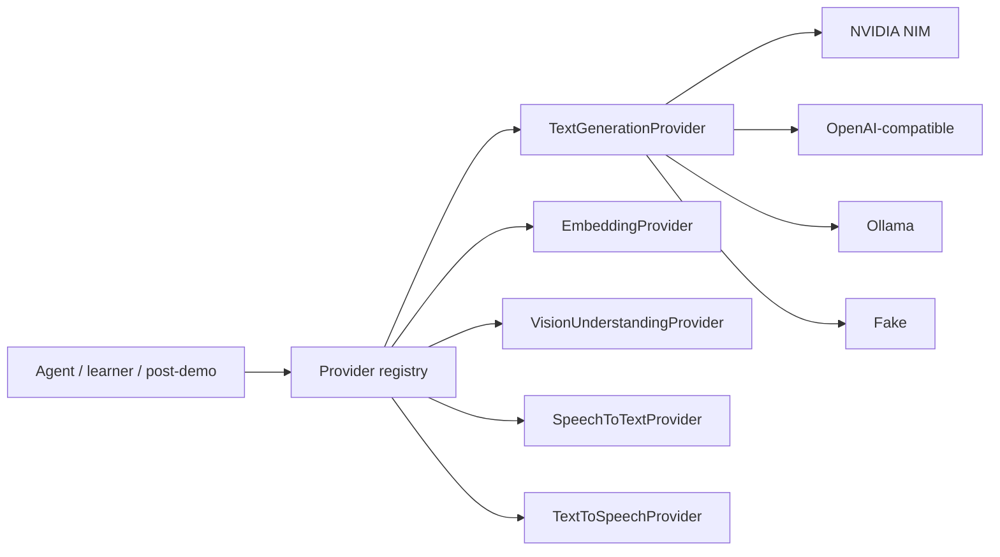

# Provider Switching Guide

## Provider Abstraction Philosophy

Business logic uses generic interfaces:

- `TextGenerationProvider`
- `EmbeddingProvider`
- `VisionUnderstandingProvider`
- `SpeechToTextProvider`
- `TextToSpeechProvider`

Provider-specific logic lives in adapters. Switching providers should usually require environment changes and service restarts, not business-code changes.



After changing provider variables, restart affected services:

```bash
docker compose up -d --build api agent-runtime learner-worker
```

## Text LLM Providers

### NVIDIA NIM

```env
AI_TEXT_PROVIDER=nvidia_nim
AI_TEXT_BASE_URL=https://integrate.api.nvidia.com/v1
AI_TEXT_API_KEY=<your-key>
AI_TEXT_MODEL=<model-name>
AI_TEXT_ENABLE_STREAMING=true
AI_TEXT_ENABLE_TOOL_CALLING=true
AI_TEXT_TEMPERATURE=0.0
AI_TEXT_TOP_P=1.0
```

Use NVIDIA NIM when you want hosted inference while keeping OpenAI-compatible request semantics. NVIDIA documents NIM LLM as exposing an OpenAI-compatible API with chat completions, streaming, and tool calling: [NVIDIA NIM LLM API reference](https://docs.nvidia.com/nim/large-language-models/latest/api-reference.html).

### Custom OpenAI-Compatible Endpoint

```env
AI_TEXT_PROVIDER=custom_openai_compatible
AI_TEXT_BASE_URL=https://your-provider.example.com/v1
AI_TEXT_API_KEY=<your-key>
AI_TEXT_MODEL=<model-name>
AI_TEXT_ENABLE_STREAMING=true
AI_TEXT_ENABLE_TOOL_CALLING=true
```

The endpoint must support a chat completions-style API. Tool calling and JSON schema support vary by provider and model.

### Ollama

```env
AI_TEXT_PROVIDER=ollama
OLLAMA_BASE_URL=http://ollama:11434
OLLAMA_TEXT_MODEL=<model-name>
```

Run:

```bash
docker compose --profile ai-local up --build
docker compose exec ollama ollama pull <model-name>
```

Ollama documents compatibility with parts of the OpenAI API: [Ollama OpenAI compatibility](https://docs.ollama.com/api/openai-compatibility).

### Fake

```env
AI_TEXT_PROVIDER=fake
```

Use fake text generation for CI, deterministic local smoke tests, and fallback demos.

## Embedding Providers

NVIDIA/OpenAI-compatible:

```env
AI_EMBEDDING_PROVIDER=nvidia_nim
AI_EMBEDDING_BASE_URL=https://integrate.api.nvidia.com/v1
AI_EMBEDDING_API_KEY=<your-key>
AI_EMBEDDING_MODEL=<embedding-model>
AI_EMBEDDING_DIMENSIONS=768
```

Ollama:

```env
AI_EMBEDDING_PROVIDER=ollama
AI_EMBEDDING_BASE_URL=http://ollama:11434
AI_EMBEDDING_MODEL=nomic-embed-text
AI_EMBEDDING_DIMENSIONS=768
```

Fake:

```env
AI_EMBEDDING_PROVIDER=fake
AI_EMBEDDING_DIMENSIONS=768
```

Embedding dimensions must match the pgvector schema. Changing dimensions requires a database migration and reindexing.

## Vision Providers

Vision is disabled by default:

```env
AI_VISION_PROVIDER=disabled
```

If enabled later, it must stay out of the realtime hot path unless explicitly configured:

```env
AI_VISION_ALLOW_HOT_PATH=false
AI_VISION_USE_ONLY_AS_FALLBACK=true
```

Do not put raw screenshots in prompts unless a later phase implements and verifies visual redaction and explicit policy.

## STT Providers

Fake:

```env
AI_STT_PROVIDER=fake
```

Local Whisper:

```env
AI_STT_PROVIDER=whisper_local
WHISPER_LOCAL_MODEL=base
WHISPER_LOCAL_DEVICE=cpu
```

whisper.cpp:

```env
AI_STT_PROVIDER=whisper_cpp
WHISPER_CPP_BINARY_PATH=/path/to/whisper-cli
WHISPER_CPP_MODEL_PATH=/path/to/model.bin
```

Cloud STT example:

```env
AI_STT_PROVIDER=deepgram
DEEPGRAM_API_KEY=<your-key>
DEEPGRAM_MODEL=<model>
DEEPGRAM_LANGUAGE=en
```

Cloud STT generally gives better realtime latency than weak local hardware. Local Whisper is useful for no-cost/offline mode but may be slower.

## TTS Providers

Fake:

```env
AI_TTS_PROVIDER=fake
```

Kokoro local service:

```env
AI_TTS_PROVIDER=kokoro
KOKORO_BASE_URL=http://tts:8100
KOKORO_VOICE=af_heart
```

Run:

```bash
docker compose --profile tts-local up --build
```

Piper:

```env
AI_TTS_PROVIDER=piper
PIPER_BINARY_PATH=/path/to/piper
PIPER_MODEL_PATH=/path/to/model.onnx
```

Cloud TTS example:

```env
AI_TTS_PROVIDER=cartesia
CARTESIA_API_KEY=<your-key>
CARTESIA_VOICE_ID=<voice-id>
```

## Recommended Local Modes

| Mode | LLM | STT | TTS | Cost | Latency | Best for |
| --- | --- | --- | --- | --- | --- | --- |
| CI/fake | fake | fake | fake | free | deterministic | tests |
| Local no-cost | Ollama | whisper.cpp | Kokoro/Piper | local compute | hardware-dependent | dev experiments |
| NIM demo | NVIDIA NIM | fake/cloud STT | fake/cloud TTS | provider usage | usually faster than local laptop models | interview demo |
| Cloud voice demo | hosted LLM | cloud STT | cloud TTS | provider usage | best voice quality | polished demo |
| Production managed | managed LLM | cloud STT | cloud TTS | provider usage | target production | real users |

## Recommended Demo Modes

For maximum reliability during an interview:

```env
AI_TEXT_PROVIDER=fake
AI_STT_PROVIDER=fake
AI_TTS_PROVIDER=fake
CRM_EXPORT_PROVIDER=mock
CRM_EXPORT_DRY_RUN=true
```

For more realistic language generation:

```env
AI_TEXT_PROVIDER=nvidia_nim
AI_STT_PROVIDER=fake
AI_TTS_PROVIDER=fake
```

## Recommended Production Modes

Production should use managed or explicitly supported providers, real secrets from a secret manager, and provider health checks. Real CRM writes must stay disabled until a provider adapter is implemented and live-tested.

## Troubleshooting Provider Errors

```bash
grep AI_TEXT_ .env
grep AI_STT_ .env
grep AI_TTS_ .env
docker compose logs agent-runtime --tail=200
docker compose logs api --tail=200
```

Common fixes:

- switch to fake mode to isolate provider issues;
- verify base URL, model name, and key;
- pull Ollama models manually;
- check whether the model supports tools and strict JSON;
- increase timeouts only after provider health is verified.
