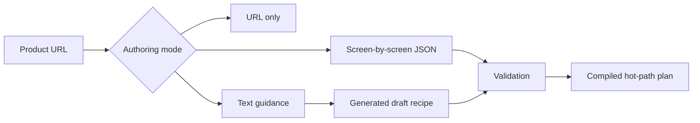

# Demo Recipe Guide

## What Is a Demo Recipe?

A demo recipe is a safety-constrained plan for showing a product. It can include persona, demo goal, talk track, screen hints, click hints, safe actions, success criteria, fallback strategies, and policy constraints.



## When to Use Just a URL

Use URL-only mode for quick exploration. The agent reads the live UI and builds a provisional route. Reliability depends on the product UI, visible labels, and safe action extraction.

## When to Add Text Guidance

Use text guidance when you know the persona, product value, and demo goals but do not want to write JSON.

Example:

```text
Product: Metric Master
Persona: startup founder

This product helps founders track KPIs and understand weekly revenue trends.
Show the dashboard first, then show how to create a metric, then show reporting.
Avoid billing, delete, invite users, payment, account settings, and publishing.
Keep the talk track focused on speed to insight and reducing manual reporting.
```

Expected result: the recipe generator can convert this into a draft recipe. The draft must still be validated before use. A generated recipe is not trusted merely because an LLM produced it.

## When to Add Screen-by-Screen Recipe JSON

Use JSON recipes for production-grade demo reliability. JSON defines deterministic step order, hints, talk tracks, success criteria, and fallback behavior.

## Recipe JSON Schema

Minimal shape:

```json
{
  "recipe_name": "Founder Metrics Demo",
  "target_persona": "founder",
  "demo_goal": "Show how a founder can understand business performance and create a metric.",
  "global_talk_track": "Focus on speed to insight and reducing manual reporting.",
  "never_click": ["Delete", "Remove", "Billing", "Payment"],
  "allowed_domains": ["metric-master-suite505.apps.rebolt.ai"],
  "steps": []
}
```

## Screen-by-Screen Recipe Example

```json
{
  "recipe_name": "Founder Metrics Demo",
  "target_persona": "founder",
  "demo_goal": "Show how a founder can understand business performance and create a metric.",
  "global_talk_track": "Focus on speed to insight and reducing manual reporting.",
  "never_click": [
    "Delete",
    "Remove",
    "Billing",
    "Invite",
    "Send",
    "Publish",
    "Upgrade",
    "Payment",
    "Account Settings"
  ],
  "allowed_domains": [
    "metric-master-suite505.apps.rebolt.ai"
  ],
  "steps": [
    {
      "step_order": 0,
      "step_key": "overview",
      "phase": "OVERVIEW",
      "goal": "Show the dashboard overview.",
      "screen_hint": "dashboard, metrics, overview",
      "click_hint": null,
      "talk_track": "This is where the team sees the health of the business at a glance.",
      "allowed_actions": [
        "read_current_screen",
        "highlight_element",
        "scroll"
      ],
      "success_criteria": [
        "dashboard visible",
        "metric cards or KPI summaries visible"
      ],
      "fallback_strategy": "Read the current screen and explain only what can be verified.",
      "required": true,
      "max_attempts": 2
    },
    {
      "step_order": 1,
      "step_key": "metric_creation",
      "phase": "CORE_WORKFLOW",
      "goal": "Show how to create or configure a metric.",
      "screen_hint": "metric builder, add metric, create metric",
      "click_hint": "Add Metric, Create Metric, New Metric",
      "talk_track": "Now I will show how quickly a team can define the metric they want to track.",
      "allowed_actions": [
        "highlight_element",
        "click_element",
        "type_demo_text"
      ],
      "success_criteria": [
        "metric creation form or modal visible"
      ],
      "fallback_strategy": "If metric creation is not visible, ask whether to continue with the closest safe workflow.",
      "required": false,
      "max_attempts": 2
    },
    {
      "step_order": 2,
      "step_key": "reporting",
      "phase": "DEEP_DIVE",
      "goal": "Show reports or analytics.",
      "screen_hint": "reports, analytics, insights",
      "click_hint": "Reports, Analytics, Insights",
      "talk_track": "This is where metrics become shareable insights.",
      "allowed_actions": [
        "highlight_element",
        "click_element",
        "scroll"
      ],
      "success_criteria": [
        "reports or analytics screen visible"
      ],
      "fallback_strategy": "If reports are unavailable, explain that reporting was not verified in this run.",
      "required": false,
      "max_attempts": 2
    },
    {
      "step_order": 3,
      "step_key": "recap",
      "phase": "SUMMARY",
      "goal": "Recap verified value and next steps.",
      "screen_hint": null,
      "click_hint": null,
      "talk_track": "Recap only what was shown and what the user cared about.",
      "allowed_actions": [],
      "success_criteria": [
        "recap delivered"
      ],
      "fallback_strategy": "Summarize what was verified and what remains unknown.",
      "required": true,
      "max_attempts": 1
    }
  ]
}
```

## Safe Defaults

Safe actions are produced by the browser runtime. The agent can only choose safe action IDs, not raw selectors.

Global hard blocks override recipe settings. Recipes cannot allow raw JavaScript, raw CSS selectors, XPath selectors, payment fields, destructive actions, or unsafe private-network navigation.

## never_click

`never_click` adds labels and text fragments that should be blocked for this product or demo.

```json
{
  "never_click": ["Delete", "Billing", "Payment", "Account Settings"]
}
```

## allowed_domains

Restrict navigation to the product domain and approved asset domains.

```json
{
  "allowed_domains": ["metric-master-suite505.apps.rebolt.ai"]
}
```

## allowed_form_fields

Allow safe demo text fields, not sensitive fields.

```json
{
  "allowed_form_fields": ["Metric name", "Report title"]
}
```

Sensitive fields such as passwords, tokens, API keys, payment cards, and production credentials remain blocked.

## confirmation_required_actions

Use confirmation for actions that may be high impact but not globally forbidden.

```json
{
  "confirmation_required_actions": ["Invite", "Publish", "Export"]
}
```

## Step Matching

The runtime matches steps using:

- phase;
- `screen_hint`;
- `click_hint`;
- current screen summary/title;
- visible labels;
- recipe progress;
- safe actions.

Matching is deterministic and bounded.

## Fallback Strategies

Fallbacks should tell the agent what to do safely when the expected screen is unavailable.

Good fallback:

```text
Read the current screen and explain only what can be verified.
```

Risky fallback:

```text
Try any button that looks related.
```

Avoid risky fallbacks.

## Validation Errors

| Error code | Meaning | Fix |
| --- | --- | --- |
| `step_order_not_contiguous` | Step order has gaps or duplicates | Renumber from 0 without gaps |
| `duplicate_step_key` | Step keys repeat | Use unique step keys |
| `destructive_action_not_allowed` | Recipe attempts to allow destructive action | Remove the action |
| `raw_selector_not_allowed` | Raw CSS/XPath selector was provided | Use visible labels and hints |
| `javascript_not_allowed` | Recipe attempted arbitrary script | Remove it |
| `domain_not_allowed` | Domain is outside allowed policy | Add safe domain or change URL |
| `sensitive_form_field_not_allowed` | Sensitive field is allowed | Remove the field |

## Examples

Fixture examples live in:

```text
tests/fixtures/recipes/
tests/recipes/fixtures/
```
