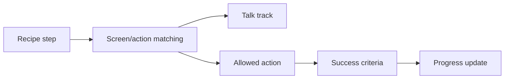

# Screen-by-Screen Recipe Guide

Screen-by-screen recipes are for reliable demos. Each step should include:

- `step_order`;
- `step_key`;
- `phase`;
- `goal`;
- `screen_hint`;
- `click_hint`;
- `talk_track`;
- `allowed_actions`;
- `success_criteria`;
- `fallback_strategy`;
- `required`;
- `max_attempts`.

Keep click hints label-based. Do not use raw selectors.
