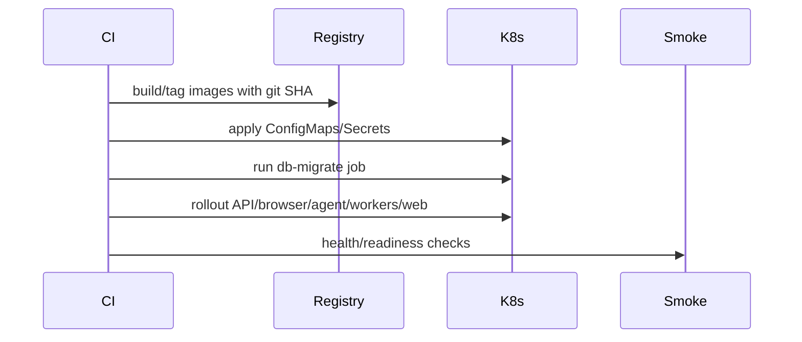

# Deployment Runbook



Symptoms: rollout stalls, pods crashloop, smoke test fails.

Dashboards: infrastructure health, latency budget, browser reliability.

Commands:

```bash
make k8s-render
scripts/deploy/deploy_staging.sh
kubectl -n live-demo-agent get pods
kubectl -n live-demo-agent rollout status deployment/api
```

Mitigation: pause production, inspect events/logs, rollback application deployments if schema is compatible.

Rollback: `scripts/deploy/rollback.sh production`.

Prevention: deploy staging first, keep migrations forward-compatible, run `make ci-local`.
