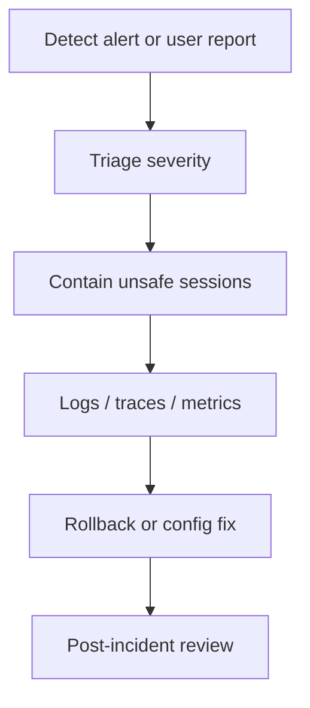

# Incident Response Runbook



Symptoms: safety block failure, provider outage, data leak suspicion, widespread 5xx.

Commands:

```bash
kubectl -n live-demo-agent get pods
kubectl -n live-demo-agent logs deploy/api --since=30m
kubectl -n live-demo-agent logs deploy/browser-runtime --since=30m
scripts/deploy/rollback.sh production
```

Mitigation: stop risky browser actions, scale down affected worker, rotate exposed secret if suspected.

Rollback: application rollback first; DB rollback only from approved plan.

Prevention: audit every high-impact action, keep telemetry redacted, rehearse rollback.
