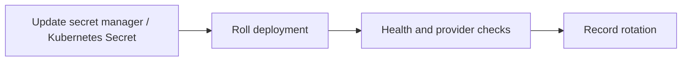

# Secret Rotation Runbook



Symptoms: provider auth failures, JWT/session validation failures, CRM export failures.

Commands:

```bash
kubectl -n live-demo-agent apply -f secrets.yaml
kubectl -n live-demo-agent rollout restart deployment/api deployment/agent-runtime
```

Mitigation: rotate staging first. Roll services that load secrets at startup.

Rollback: restore previous secret version and restart affected deployments.

Prevention: use external secret manager versioning; never commit secret values.

Limitation: Phase 16 loads secrets at startup. Live rotation requires rolling restart.
