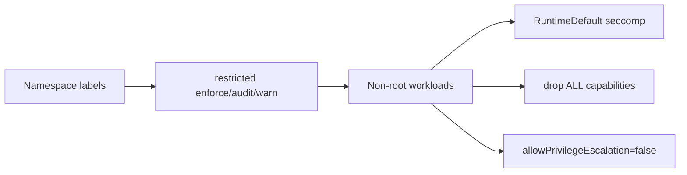

# Pod Security Standards

The `live-demo-agent` namespace enforces Kubernetes Pod Security `restricted`.

Browser runtime uses writable `emptyDir` mounts for `/tmp`, `/app/.cache`, and
`/dev/shm`. It is not privileged and must not run with `BROWSER_CHROMIUM_NO_SANDBOX=true`
in production.
