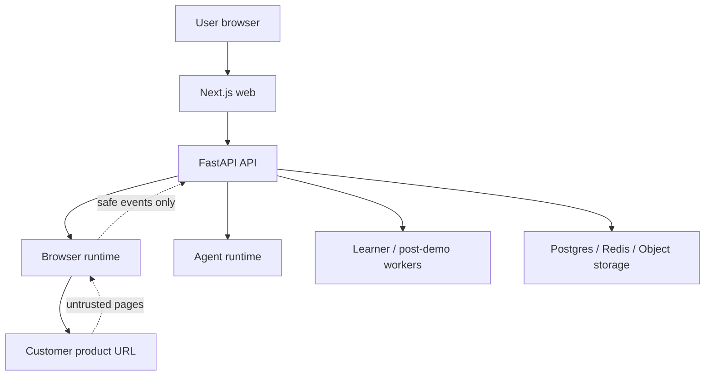

# Production Threat Model

Primary risks:

- Browser runtime is exposed to arbitrary product pages.
- Provider and CRM credentials must never enter logs, metrics, images, or frontend payloads.
- Agent/browser actions must remain policy-gated even when recipes or LLM output are hostile.
- Worker queues must not create unbounded resource allocation.

Controls:

- Per-session Playwright contexts, blocked downloads/uploads, metadata endpoint blocking, and
  domain allowlists.
- Kubernetes non-root, restricted pods, read-only filesystems, explicit writable volumes, and
  no privilege escalation.
- Secrets injected through Kubernetes Secrets or future external secret managers.
- CI secret scans, image scans, manifest validation, lint/type/tests, and gated CD.
