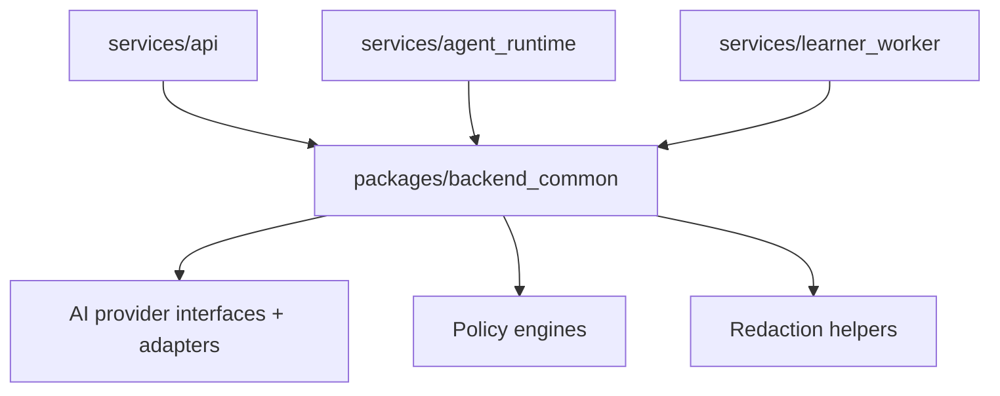
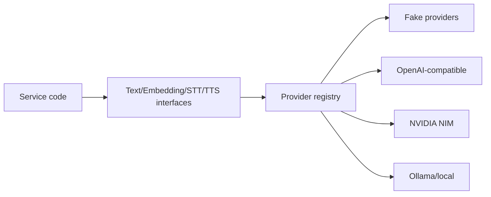
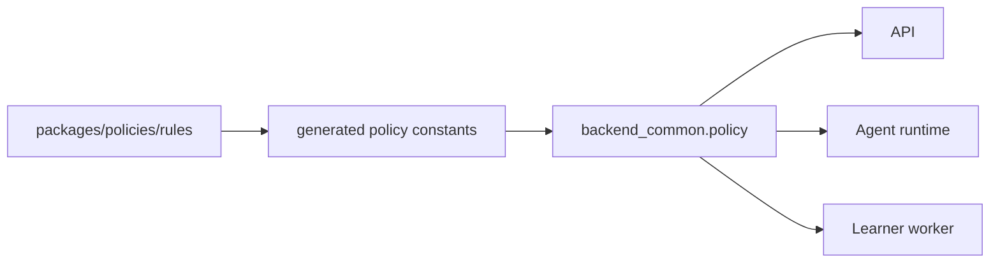

# Backend Common Package

`packages/backend_common` contains reusable Python implementation shared by backend services. It currently owns provider abstractions, provider adapters, policy engines, redaction helpers, and common tests.

## Dependency Role



## Provider Abstraction



Business logic should depend on interfaces and provider purposes, not vendor SDKs.

## Policy Implementation



Policy rule lists belong in `packages/policies`; this package implements deterministic evaluation.

## Verification

```bash
uv run pytest packages/backend_common/src/live_demo_backend_common/tests
```
