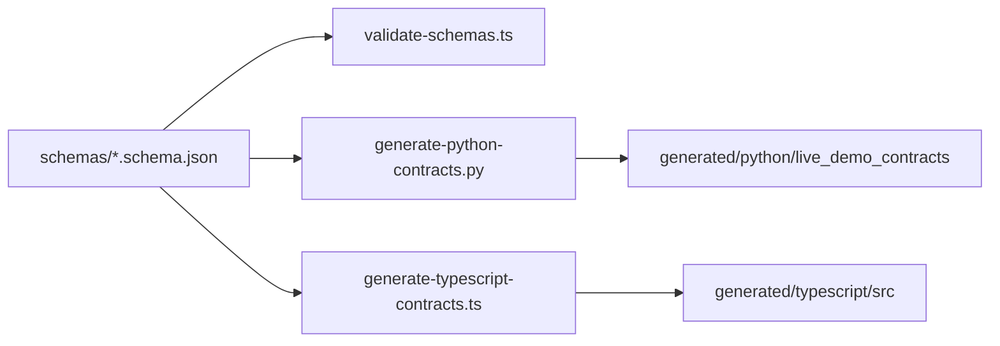

# Contracts Package

`packages/contracts` is the single source of truth for shared wire contracts.

## Source Of Truth



Rules:

- JSON Schema is canonical.
- Wire fields use snake_case.
- Generated files are deterministic and must not be edited manually.
- Services import DTOs only from generated contracts.
- Metadata fields are shallow JSON objects and must not carry secrets.

## Commands

```bash
pnpm --filter @live-demo-agent/contracts validate
pnpm --filter @live-demo-agent/contracts generate
```

Generated Python files start with:

```text
# Generated from packages/contracts/schemas. Do not edit manually.
```

Generated TypeScript files start with:

```text
// Generated from packages/contracts/schemas. Do not edit manually.
```

## Determinism Check

```bash
make contracts
git diff --exit-code packages/contracts/generated
```
